# Design Document — WhatsApp Chatbot Platform (Multi-Tenant SaaS)

## Overview

This document designs a **multi-tenant SaaS platform** built on the proven **Laravel 11 / PHP 8.3 / MySQL 8** monolith and the thin **Node + Baileys "WA Bridge"** sidecar established by the existing `whatsapp-auto-messenger` spec. It keeps every core messaging, group, channel, extraction, and anti-ban capability of that system and adds three large net-new subsystems:

1. **Multi-tenancy + Billing** — many isolated tenants (customers), each with their own WhatsApp numbers, contacts, campaigns, chatbots, plan, quota, and wallet.
2. **Conversational AI Engine** — auto-reply, keyword triggers, LLM smart replies, visual flow builder, intent/FAQ, business-hours/away mode, lead capture, order/booking, payments, multi-language, sentiment, human handoff, and conversation analytics. This is the biggest new subsystem and is designed with both high-level and low-level detail below.
3. **User Panel + Admin Panel** — a customer-facing self-service dashboard (28 features) and a super-admin/platform-owner control plane (28 features).

The document is intentionally **both High-Level (architecture, sequence diagrams, interfaces, data models) and Low-Level (formal PHP interfaces, algorithmic pseudocode with pre/postconditions and loop invariants, correctness properties)**, because both artifact levels were requested.

**Design principles carried forward and extended:**

1. **PHP owns everything** — data, decisions, scheduling, UI. The Bridge stays a dumb, replaceable wire.
2. **Queue-first** — every outbound send and every AI reply flows through the durable MySQL `jobs` queue.
3. **MySQL-only default** — queue, cache, locks, sessions on MySQL; Redis is an optional performance upgrade (recommended once tenant count grows).
4. **Tenant isolation is non-negotiable** — every domain row carries a `tenant_id`; a global query scope makes cross-tenant reads structurally impossible.
5. **Compliance & anti-ban are hard-enforced per tenant** — opt-out filtering and rate limits have no bypass parameter, exactly as before, now scoped per tenant.
6. **Plan gates everything** — messaging volume, session count, and feature access are gated by the tenant's plan; enforcement lives in one place, not scattered.
7. **Fail loud, degrade gracefully** — unsupported operations and exhausted quotas produce clean, typed errors, never silent no-ops.

---

## Relationship to `whatsapp-auto-messenger`

This is a **new, separate spec**. It does not modify the existing one. Conceptually, `whatsapp-auto-messenger` becomes the **single-tenant engine core** that this platform wraps and multiplies:

| Existing (single-tenant) | This platform (multi-tenant SaaS) |
|---|---|
| One implicit owner, `admin`/`admin` | Many tenants + platform super-admin above them |
| Global sessions, contacts, campaigns | Every row scoped by `tenant_id` |
| Config-file rate/warm-up caps | Per-plan quotas + config caps, whichever is stricter |
| No billing | Plans, wallets/credits, invoices, coupons, gateway |
| Manual replies only | Full conversational AI / chatbot engine |
| Single dashboard | User Panel (tenant) + Admin Panel (platform) |

The 22 existing domain tables are reused with an added `tenant_id` column and a global scope; new tables are added for tenancy, billing, and the AI engine.

---

## Architecture

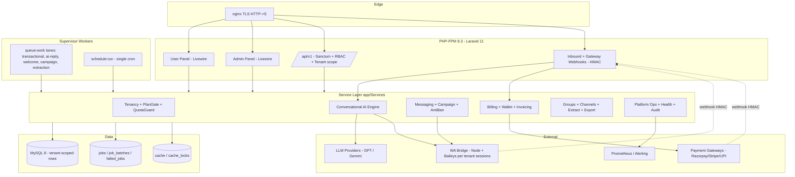

**What changed vs the single-tenant architecture:**

- A **Tenancy layer** sits in front of every service. Requests are resolved to a tenant (by subdomain, panel session, or API key), a global Eloquent scope is applied, and `PlanGate`/`QuotaGuard` are consulted before any billable action.
- A **Conversational AI Engine** consumes inbound-message webhooks and produces replies through the same anti-ban send pipeline.
- A **Billing subsystem** manages plans, wallets/credits, invoices, coupons, and payment-gateway webhooks.
- Two Livewire panels replace the single dashboard: **User Panel** (tenant self-service) and **Admin Panel** (platform super-admin).

### Multi-tenancy model

**Single database, shared schema, row-level isolation** (`tenant_id` on every domain table) is the chosen model.

| Model | Verdict | Rationale |
|---|---|---|
| Row-level `tenant_id` + global scope | **Chosen** | Simplest to operate on MySQL, cheapest per tenant, matches "PHP + MySQL only" constraint; isolation enforced in one global scope + tests |
| Database-per-tenant | Rejected for v1 | Migration/backup fan-out, connection sprawl; revisit only for enterprise isolation tiers |
| Schema-per-tenant | Rejected | MySQL schema = database; same cost as DB-per-tenant without the benefit |

Isolation is guaranteed by `BelongsToTenant` (a global scope + auto-fill of `tenant_id` on create). The WhatsApp **auth-state files** and **export files** are stored under a per-tenant path prefix (`storage/tenants/{tenantId}/...`) so a filesystem bug can't leak across tenants either.

### Bridge multi-tenancy

The Bridge stays logic-free. Sessions are already keyed by an opaque `sessionId` (ULID); the platform simply guarantees every `sessionId` maps to exactly one tenant (`sessions_wa.tenant_id`). The Bridge never learns about tenants — PHP resolves tenant → session set and only ever asks the Bridge about session IDs the tenant owns. Auth-state directories are namespaced per tenant on disk.

---

## Conversational AI Engine — High-Level Design

This is the largest net-new subsystem. It turns an inbound WhatsApp message into a reply by running it through a deterministic **resolution pipeline** whose stages are ordered from cheapest/most-specific to most-expensive/most-general.

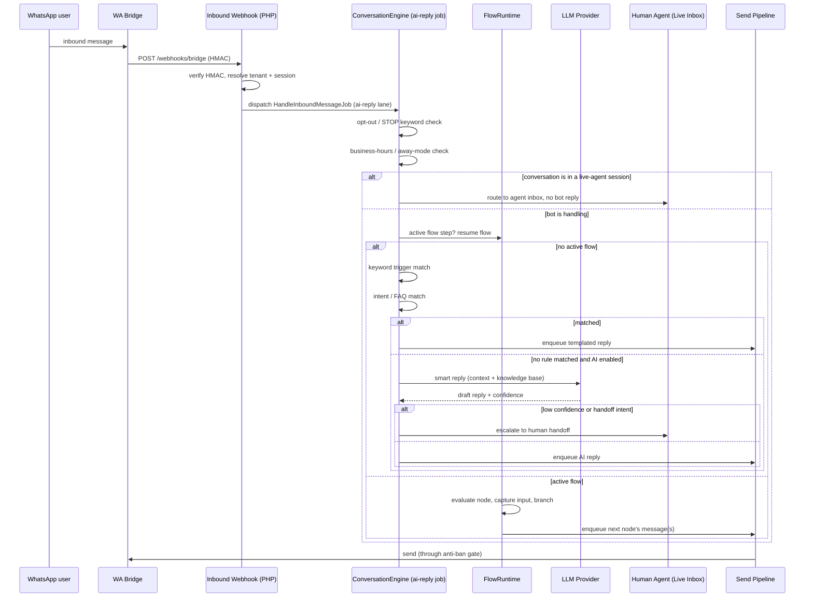

### Resolution pipeline order (deterministic, first-win)

1. **Compliance short-circuit** — opt-out keyword (`STOP`/`UNSUBSCRIBE`) always wins; records opt-out, sends confirmation, stops.
2. **Live-agent lock** — if a human agent has taken over this conversation, the bot stays silent (agent-only).
3. **Business-hours / away-mode** — outside configured hours, send the away message and (optionally) suppress further stages.
4. **Active flow resume** — if the contact is mid-flow, resume that flow's runtime (highest priority among bot logic).
5. **Keyword triggers** — exact / contains / regex matchers, tenant-ordered.
6. **Intent & FAQ** — classify intent (rule-based first, LLM-assisted optional) → matched FAQ answer.
7. **LLM smart reply** — only if enabled for the tenant and nothing above matched; uses conversation context + tenant knowledge base; low confidence or explicit "talk to human" intent → handoff.
8. **Default fallback** — configured fallback message, or silent.

Every stage is **feature-gated by plan** and **quota-metered** (LLM calls consume AI credits; outbound replies consume message quota). The order is fixed in code so behavior is predictable and testable.

### Visual Chatbot / Flow Builder (no-code)

- The builder is a **Livewire + Alpine** drag-and-drop canvas producing a **flow graph JSON** (nodes + edges) — no code generation, the graph is interpreted at runtime.
- **Node types:** `message`, `question` (capture input to a variable), `condition` (branch on variable/intent), `menu` (numbered options), `action` (call webhook / write to CRM / Google Sheet), `handoff` (to human), `end`.
- The graph is **validated** on save (reachability, no dangling edges, exactly one entry node, terminal nodes reachable) so a broken flow can never be published.
- Flow state per contact lives in `conversation_states` (current node id + captured variables), so runtime is stateless and horizontally scalable.

### Human handoff / Live Agent inbox

- A conversation can be in mode `BOT`, `HANDOFF_REQUESTED`, or `AGENT`.
- When escalated, it appears in the tenant's **Live Inbox** (Livewire, `wire:poll`), bot replies are suppressed, and agent messages go out through the same send pipeline (still rate-limited/anti-ban'd).
- Agent can **release** back to the bot; SLA timers and unassigned-timeout can auto-escalate or auto-reply.

---

## AI / LLM Engine — Deep Dive (Production-Grade)

> **Scope note (new requirements implied).** This section deepens Requirement **B4** (LLM smart replies) and **B7** (language/sentiment) and introduces behaviours that will require **new requirements** on regeneration: RAG grounding (B4.5–B4.8), conversation memory/token budgeting (B4.9), prompt guardrails & PII redaction (B4.10, sec), semantic caching (NFR-perf), and the LLM fallback/circuit-breaker chain (NFR-reliability). New tasks are flagged inline as **[NEW TASK]**.
>
> **MySQL-only default.** Every external dependency here (vector store, embeddings API, reranker, STT) is **optional/scale-up**. When absent the engine degrades to keyword + FAQ + lexical (MySQL `FULLTEXT`) retrieval and a single-provider LLM call, still functioning per Design Principle 3.

### 1.1 RAG architecture (knowledge grounding)

The LLM smart-reply stage (`LlmReplyStage`) is backed by a **Retrieval-Augmented Generation** pipeline so answers are grounded in the tenant's knowledge base (KB) rather than model priors. This directly reduces hallucination and enables **citation grounding**.

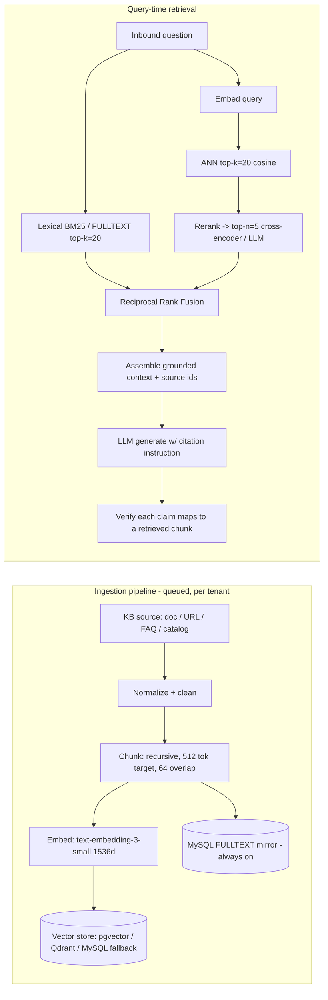

**Ingestion pipeline (`KbIngestionJob`, [NEW TASK]):**

| Stage | Choice | Detail |
|---|---|---|
| Loaders | Text/MD/HTML/PDF/CSV, URL crawl | Strip boilerplate, keep headings as metadata |
| Chunking | **Recursive structural** chunker | Target **512 tokens**, **64-token overlap**, never split mid-sentence; keep `(source_id, heading_path, ordinal)` |
| Embedding | `text-embedding-3-small` (1536-d), batch 96 | Cheap, good recall; pluggable via `Embedder` interface |
| Storage | Vector store row `{tenant_id, kb_chunk_id, vector, tokens, checksum}` | `checksum` de-dupes re-ingest; re-embed only changed chunks |
| Mirror | MySQL `FULLTEXT` on chunk text | Always populated so lexical search works with **zero external deps** |

**Chunking strategy — trade-off table:**

| Strategy | Chosen | Rationale |
|---|---|---|
| Fixed 512-tok + overlap, structural boundaries | **Chosen** | Predictable token budget, cheap, preserves sentence/heading integrity |
| Sentence-window / small-to-big | Rejected v1 | Better precision but 2–3× storage and retrieval complexity; revisit for enterprise |
| Whole-document | Rejected | Blows the context window, poor retrieval granularity |

**Vector store — decision table:**

| Option | Chosen / Rejected | Rationale |
|---|---|---|
| **Qdrant** (external, self-host/managed) | **Chosen (scale-up default)** | Purpose-built ANN (HNSW), payload filtering by `tenant_id`, cheap ops at scale, gRPC |
| **pgvector** (Postgres sidecar) | **Alt (medium scale)** | Single-node simplicity if a Postgres box already exists; HNSW index; good to ~1–5M vectors/tenant pool |
| **MySQL 8 brute-force cosine** (`VEC_` UDF or app-side) | **Fallback (zero-dep default)** | No new infra; O(N) scan acceptable for small KBs (<5k chunks/tenant); auto-selected when `RAG_DRIVER=mysql` |
| Pinecone / managed only | Rejected as default | Vendor lock-in, cost, egress; supported behind the interface but not the default |

Retrieval driver is chosen by `config('rag.driver')`; the `VectorStore` interface makes it swappable. **When the vector store is unavailable the query path falls back to FULLTEXT-only retrieval** (lower recall, still grounded) and emits a `rag.degraded` metric.

**Hybrid retrieval + reranking:** dense ANN (top-k=20) is fused with lexical BM25/FULLTEXT (top-k=20) via **Reciprocal Rank Fusion** (`score = Σ 1/(60+rank)`), then reranked to **top-n=5** by a cross-encoder (scale-up) or an LLM-as-reranker (default when no cross-encoder). Fusion beats either signal alone on short WhatsApp queries with typos/code-switching.

**Citation grounding:** the generation prompt requires the model to answer **only** from the provided chunks and to emit `[[source:<kb_chunk_id>]]` markers. A post-generation verifier checks every citation id was actually in the retrieved set; **unsupported claims trigger a grounding failure** → the reply is downgraded (drop the unsupported sentence) or escalated to handoff. This is captured by **Correctness Property 11 (RAG citation grounding)**.

```php
namespace App\Services\Chatbot\Rag;

interface VectorStore {
    public function upsert(int $tenantId, iterable $chunks): void;       // {id, vector, payload}
    public function search(int $tenantId, array $queryVector, int $k, array $filter = []): array; // ranked hits
    public function delete(int $tenantId, array $chunkIds): void;        // right-to-delete path
    public function driver(): string;                                    // 'qdrant'|'pgvector'|'mysql'
}
interface Embedder {
    public function embed(array $texts): array;   // batched; returns float[][]
    public function dimensions(): int;
    public function model(): string;
}
interface Retriever {
    /** Hybrid dense+lexical+rerank; returns grounded chunks with source ids and scores. */
    public function retrieve(int $tenantId, string $query, int $topN = 5): RetrievedContext;
}
```

### 1.2 Conversation memory & context-window management

A conversation may span hundreds of turns; the model context window (and cost) is finite. Memory is **two-tier**:

- **Short-term (working) memory** — the last `K` verbatim turns (default `K=8`, hard cap by token budget), pulled from `messages_inbound` + outbound log.
- **Long-term memory** — a **rolling summary** (`conversation_states.summary`) plus optional **episodic vectors** (per-conversation embeddings in the vector store) for semantic recall of older facts ("what's my order number?").

**Token budgeting** (per request, default 8k-context model):

| Bucket | Budget | Policy |
|---|---|---|
| System prompt + guardrails | ~800 tok | Templated per tenant, cached |
| RAG context (top-n chunks) | ~2500 tok | Trimmed to budget by score order |
| Rolling summary (long-term) | ~600 tok | Regenerated when it grows past cap |
| Recent turns (short-term) | ~2500 tok | Newest-first until budget hit |
| Reserved for completion | ~1600 tok | `max_tokens` on the call |

**Sliding-window + summarization compaction** (`MemoryCompactor`, [NEW TASK]): when short-term tokens exceed the window, the oldest turns are summarized into the rolling summary and dropped from the verbatim window (see Algorithm 5). Summarization itself uses the **cheap model tier** to control cost.

```php
interface ConversationMemory {
    public function assemble(Conversation $c, int $tokenBudget): AssembledContext; // system+summary+recent+rag
    public function compact(Conversation $c): void;                                 // slide + summarize
    public function remember(Conversation $c, string $fact): void;                  // episodic upsert
}
```

### 1.3 Prompt engineering, guardrails & PII redaction

- **Per-tenant system-prompt templating.** `PromptTemplate` renders `{tenant.persona}`, `{business.hours}`, `{catalog.brief}`, `{guardrails}` into a versioned system prompt (stored in `prompt_templates`, versioned so a bad prompt is rollback-able). Templates are cached (see caching layer).
- **Guardrails / jailbreak defense.** A layered defense: (1) instruction hierarchy — system prompt asserts non-overridable rules; (2) an **input classifier** flags prompt-injection patterns ("ignore previous instructions", tool-exfil attempts); (3) **delimiter fencing** wraps user content in a data block the model is told is untrusted; (4) **output validation** rejects replies that leak the system prompt or violate policy. Injection attempts are logged to `abuse_events` and can trip a per-conversation rate limit.
- **PII redaction before LLM egress.** A `PiiRedactor` masks phone numbers, emails, card-like sequences, and configurable tenant patterns **before** any text leaves to the LLM/embeddings API; a reversible token map is kept in-process for the single request so the reply can be re-hydrated for the customer but the provider never sees raw PII. This satisfies the "message bodies never logged / minimize LLM exposure" security posture and is covered by **Correctness Property 15**.
- **Structured output.** For flows/tools the engine uses **JSON mode / function calling**: the model returns a typed object (validated against a JSON Schema) instead of prose, e.g. `{intent, entities, next_action, tool_calls[]}`. Invalid JSON triggers one **repair retry** then falls back to a rule-based parse.

```php
interface PiiRedactor {
    public function redact(string $text): RedactionResult;   // {masked, tokenMap}
    public function rehydrate(string $text, TokenMap $map): string;
}
final class Guardrail {
    public function inspectInput(string $text): GuardVerdict;   // allow|flag|block + reasons
    public function inspectOutput(string $reply, string $systemPrompt): GuardVerdict;
}
```

### 1.4 Cost & latency optimization

- **Token accounting.** Every LLM/embedding call records `{tenant_id, conversation_id, model, prompt_tokens, completion_tokens, cost_micros}` in `llm_usage` (drives per-tenant cost attribution + `AI_CREDITS` metering). Consumption is idempotent per `request_id`.
- **Semantic reply caching.** Before calling the model, the normalized+embedded query is looked up in a **semantic cache** (`semantic_cache` table + vector). A hit within cosine ≥ `0.95` **and** same tenant/chatbot/flow-context returns the cached reply, skipping the LLM entirely. Cache entries are invalidated on KB change or template version bump. Correctness is bounded by **Correctness Property 12 (semantic-cache soundness)** — a cache hit must be for an equivalent context, never cross-tenant.
- **Model routing (cheap→strong escalation).** A `ModelRouter` sends the request to a **cheap/fast model** first (e.g. `gpt-4o-mini`/`gemini-flash`); if the response fails a confidence/coverage check (low logprob-derived confidence, empty RAG grounding, or JSON-repair failure), it **escalates to a stronger model**. Simple FAQ-style queries never pay for the expensive model.
- **Streaming.** Replies stream token-by-token internally to cut time-to-first-token; because WhatsApp sends discrete messages, streaming is used to start typing-indicator and to allow **early cancellation** if the user sends a new message (supersede).
- **Batching.** Embeddings are batched (96/req) in the ingestion lane; sentiment/language detection are batched per inbound burst.

**Cost/latency budget table:**

| Path | p50 latency target | p95 target | Cost control |
|---|---|---|---|
| Semantic cache hit | < 50 ms | < 150 ms | $0 (no LLM call) |
| Cheap model + RAG | < 1.2 s | < 3.0 s | mini model + capped `max_tokens` |
| Escalated strong model | < 3.0 s | < 8.0 s | only on low confidence |
| Embedding (ingest) | batch | — | off critical path (queued) |

### 1.5 LLM fallback chain, circuit breaker & hallucination mitigation

The provider call is wrapped in a **fallback chain** guarded by a **circuit breaker** (shared machinery with §Reliability):

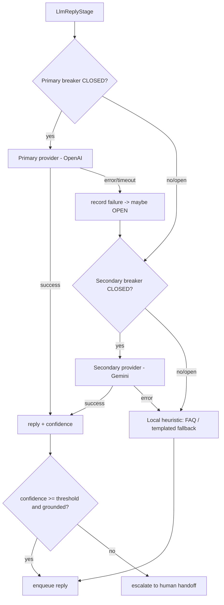

- **Circuit breaker** states `CLOSED → OPEN → HALF_OPEN`; opens after `≥5` failures within a `30s` window **or** error-rate `>50%` over the last `20` calls; stays open `30s`; `HALF_OPEN` admits `3` probes. Per-provider **and** per-tenant scoping prevents one tenant's abuse from opening the breaker for all (see §Reliability, Algorithm 7). Governed by **Correctness Property 13 (circuit-breaker safety)**.
- **Confidence calibration.** Confidence combines RAG coverage (was the answer grounded?), model self-report, and a cheap NLI-style entailment check for critical intents. Below `0.55` → handoff; `0.55–0.7` → reply with a hedging disclaimer + "type AGENT for a human".
- **Hallucination mitigation.** Grounding requirement (§1.1), citation verification, "answer only from context / say you don't know" instruction, and JSON-schema validation for structured answers. Ungrounded free-text answers to factual queries are suppressed.

### Algorithm 5 — Memory compaction (sliding window + summarization)

```php
function compactMemory(conversation): void
```
**Preconditions:** conversation has ≥1 turn; `tokenCount(recentTurns) > windowBudget`.
**Postconditions:** verbatim window holds only the newest turns within `windowBudget`; all evicted turns are represented in `summary`; no turn is both dropped and unsummarized (no information silently lost); `summary` token count ≤ `summaryCap`.
**Loop invariant:** at each step the set (still-verbatim ∪ already-summarized) equals all turns processed so far.

```pascal
ALGORITHM compactMemory(conv)
BEGIN
    turns   <- conv.recentTurns ordered oldest->newest
    budget  <- windowBudget
    keep    <- []                       // newest turns to keep verbatim
    FOR t IN reverse(turns) DO          // newest first
        IF tokens(keep) + tokens(t) <= budget THEN keep.prepend(t)
        ELSE evict.append(t) END IF
    END FOR
    IF evict NOT EMPTY THEN
        // INVARIANT: keep ∪ evict = turns (partition, no loss)
        delta   <- summarizeCheapModel(evict, conv.summary)
        conv.summary <- capTo(merge(conv.summary, delta), summaryCap)
    END IF
    conv.recentTurns <- keep
    persist(conv)
END
```

---

## Components and Interfaces

All namespaces under `App\`. New/changed components are shown; unchanged single-tenant engine services (SessionManager, AntiBanEngine, GroupService, etc.) are reused as-is with tenant scoping applied by the global scope.

### 1. Tenancy layer

```php
namespace App\Services\Tenancy;

interface TenantContext
{
    public function current(): ?Tenant;          // null in platform-admin/global context
    public function set(Tenant $tenant): void;
    public function actingAsPlatform(): bool;     // super-admin bypasses tenant scope for admin panel
    public function forget(): void;
}

/** Global Eloquent scope + creating() hook mixed into every tenant-owned model. */
trait BelongsToTenant
{
    // adds: static::addGlobalScope(new TenantScope);
    //       static::creating(fn ($m) => $m->tenant_id ??= app(TenantContext::class)->current()?->id);
}

final class PlanGate
{
    /** True if the tenant's plan includes a feature flag. */
    public function allows(Tenant $t, string $feature): bool;

    /** Throws FeatureNotInPlanException if not allowed. */
    public function authorize(Tenant $t, string $feature): void;
}

final class QuotaGuard
{
    public function verdict(Tenant $t, QuotaKind $kind, int $units = 1): QuotaVerdict; // allow|defer|block
    public function consume(Tenant $t, QuotaKind $kind, int $units = 1): void;          // atomic
    public function remaining(Tenant $t, QuotaKind $kind): int;
}
```

`QuotaKind` enum: `MESSAGES_MONTHLY`, `MESSAGES_DAILY`, `SESSIONS`, `CONTACTS`, `AI_CREDITS`, `CAMPAIGNS_CONCURRENT`. Quota state lives in `tenant_usage` (period-bucketed counters) updated atomically via `Cache::lock()`.

### 2. Billing subsystem

```php
namespace App\Services\Billing;

interface PaymentGateway
{
    public function createCheckout(Tenant $t, Plan $p, Money $amount, array $meta = []): CheckoutSession;
    public function createPaymentLink(Tenant $t, Money $amount, string $ref): PaymentLink; // for chatbot order/booking
    public function verifyWebhook(Request $r): GatewayEvent;   // HMAC / signature verify
}

final class SubscriptionService
{
    public function subscribe(Tenant $t, Plan $p, ?Coupon $c = null): Subscription;
    public function changePlan(Tenant $t, Plan $to): Subscription;   // prorate
    public function cancel(Tenant $t, bool $atPeriodEnd = true): void;
    public function onGatewayEvent(GatewayEvent $e): void;           // activate/renew/dunning
}

final class WalletService
{
    public function balance(Tenant $t): Money;
    public function topUp(Tenant $t, Money $amount, string $source): WalletTxn;   // idempotent by source ref
    public function debit(Tenant $t, Money $amount, string $reason): WalletTxn;   // never below zero
}

final class InvoiceService
{
    public function issue(Tenant $t, Subscription $s): Invoice;      // PDF, sequential number
    public function markPaid(Invoice $i, GatewayEvent $e): void;
}
```

Implementations: `RazorpayGateway`, `StripeGateway`, `UpiLinkGateway` (payment links / UPI intents), plus `FakeGateway` for tests. Gateways sit behind the `PaymentGateway` interface so a tenant/admin can switch provider without touching billing logic.

### 3. Conversational AI Engine

```php
namespace App\Services\Chatbot;

final class ConversationEngine
{
    /** Entry point from HandleInboundMessageJob. Returns the action taken. */
    public function handle(InboundMessage $in): EngineOutcome;
}

interface ResolverStage
{
    /** Returns a StageResult: handled(reply)|passthrough|halt. Ordered by priority(). */
    public function resolve(ConversationContext $ctx): StageResult;
    public function priority(): int;
    public function requiresFeature(): ?string;   // plan gate key, or null
}

// Concrete stages, highest priority first:
//   OptOutStage, LiveAgentStage, BusinessHoursStage, ActiveFlowStage,
//   KeywordTriggerStage, IntentFaqStage, LlmReplyStage, FallbackStage

final class FlowRuntime
{
    public function start(ConversationContext $ctx, Flow $flow): FlowStep;
    public function resume(ConversationContext $ctx): FlowStep;   // uses conversation_states
    public function evaluateNode(FlowNode $node, ConversationContext $ctx): NodeResult;
}

interface LlmProvider
{
    public function reply(LlmRequest $req): LlmResponse;   // {text, confidence, intent, tokensUsed}
    public function detectIntent(string $text, array $intents): IntentMatch;
    public function detectLanguage(string $text): string;  // ISO code, e.g. 'hi' | 'en'
    public function sentiment(string $text): Sentiment;    // -1..1 + label
}

final class HandoffService
{
    public function request(Conversation $c, string $reason): void;    // BOT -> HANDOFF_REQUESTED
    public function assign(Conversation $c, User $agent): void;         // -> AGENT
    public function release(Conversation $c): void;                    // -> BOT
    public function agentSend(Conversation $c, User $agent, OutboundContent $m): void;
}
```

Implementations: `OpenAiProvider`, `GeminiProvider` behind `LlmProvider`; `FakeLlmProvider` for tests (deterministic canned responses + injectable confidence). Language detection and sentiment can be provider-backed or a lightweight local heuristic when AI credits are exhausted.

### 4. Panels

- **User Panel** (`app/Livewire/Panel/*`) — tenant-scoped; every component runs inside the resolved tenant context.
- **Admin Panel** (`app/Livewire/Admin/*`) — platform super-admin; runs in `actingAsPlatform()` mode so the tenant global scope is bypassed and cross-tenant data is visible. Guarded by a distinct `platform-admin` guard, IP allowlist, and full audit logging (reusing the existing default-admin guard rails).

The two subsections below (**User Panel — Full Feature Design** and **Admin Panel — Full Feature Design**) itemize **every** feature to production-ready completeness so no panel screen is left as a stub. Every User Panel component runs inside the resolved tenant context (global `TenantScope` auto-applied, Property 1); every Admin Panel component runs under the `platform-admin` guard + IP allowlist + audit (Property 1 bypass is the only audited exception). Feature access is uniformly gated by `PlanGate` (users) / role guard (admins) and metered by `QuotaGuard`; unsupported/over-limit states **degrade to a clean, disabled+explained UI**, never a crash (Design Principle 7).

#### 4.1 User Panel — Full Feature Design (28 tenant self-service features)

> **Conventions.** All components live under `App\Livewire\Panel\*`; routes are under the tenant panel prefix `/app` (or the tenant subdomain root — see §Base URL). Every route passes through middleware `[auth, resolve.tenant, tenant.member, verified]`; feature-gated routes add `plan.feature:{key}` and quota-metered actions call `QuotaGuard`. **Tenant-scoping** = the component only ever reads/writes rows in the resolved tenant's scope (structural via `BelongsToTenant`). **Degrades** = what the user sees when the plan/quota/dependency blocks the feature. Requirements traced to **Block C (C1–C6)** with the specific engine requirement each feature exercises.

**Group A — Account & Security (C1)**

| # | Feature | Livewire component | Route | Service / interface | Tenant-scope + plan-gate | Degrades |
|---|---|---|---|---|---|---|
| 1 | Registration (email + phone OTP) | `Panel\Auth\Register` | `GET/POST /register` | `RegistrationService`, `OtpService`, `TenantLifecycle::provision` | pre-tenant; provisions tenant+wallet+default chatbot+DEK on verify | OTP send failure → resend w/ backoff; disposable-email/velocity block (anti-fraud §Security) |
| 2 | Login (email + phone OTP) | `Panel\Auth\Login` | `GET/POST /login` | `AuthService`, `OtpService` | binds `TenantContext` to the user's active tenant | throttle+lockout on repeated failure (reuses login-security rails) |
| 3 | Profile management | `Panel\Account\Profile` | `GET /app/profile` | `ProfileService` | `tenant_users` row; own user only | avatar upload → signed tenant-prefixed URL |
| 4 | Subscription / plan view | `Panel\Account\Subscription` | `GET /app/subscription` | `SubscriptionService`, `PlanGate` | reads own `subscriptions`+`plans`; upgrade/downgrade CTA | past-due → dunning banner; read-only while `SUSPENDED` |
| 5 | Wallet / credits view + top-up | `Panel\Account\Wallet` | `GET /app/wallet` | `WalletService`, `PaymentGateway::createCheckout` | own `wallets`/`wallet_txns`; balance ≥ 0 (Property 5) | gateway down → "try again", existing balance unaffected |
| 6 | Two-factor auth (2FA) | `Panel\Account\TwoFactor` | `GET/POST /app/security/2fa` | `TwoFactorService` (TOTP + recovery codes) | own user; enforced on next login (C1.3) | recovery-code fallback if authenticator lost |

**Group B — WhatsApp Connection Self-Service (C2)**

| # | Feature | Livewire component | Route | Service / interface | Tenant-scope + plan-gate | Degrades |
|---|---|---|---|---|---|---|
| 7 | Connect own number (QR / pairing) | `Panel\Sessions\Connect` | `GET /app/sessions/connect` | `SessionManager::create`, `ChannelRouter`, `ChannelDriver::register` | `SESSIONS` quota gate (C2.2); session mapped to one tenant | quota hit → blocked w/ limit + upgrade CTA; Cloud API/BSP → credential-entry flow instead of QR |
| 8 | View sessions / live status | `Panel\Sessions\Index` | `GET /app/sessions` | `SessionManager`, `wire:poll` | own sessions only (A2.2) | bridge down → "reconnecting", queue still accepts sends |
| 9 | Reconnect / disconnect | `Panel\Sessions\Manage` | `POST /app/sessions/{id}/{action}` | `SessionManager::reconnect/disconnect` | own session; ownership-checked | unrecoverable auth → prompt re-scan |
| 10 | Choose / view channel mode | `Panel\Sessions\ChannelMode` | `GET/POST /app/sessions/{id}/mode` | `ChannelRouter`, `ChannelCredentialStore` | per-mode credentials secret-redacted, envelope-encrypted (A8.4) | mode w/o credentials → disabled w/ setup hint; official-mode caveats shown |

**Group C — Messaging Within Quota (C3)**

| # | Feature | Livewire component | Route | Service / interface | Tenant-scope + plan-gate | Degrades |
|---|---|---|---|---|---|---|
| 11 | Single / dual send | `Panel\Messaging\Compose` | `GET/POST /app/messaging/compose` | `SendMessageJob` via `tenantSendGate` (Alg 3/9) | `MESSAGES_*` quota; opt-out enforced (Property 3) | over-quota → defer notice + remaining count |
| 12 | Bulk campaign | `Panel\Messaging\Campaigns` | `GET /app/campaigns` | `CampaignService`, `QuotaGuard` | `CAMPAIGNS_CONCURRENT` + message quota (C3.2) | would-exceed → start blocked, remaining shown; mid-run exhaustion → `QUOTA_PAUSED`, auto-resume |
| 13 | Schedule (once + recurring) | `Panel\Messaging\Scheduler` | `GET /app/scheduler` | `Scheduler` (`cron-expression`) | own scheduled jobs; quota checked at fire time | quiet-hours defer; recurrence validated |
| 14 | Media library / send | `Panel\Messaging\Media` | `GET /app/media` | `MediaService` (Intervention Image) | tenant-prefixed storage; `Media` capability per mode | mode w/o media cap → `ModeCapabilityException` surfaced as disabled |
| 15 | Templates (use / create / version) | `Panel\Messaging\Templates` | `GET /app/templates` | `TemplateService`, `cloud_api_templates` (official modes) | own templates; Cloud API/BSP require approved template outside 24h window | Baileys → text-templated; official → sync/approval status shown |
| 16 | Delivery status board | `Panel\Messaging\Delivery` | `GET /app/messaging/delivery` | reads `messages` (status), `wire:poll` | own messages; status never downgrades (Property 9) | out-of-order acks ignored via `rank()` |

**Group D — Contacts & Groups (C4)**

| # | Feature | Livewire component | Route | Service / interface | Tenant-scope + plan-gate | Degrades |
|---|---|---|---|---|---|---|
| 17 | Contacts manage | `Panel\Contacts\Index` | `GET /app/contacts` | `ContactService` | own contacts; `CONTACTS` quota | over-quota → import blocked w/ limit |
| 18 | Import (CSV / vCard) | `Panel\Contacts\Import` | `GET/POST /app/contacts/import` | `ContactImporter` (queued, streamed) | validates + de-dups; quota-checked | malformed rows reported, valid rows still imported |
| 19 | Groups manage (own) | `Panel\Groups\Index` | `GET /app/groups` | `GroupService` (see §Groups Full Mgmt) | own groups; `Groups` capability (Baileys) | official mode → group ops disabled (`ModeCapabilityException`) |
| 20 | Own-group number extraction | `Panel\Groups\Extract` | `GET/POST /app/groups/{id}/extract` | `GroupService::extractMembers` (generator, temp-table de-dup) | admin-guard; `Extraction` capability | official mode → disabled; large group → streamed job |
| 21 | Export own data | `Panel\Contacts\Export` | `POST /app/export` | `ExportService` (CSV/TXT/JSON/XLSX/vCard) | tenant-prefixed file; signed expiring URL (A6.3) | large data → streamed + emailed link |

**Group E — Chatbot Self-Service (C5)**

| # | Feature | Livewire component | Route | Service / interface | Tenant-scope + plan-gate | Degrades |
|---|---|---|---|---|---|---|
| 22 | Flow builder (no-code) | `Panel\Chatbot\FlowBuilder` | `GET /app/chatbot/flows/{id}` | `FlowRuntime`, `FlowValidator` (Alg 4) | own flows; publish blocked if invalid (B5.2) | invalid graph → failing node highlighted, publish disabled |
| 23 | Keyword / FAQ manager | `Panel\Chatbot\Keywords` | `GET /app/chatbot/keywords` | `KeywordTriggerService`, `IntentFaqService` | own rules; priority-ordered (B3) | — |
| 24 | AI auto-reply toggle | `Panel\Chatbot\AiSettings` | `GET/POST /app/chatbot/ai` | `PlanGate:ai`, `LlmProvider` | `ai_enabled`; `AI_CREDITS` quota | credits 0 → LLM stage skipped, falls to FAQ/fallback (B4.3); not-in-plan → hidden (C5.2) |
| 25 | Away / business-hours | `Panel\Chatbot\BusinessHours` | `GET/POST /app/chatbot/hours` | `BusinessHoursStage` | own config; timezone-aware | outside hours → away message (B6.1) |

**Group F — Reports & Support (C6)**

| # | Feature | Livewire component | Route | Service / interface | Tenant-scope + plan-gate | Degrades |
|---|---|---|---|---|---|---|
| 26 | Campaign analytics + conversation reports | `Panel\Reports\Analytics` | `GET /app/reports` | reads `metrics_rollup` (own tenant) | own aggregates only (B7.4) | replica lag tolerated (eventual) |
| 27 | Error logs + notifications inbox | `Panel\Reports\Errors`, `Panel\Notifications\Inbox` | `GET /app/errors`, `GET /app/notifications` | `ErrorService`, `NotificationService` | own errors/notifications; retry updates original row (A7.2) | phone numbers redacted (A7.3) |
| 28 | Support ticket / help center + billing history & invoices | `Panel\Support\Tickets`, `Panel\Account\Invoices` | `GET /app/support`, `GET /app/invoices` | `SupportService` (`support_tickets`), `InvoiceService` (PDF) | own tickets/invoices; ticket routed to platform support (C6.2) | invoice PDF via signed URL; KB served from `kb_articles` |

**Cross-cutting User Panel guarantees:** every action is (a) **tenant-scoped** structurally, (b) **plan-gated** via `PlanGate` + **quota-metered** via `QuotaGuard`, (c) **opt-out/anti-ban enforced** on every outbound path with no bypass (Property 3, Req C4.2), (d) **observable** (trace_id + `metrics_rollup`), and (e) **capability-aware** — a feature unavailable on the session's `channel_mode` renders disabled with an explanation rather than erroring at send time.

#### 4.2 Admin Panel — Full Feature Design (28 platform super-admin features)

> **Conventions.** All components live under `App\Livewire\Admin\*`; routes under `/admin`, behind middleware `[auth:platform-admin, ip.allowlist, admin.throttle, audit]` and executed in `TenantContext::actingAsPlatform()` (the only audited tenant-scope bypass, Req A1.5). **Guard** = `platform-admin`. **Audit** = every mutating action + impersonation + login is written to the hash-chained append-only `audit_logs` (Property 17). Requirements traced to **Block D (D1–D6)**.

**Group A — User & Access Management (D1)**

| # | Feature | Livewire component | Route | Service / interface | Guard + audit | Notes |
|---|---|---|---|---|---|---|
| 1 | CRUD / suspend all users | `Admin\Users\Index` | `/admin/users` | `UserAdminService`, `TenantLifecycle::suspend` | platform-admin; audited | cross-tenant view (actingAsPlatform) |
| 2 | CRUD / suspend all tenants | `Admin\Tenants\Index` | `/admin/tenants` | `TenantLifecycle` (provision/suspend/offboard) | platform-admin; audited | suspend blocks outbound, keeps inbound log (A1) |
| 3 | RBAC (owner/admin/operator/viewer/agent) | `Admin\Access\Roles` | `/admin/roles` | `RbacService` (`tenant_users.role`) | platform-admin; audited | role change re-evaluated on next request |
| 4 | Impersonate / login-as | `Admin\Users\Impersonate` | `POST /admin/users/{id}/impersonate` | `ImpersonationService` | platform-admin; **fully audited**, time-boxed | banner shown; destructive ops blocked while impersonating (D1.4) |
| 5 | Audit-log viewer | `Admin\Audit\Index` | `/admin/audit` | `AuditService` (verify hash-chain) | platform-admin; read-only | tamper detection via chain verify (Property 17) |
| 6 | Login security (IP allowlist / throttle / lockout) | `Admin\Security\Login` | `/admin/security` | `LoginSecurityService` | platform-admin; audited | applies to admin panel (D1.3) |

**Group B — Plans & Billing (D2)**

| # | Feature | Livewire component | Route | Service / interface | Guard + audit | Notes |
|---|---|---|---|---|---|---|
| 7 | Create / manage plans & pricing | `Admin\Plans\Index` | `/admin/plans` | `PlanService` (`plans`) | platform-admin; audited | version bump invalidates plan cache |
| 8 | Feature limits per plan | `Admin\Plans\Limits` | `/admin/plans/{id}/limits` | `PlanService` (limits JSON per `QuotaKind`) | platform-admin; audited | drives `PlanGate`/`QuotaGuard` |
| 9 | Payment gateway config | `Admin\Billing\Gateways` | `/admin/billing/gateways` | `platform_settings` (secret, redacted), `PaymentGateway` | platform-admin; audited | keys never exposed to tenants (NFR3.3) |
| 10 | Wallet / credit top-ups | `Admin\Billing\Wallets` | `/admin/billing/wallets` | `WalletService::topUp` (idempotent) | platform-admin; audited | manual adjust logged |
| 11 | Coupons / discounts | `Admin\Billing\Coupons` | `/admin/coupons` | `CouponService` | platform-admin; audited | redemption limits enforced |
| 12 | Invoices & revenue reports | `Admin\Billing\Revenue` | `/admin/revenue` | `InvoiceService`, `metrics_rollup` (replica) | platform-admin; read | cross-tenant reports from replica/rollup (D4.3) |

**Group C — Platform Control (D3)**

| # | Feature | Livewire component | Route | Service / interface | Guard + audit | Notes |
|---|---|---|---|---|---|---|
| 13 | Global session monitor | `Admin\Monitor\Sessions` | `/admin/monitor/sessions` | `SessionManager` (all tenants), `wire:poll` | platform-admin; read | disconnect storms → alert (D4.2) |
| 14 | Global campaign & queue monitor | `Admin\Monitor\Queues` | `/admin/monitor/queues` | queue depth/age metrics per lane | platform-admin; read | backpressure/shedding controls |
| 15 | Global anti-ban / rate-limit floor | `Admin\Control\AntiBan` | `/admin/control/antiban` | `AntiBanEngine` global config | platform-admin; audited | applied as **floor** tenants cannot loosen (D3.2) |
| 16 | Broadcast announcements | `Admin\Control\Announcements` | `/admin/announcements` | `AnnouncementService` (`announcements`) | platform-admin; audited | audience segment targeting |
| 17 | Feature flags | `Admin\Control\FeatureFlags` | `/admin/flags` | `FeatureFlagService` (`feature_flags`) | platform-admin; audited | global or per-tenant override (D3.3) |
| 18 | System settings (SMTP / API / LLM / gateway keys) | `Admin\Control\Settings` | `/admin/settings` | `platform_settings` (secret-redacted) | platform-admin; audited | secrets from Vault/KMS; never returned raw |

**Group D — Monitoring & Health (D4)**

| # | Feature | Livewire component | Route | Service / interface | Guard + audit | Notes |
|---|---|---|---|---|---|---|
| 19 | Health dashboard (server / bridge / queue) | `Admin\Health\Dashboard` | `/admin/health` | `HealthService`, `Metrics` | platform-admin; read | traffic-light per subsystem |
| 20 | Global error center & alerts | `Admin\Health\Errors` | `/admin/health/errors` | `ErrorService`, `alerts` (dedup fingerprint) | platform-admin; read | deduplicated alerts (D4.2) |
| 21 | Per-user & platform usage analytics | `Admin\Analytics\Usage` | `/admin/analytics` | `metrics_rollup` (replica/warehouse) | platform-admin; read | no live-table scans (D4.3) |
| 22 | Prometheus metrics endpoint | `MetricsController` (not Livewire) | `GET /metrics` | `Metrics` exporter (`wacb_*`) | scrape auth / network-restricted | histograms/gauges/counters |

**Group E — Content & Compliance (D5)**

| # | Feature | Livewire component | Route | Service / interface | Guard + audit | Notes |
|---|---|---|---|---|---|---|
| 23 | Global templates library | `Admin\Content\Templates` | `/admin/templates` | `TemplateLibraryService` | platform-admin; audited | shared/default templates |
| 24 | Opt-out / blocklist management | `Admin\Compliance\Blocklist` | `/admin/blocklist` | `OptOutService` (`opt_outs`) | platform-admin; audited | opt-out non-bypassable across tenants (D5.3, Property 3) |
| 25 | Data retention & deletion | `Admin\Compliance\Retention` | `/admin/retention` | `TenantLifecycle::export/offboard`, retention policy | platform-admin; audited | right-to-delete purge + verification + signed cert (D5.2) |
| 26 | ToS enforcement | `Admin\Compliance\Tos` | `/admin/compliance/tos` | `ComplianceService`, per-session risk/kill-switch | platform-admin; audited | offending session kill-switch |

**Group F — Support (D6)**

| # | Feature | Livewire component | Route | Service / interface | Guard + audit | Notes |
|---|---|---|---|---|---|---|
| 27 | Ticket management | `Admin\Support\Tickets` | `/admin/support` | `SupportService` (`support_tickets`/`support_messages`) | platform-admin; audited | assign/close, SLA |
| 28 | KB/FAQ manager + segment notifications | `Admin\Support\Kb`, `Admin\Support\Notify` | `/admin/kb`, `/admin/notify` | `KbService` (`kb_articles`), `NotificationService` | platform-admin; audited | segment notification delivers only to targeted audience (D6.2) |

**Cross-cutting Admin Panel guarantees:** every screen (a) runs under the `platform-admin` guard + IP allowlist + throttle/lockout, (b) is **audited** to the hash-chained append-only log (Property 17), (c) reads cross-tenant data via `actingAsPlatform()` **only** (the sole audited scope bypass, Property 1), (d) reads heavy cross-tenant analytics from **replica/rollup**, never live-table scans (D4.3), and (e) keeps platform secrets (gateway/LLM/SMTP keys) **redacted and never exposed to tenants** (NFR3.3).

### 5. Reliability primitives (new)

```php
namespace App\Services\Reliability;

interface CircuitBreaker {
    /** Runs $op unless the breaker for (scope,name) is OPEN; see Algorithm 7. */
    public function call(string $scope, string $name, callable $op): mixed;
    public function state(string $scope, string $name): CircuitState;
    public function trip(string $scope, string $name): void;   // manual/kill-switch
}

interface Outbox {
    /** MUST be called inside the same DB transaction as the state change. */
    public function enqueue(string $aggregateType, string $aggregateId, string $eventType, array $payload, string $dedupKey): void;
    public function relay(int $batch = 200): int;   // Algorithm 6; returns delivered count
}

interface IdempotencyStore {
    /** Returns cached response if $key already processed in $scope, else runs $op once. */
    public function once(string $scope, string $key, callable $op): mixed;
}

interface SagaOrchestrator {
    public function run(Saga $saga): SagaOutcome;   // Algorithm 8, with compensation
}

/** Backoff policy per error class (see Reliability section matrix). */
final class RetryPolicy {
    public function delay(int $attempt, ErrorClass $class): int; // ms, exponential + full jitter
    public function shouldRetry(int $attempt, ErrorClass $class): bool;
}
```

### 6. AI orchestration (new)

```php
namespace App\Services\Chatbot\Orchestration;

interface AgentRouter {
    /** Router agent classifies + dispatches to a specialist/skill; returns the chosen agent. */
    public function route(ConversationContext $ctx): AgentDecision;   // {agent, confidence, reason}
}
interface Skill {                       // a specialist agent / capability
    public function name(): string;
    public function canHandle(ConversationContext $ctx): float;       // 0..1 score
    public function handle(ConversationContext $ctx): SkillResult;    // reply | toolCalls | handoff
}
interface ToolRegistry {                // function-calling registry (per tenant/chatbot)
    public function schemas(int $chatbotId): array;                   // JSON Schemas for the model
    public function invoke(int $chatbotId, string $tool, array $args): ToolResult; // validated, idempotent
}
interface ModelRouter {                 // cheap -> strong escalation
    public function pick(LlmRequest $req, ?ConfidenceSignal $prev = null): ModelChoice;
}
interface AbTester {
    public function assign(string $test, string $unitId): string;     // sticky variant
    public function record(string $test, string $unitId, string $metric, float $value): void;
}
interface SpeechToText {                 // inbound voice-note transcription (optional)
    public function transcribe(MediaRef $audio, ?string $langHint = null): Transcript; // {text, confidence, lang}
}
interface TextToSpeech {                 // optional outbound voice (degrades to text)
    public function synthesize(string $text, string $lang): MediaRef;
}
```

**Optional-dependency fallbacks:** no `SpeechToText` bound → voice notes are acknowledged with "please type your message" (degraded); no `ToolRegistry`/router configured → single-agent LLM path; no `AbTester` → everyone gets the control variant.

### 7. Observability & tenancy tiers (new)

```php
namespace App\Services\Observability;

interface Tracer {
    public function startSpan(string $op, array $attrs = []): Span;   // propagates trace_id/correlation_id
    public function currentTraceId(): ?string;
}
interface Metrics {
    public function increment(string $metric, array $tags = [], int $by = 1): void;
    public function observe(string $metric, float $value, array $tags = []): void; // histograms
    public function gauge(string $metric, float $value, array $tags = []): void;
}
namespace App\Services\Tenancy;
interface TierResolver {
    public function tierOf(Tenant $t): TenantTier;                    // SHARED | DEDICATED_WORKER | DEDICATED_DB
    public function laneWeight(Tenant $t): int;                       // fair-scheduling weight
    public function connection(Tenant $t): string;                    // dedicated DB conn or 'default'
}
interface TenantLifecycle {
    public function provision(array $spec): Tenant;                   // create tenant, wallet, defaults, keys
    public function suspend(Tenant $t, string $reason): void;         // block outbound; keep inbound log
    public function export(Tenant $t): ExportArchive;                 // GDPR/DPDP portability
    public function offboard(Tenant $t): void;                        // schedule hard-delete + verification
}
interface FieldCipher {                  // envelope-encrypted sensitive fields
    public function encrypt(int $tenantId, string $plaintext): string;   // per-tenant DEK, KMS-wrapped
    public function decrypt(int $tenantId, string $ciphertext): string;
    public function rotate(int $tenantId): void;                          // re-wrap DEK, mark old RETIRING
}
```

---

## Data Models

New and changed tables (the 22 existing engine tables are reused, each gaining `tenant_id` + `idx(tenant_id, ...)`). New tables shown below.

```
-- ---------- Tenancy & access ----------
tenants                 id(ulid), name, slug(uniq), subdomain(uniq null),
                        status(ACTIVE|SUSPENDED|TRIAL|CANCELLED), plan_id->plans,
                        trial_ends_at, timezone, locale, created_at
                        idx(status)

tenant_users            id, tenant_id->tenants, user_id->users, role(owner|admin|operator|viewer|agent),
                        invited_at, joined_at   uniq(tenant_id, user_id)
                        -- a User can belong to multiple tenants; platform super-admins have tenant_id NULL

tenant_usage            id, tenant_id->, kind(enum QuotaKind), period_key(e.g. 2025-06 / 2025-06-14),
                        used(int), limit(int), updated_at   uniq(tenant_id, kind, period_key)

-- ---------- Billing ----------
plans                   id, name, slug(uniq), price_cents, currency, interval(MONTH|YEAR),
                        features(json feature flags), limits(json QuotaKind->int),
                        active, sort   idx(active)

subscriptions           id, tenant_id->(uniq active partial), plan_id->plans, status(TRIALING|ACTIVE|PAST_DUE|CANCELLED),
                        gateway, gateway_ref, current_period_start, current_period_end,
                        cancel_at_period_end, coupon_id->coupons
                        idx(status, current_period_end)

wallets                 id, tenant_id->(uniq), balance_cents, currency, updated_at
wallet_txns             id, tenant_id->, wallet_id->, type(TOPUP|DEBIT|REFUND|ADJUST),
                        amount_cents, balance_after, reason, source_ref(uniq null), created_at
                        idx(tenant_id, created_at)

invoices                id, tenant_id->, number(uniq), subscription_id->, amount_cents, currency,
                        status(DRAFT|OPEN|PAID|VOID), issued_at, paid_at, pdf_ref, line_items(json)
                        idx(tenant_id, status)

coupons                 id, code(uniq), type(PERCENT|FIXED), value, max_redemptions, redeemed,
                        expires_at, active   idx(active)

payment_events          id, tenant_id->null, gateway, gateway_event_id(uniq), type, payload(json),
                        processed_at, created_at   -- idempotent gateway webhook log

-- ---------- Channel Mode (pluggable messaging backends) ----------
-- sessions_wa (reused engine table) GAINS a column:
--   sessions_wa.channel_mode  enum(BAILEYS|CLOUD_API|ON_PREMISE|BSP_GATEWAY) NOT NULL DEFAULT 'BAILEYS'
--   idx(tenant_id, channel_mode)   -- every session declares exactly one mode (default keeps existing tenants on Baileys)

channel_credentials     id, tenant_id->, mode(enum ChannelMode), provider(enum BspProvider null),
                        label, config(json non-secret: waba_id, phone_number_id, endpoint, sender, api_version),
                        secret_config(blob, FieldCipher envelope-encrypted: access_token, verify_token,
                        api_key, webhook_secret), status(ACTIVE|INVALID|DISABLED), verified_at, updated_at
                        uniq(tenant_id, mode, provider, label)   idx(tenant_id, mode)
                        -- secret_config NEVER returned raw to UI/logs; decrypted in-request only

cloud_api_templates     id, tenant_id->, credential_id->channel_credentials, name, language,
                        category(MARKETING|UTILITY|AUTHENTICATION), body, components(json),
                        status(PENDING|APPROVED|REJECTED|PAUSED), provider_template_id, synced_at
                        uniq(tenant_id, credential_id, name, language)   idx(tenant_id, status)
                        -- approved template registry for CLOUD_API / ON_PREMISE / BSP (outside 24h window)

channel_webhook_routes  id, tenant_id->, session_id->sessions_wa, mode(enum ChannelMode),
                        route_key(uniq), verify_token_hash null, signing_secret_ref, active
                        idx(tenant_id, mode)
                        -- maps an incoming provider webhook (Meta phone-number-id / BSP sender) -> tenant+session+driver

channel_send_log        id(ulid), tenant_id->, session_id->, mode(enum ChannelMode), provider null,
                        capability(enum ChannelCapability), idempotency_key(uniq), result(SENT|BLOCKED|FAILED|FAILED_OVER),
                        block_reason null, provider_message_id, failover_from(enum ChannelMode null), created_at
                        idx(tenant_id, session_id, created_at)
                        -- per-send audit incl. capability-block (ModeCapabilityException) and failover events

-- ---------- Conversational AI ----------
chatbots                id, tenant_id->, name, enabled, ai_enabled, default_flow_id->flows null,
                        away_message, fallback_message, settings(json), created_at
                        idx(tenant_id, enabled)

flows                   id, tenant_id->, chatbot_id->chatbots, name, version, status(DRAFT|PUBLISHED|ARCHIVED),
                        graph(json nodes+edges), entry_node_id, is_current
                        uniq(chatbot_id, name, version)

keyword_triggers        id, tenant_id->, chatbot_id->, match_type(EXACT|CONTAINS|REGEX), pattern,
                        priority, response_type(TEXT|TEMPLATE|FLOW), response_ref, enabled
                        idx(tenant_id, chatbot_id, priority)

intents                 id, tenant_id->, chatbot_id->, name, samples(json), answer, faq_group, enabled
knowledge_base          id, tenant_id->, chatbot_id->, title, content, embedding_ref null, tags(json)

conversations           id, tenant_id->, session_id->sessions_wa, contact_id->contacts, chatbot_id->,
                        mode(BOT|HANDOFF_REQUESTED|AGENT), assigned_agent_id->users null,
                        language, last_inbound_at, last_outbound_at, sentiment_avg, status(OPEN|CLOSED)
                        uniq(tenant_id, session_id, contact_id), idx(tenant_id, mode)

conversation_states     id, conversation_id->(uniq), flow_id->flows, current_node_id,
                        variables(json), expires_at, updated_at

messages_inbound        id(ulid), tenant_id->, conversation_id->, wa_message_id(uniq), body,
                        media_ref, intent, sentiment, language, handled_by(enum), created_at
                        idx(conversation_id, created_at)

leads                   id, tenant_id->, conversation_id->, contact_id->, form_id->lead_forms null,
                        fields(json), status, created_at
lead_forms              id, tenant_id->, chatbot_id->, name, fields(json schema)

orders                  id, tenant_id->, conversation_id->, contact_id->, items(json), total_cents,
                        currency, status(CART|PLACED|PAID|CANCELLED), payment_link, created_at
catalog_items           id, tenant_id->, name, description, price_cents, currency, sku, media_ref, active

handoff_events          id, tenant_id->, conversation_id->, from_mode, to_mode, agent_id->users null,
                        reason, created_at   idx(conversation_id, created_at)

-- ---------- Platform ops ----------
feature_flags           id, key(uniq), description, enabled_globally, tenant_overrides(json)
announcements           id, title, body, audience(json segment), publish_at, expires_at, created_by
platform_settings       key(pk), value(json), secret(bool), updated_at   -- SMTP, gateway keys, LLM keys, defaults
support_tickets         id, tenant_id->, user_id->, subject, status(OPEN|PENDING|CLOSED), priority,
                        assigned_admin_id->users null, created_at   idx(status)
support_messages        id, ticket_id->, author_id->users, body, attachments(json), created_at
kb_articles             id, category, title, body_md, published, sort   -- platform knowledge base / help center

-- ---------- RAG / AI engine (scale-up; mysql-fallback columns noted) ----------
kb_chunks               id, tenant_id->, knowledge_base_id->knowledge_base, ordinal, heading_path,
                        content(text, FULLTEXT idx), token_count, checksum(uniq per kb),
                        embedding_model, created_at   idx(tenant_id, knowledge_base_id)
                        -- FULLTEXT(content) always populated; vectors live in vector store or embeddings

embeddings              id, tenant_id->, owner_type(kb_chunk|conversation|semantic_cache), owner_id,
                        model, dims, vector(json/blob -- mysql fallback), created_at
                        idx(tenant_id, owner_type, owner_id)
                        -- external vector store is source of truth when RAG_DRIVER != mysql; this mirrors for fallback

prompt_templates        id, tenant_id->, chatbot_id->, version, body, variables(json),
                        is_current, created_by, created_at   uniq(chatbot_id, version)

semantic_cache          id, tenant_id->, chatbot_id->, context_hash, query_norm, query_embedding_ref,
                        reply, model, hits, kb_version, template_version, expires_at, created_at
                        idx(tenant_id, chatbot_id, context_hash)

llm_usage               id, tenant_id->, conversation_id->null, request_id(uniq), provider, model,
                        prompt_tokens, completion_tokens, cost_micros, latency_ms, cache_hit(bool),
                        escalated(bool), created_at   idx(tenant_id, created_at)

-- ---------- Reliability / idempotency ----------
outbox                  id, tenant_id->null, aggregate_type, aggregate_id, event_type, payload(json),
                        dedup_key(uniq), status(PENDING|SENT|FAILED), attempts, next_attempt_at,
                        created_at, sent_at   idx(status, next_attempt_at)
                        -- transactional outbox: written in same tx as the state change; relay publishes

idempotency_keys        id, tenant_id->null, scope, key, response_hash, locked_at, created_at
                        uniq(scope, key)   -- generic dedup for webhooks/side-effects

circuit_breakers        id, scope(provider|tenant|gateway|bridge), name, state(CLOSED|OPEN|HALF_OPEN),
                        failure_count, window_started_at, opened_at, half_open_probes, updated_at
                        uniq(scope, name)   -- persisted breaker state (also cached)

sagas                   id, tenant_id->, type(ORDER_FULFILLMENT|...), state(json),
                        status(RUNNING|COMPLETED|COMPENSATING|FAILED), current_step, created_at, updated_at
                        idx(status)
saga_steps              id, saga_id->, name, status(PENDING|DONE|COMPENSATED|FAILED), compensation_ref,
                        payload(json), created_at

-- ---------- Multi-tenancy tiers & encryption ----------
tenant_tiers            id, tenant_id->(uniq), tier(SHARED|DEDICATED_WORKER|DEDICATED_DB),
                        lane_weight(int), data_region, shard_key, dedicated_conn(json null), updated_at
encryption_keys         id, tenant_id->null, purpose(FIELD|EXPORT|BACKUP), kms_key_id, wrapped_dek(blob),
                        version, status(ACTIVE|RETIRING|RETIRED), created_at, rotated_at
                        idx(tenant_id, purpose, status)   -- envelope encryption: KMS-wrapped DEKs per tenant

-- ---------- Observability ----------
traces                  id, trace_id(idx), span_id, parent_span_id, tenant_id->null, service, operation,
                        started_at, duration_ms, status, attributes(json)   idx(trace_id)
                        -- sampled; export to OTLP collector when configured, MySQL ring-buffer fallback
metrics_rollup          id, tenant_id->null, metric, period_key, dims(json), value, created_at
                        uniq(tenant_id, metric, period_key, dims)   -- pre-aggregated for dashboards
alerts                  id, scope, name, severity, state(FIRING|RESOLVED), fingerprint(uniq active),
                        first_seen_at, last_seen_at, payload(json)   -- deduplicated alerting

-- ---------- Advanced chatbot capabilities ----------
agents_registry         id, tenant_id->, chatbot_id->, name, kind(ROUTER|SPECIALIST), skill_tags(json),
                        system_prompt_ref, tools(json), enabled   idx(tenant_id, chatbot_id)
tools_registry          id, tenant_id->, chatbot_id->, name, json_schema(json), handler(kind+ref),
                        auth(json), enabled   uniq(tenant_id, chatbot_id, name)
ab_tests                id, tenant_id->, chatbot_id->, name, unit(CONVERSATION|CONTACT),
                        status(DRAFT|RUNNING|STOPPED), variants(json weights), metric, started_at, stopped_at
                        idx(tenant_id, status)
ab_assignments          id, tenant_id->, ab_test_id->, unit_id, variant, assigned_at
                        uniq(ab_test_id, unit_id)   -- sticky assignment
flow_analytics_events   id(ulid), tenant_id->, conversation_id->, flow_id->, node_id,
                        event(ENTER|COMPLETE|DROP|ERROR), created_at
                        idx(tenant_id, flow_id, node_id, created_at)
campaign_sequences      id, tenant_id->, chatbot_id->, name, trigger(json state-condition),
                        steps(json drip), enabled   idx(tenant_id, enabled)
sequence_enrollments    id, tenant_id->, sequence_id->, contact_id->, step_index, next_run_at,
                        status(ACTIVE|DONE|CANCELLED)   uniq(sequence_id, contact_id), idx(next_run_at)
media_transcripts       id, tenant_id->, messages_inbound_id->(uniq), kind(STT|OCR), provider, text,
                        confidence, lang, created_at   -- voice-note transcription / media understanding

-- ---------- Event sourcing & analytics ----------
event_log               id(ulid, monotonic), tenant_id->, stream_id, stream_type(CONVERSATION|ORDER|SESSION|...),
                        version(int), event_type, payload(json), metadata(json trace_id,actor),
                        occurred_at   uniq(stream_id, version), idx(tenant_id, stream_type, occurred_at)
                        -- APPEND-ONLY: no UPDATE/DELETE grants for app role; projections rebuild from here
projection_checkpoints  id, projection, last_event_id, updated_at   uniq(projection)
```

**Append-only enforcement:** the application DB role has `INSERT/SELECT` on `event_log` but **no `UPDATE`/`DELETE`** grant; the same is applied to `audit_logs`, which are **hash-chained** — each row stores `prev_hash` + `row_hash = H(prev_hash || canonical(payload))` so tampering is detectable. See Correctness Properties 14 and 17.

**Enums (PHP 8.3 backed enums):**

```php
enum TenantStatus: string { case Active='ACTIVE'; case Suspended='SUSPENDED'; case Trial='TRIAL'; case Cancelled='CANCELLED'; }
enum ConversationMode: string { case Bot='BOT'; case HandoffRequested='HANDOFF_REQUESTED'; case Agent='AGENT'; }
enum QuotaKind: string { case MessagesMonthly='MESSAGES_MONTHLY'; case MessagesDaily='MESSAGES_DAILY'; case Sessions='SESSIONS'; case Contacts='CONTACTS'; case AiCredits='AI_CREDITS'; case CampaignsConcurrent='CAMPAIGNS_CONCURRENT'; }
enum FlowNodeType: string { case Message='message'; case Question='question'; case Condition='condition'; case Menu='menu'; case Action='action'; case Handoff='handoff'; case End='end'; }
enum SubscriptionStatus: string { case Trialing='TRIALING'; case Active='ACTIVE'; case PastDue='PAST_DUE'; case Cancelled='CANCELLED'; }
enum CircuitState: string { case Closed='CLOSED'; case Open='OPEN'; case HalfOpen='HALF_OPEN'; }
enum OutboxStatus: string { case Pending='PENDING'; case Sent='SENT'; case Failed='FAILED'; }
enum SagaStatus: string { case Running='RUNNING'; case Completed='COMPLETED'; case Compensating='COMPENSATING'; case Failed='FAILED'; }
enum TenantTier: string { case Shared='SHARED'; case DedicatedWorker='DEDICATED_WORKER'; case DedicatedDb='DEDICATED_DB'; }
enum RagDriver: string { case Mysql='mysql'; case Pgvector='pgvector'; case Qdrant='qdrant'; }
enum AgentKind: string { case Router='ROUTER'; case Specialist='SPECIALIST'; }
enum FlowAnalyticsEvent: string { case Enter='ENTER'; case Complete='COMPLETE'; case Drop='DROP'; case Error='ERROR'; }
enum ChannelMode: string { case Baileys='BAILEYS'; case CloudApi='CLOUD_API'; case OnPremise='ON_PREMISE'; case BspGateway='BSP_GATEWAY'; }
enum ChannelCapability: string { case SendSingle='SEND_SINGLE'; case SendBulk='SEND_BULK'; case Media='MEDIA'; case FreeFormAnytime='FREE_FORM_ANYTIME'; case Template='TEMPLATE'; case Interactive='INTERACTIVE'; case Groups='GROUPS'; case Welcome='WELCOME'; case Extraction='EXTRACTION'; case Tagging='TAGGING'; case Channels='CHANNELS'; case InboundWebhook='INBOUND_WEBHOOK'; case DeliveryReceipts='DELIVERY_RECEIPTS'; }
enum BspProvider: string { case Twilio='TWILIO'; case ThreeSixtyDialog='360DIALOG'; case Gupshup='GUPSHUP'; case Vonage='VONAGE'; case MessageBird='MESSAGEBIRD'; case Infobip='INFOBIP'; case Wati='WATI'; case Kaleyra='KALEYRA'; }
```

Reused engine enums (`SessionStatus`, `MessageStatus`, `WaStatus`) are unchanged. The reused `sessions_wa` table gains a `channel_mode` (`ChannelMode`) column defaulting to `BAILEYS`, so existing single-tenant/Baileys behaviour is preserved with zero official-API setup.

---

## Algorithmic Pseudocode (Low-Level Design)

### Algorithm 1 — Conversation resolution pipeline

```php
function resolveInbound(inbound): EngineOutcome
```

**Preconditions:**
- `inbound` is a webhook event that passed HMAC verification.
- `inbound.tenant_id` resolved and tenant is `ACTIVE` or `TRIAL` (not `SUSPENDED`).
- `inbound.conversation` exists or is created for (tenant, session, contact).

**Postconditions:**
- At most one reply action is enqueued per inbound message (no double-reply).
- If opted-out keyword detected, an `opt_outs` row exists and no marketing reply is sent.
- Conversation `mode` and `conversation_states` reflect the outcome.
- Any LLM call consumed AI credits atomically; if credits were 0, LLM stage is skipped.

**Loop invariant (over ordered stages):** every stage examined so far returned `PASSTHROUGH`; the first stage returning `HANDLED` or `HALT` terminates the loop and no later stage runs.

```pascal
ALGORITHM resolveInbound(inbound)
BEGIN
    ctx <- buildContext(inbound)          // tenant, conversation, contact, history
    ASSERT ctx.tenant.status IN {ACTIVE, TRIAL}

    stages <- orderedStagesByPriority()   // OptOut, LiveAgent, BusinessHours,
                                          // ActiveFlow, Keyword, IntentFaq, Llm, Fallback

    FOR each stage IN stages DO
        // INVARIANT: all previously examined stages returned PASSTHROUGH
        IF stage.requiresFeature() != NULL
           AND NOT planGate.allows(ctx.tenant, stage.requiresFeature()) THEN
            CONTINUE                       // feature not in plan -> skip stage
        END IF

        result <- stage.resolve(ctx)

        IF result.kind = HALT THEN
            RETURN outcome(HALT, stage)    // e.g. opt-out, agent-only: no bot reply
        ELSE IF result.kind = HANDLED THEN
            enqueueReply(ctx, result.reply) // through anti-ban send pipeline
            persistState(ctx, result)
            RETURN outcome(HANDLED, stage)
        END IF
        // PASSTHROUGH -> try next stage
    END FOR

    RETURN outcome(NO_MATCH)               // Fallback stage normally prevents reaching here
END
```

### Algorithm 2 — Flow node evaluation (FlowRuntime)

```php
function evaluateNode(node, ctx): NodeResult
```

**Preconditions:**
- `ctx.state.flow_id` references a `PUBLISHED` flow whose graph was validated on save.
- `node` is reachable from the flow's entry node (guaranteed by save-time validation).

**Postconditions:**
- Exactly one successor node is chosen (or the flow ends), so runtime never dead-ends on a validated graph.
- Captured input is stored in `conversation_states.variables` before branching on it.
- On `handoff` node, conversation transitions to `HANDOFF_REQUESTED`.

**Loop invariant (menu/condition edge scan):** all edges checked so far did not match; the first matching edge determines the successor; the graph guarantees at least one default/else edge for `condition`/`menu` nodes.

```pascal
ALGORITHM evaluateNode(node, ctx)
BEGIN
    CASE node.type OF
        MESSAGE:
            RETURN NodeResult(reply := render(node.text, ctx.variables),
                              next := node.singleSuccessor)

        QUESTION:
            IF ctx.awaitingAnswerFor = node.id THEN
                ctx.variables[node.var] <- ctx.lastInboundText   // capture BEFORE branching
                RETURN NodeResult(reply := NONE, next := node.singleSuccessor)
            ELSE
                ctx.awaitingAnswerFor <- node.id
                RETURN NodeResult(reply := render(node.prompt, ctx.variables), next := node.id) // stay
            END IF

        MENU:
            choice <- parseChoice(ctx.lastInboundText, node.options)
            FOR each option IN node.options DO
                // INVARIANT: no earlier option matched the user's choice
                IF option.matches(choice) THEN
                    RETURN NodeResult(reply := NONE, next := option.targetNode)
                END IF
            END FOR
            RETURN NodeResult(reply := render(node.invalidPrompt, ctx.variables), next := node.id)

        CONDITION:
            FOR each edge IN node.edges DO
                IF evalPredicate(edge.predicate, ctx) THEN
                    RETURN NodeResult(reply := NONE, next := edge.targetNode)
                END IF
            END FOR
            RETURN NodeResult(reply := NONE, next := node.elseEdge.targetNode) // guaranteed to exist

        ACTION:
            runAction(node.action, ctx)      // webhook / CRM / Google Sheet (queued, retry-safe)
            RETURN NodeResult(reply := NONE, next := node.singleSuccessor)

        HANDOFF:
            handoffService.request(ctx.conversation, reason := node.reason)
            RETURN NodeResult(reply := render(node.message, ctx.variables), next := NONE, terminal := true)

        END:
            clearState(ctx)
            RETURN NodeResult(reply := render(node.message, ctx.variables), next := NONE, terminal := true)
    END CASE
END
```

### Algorithm 3 — Plan-gated, quota-metered send (extends the engine's SendMessageJob)

```php
function tenantSendGate(tenant, message): GateVerdict
```

**Preconditions:**
- `tenant` is resolved; `message.tenant_id = tenant.id` (enforced by global scope).
- Existing anti-ban gate (rate limit, quiet hours, warm-up) still applies unchanged.

**Postconditions:**
- Message is sent only if BOTH the tenant plan quota AND the anti-ban caps allow it.
- On quota exhaustion the job is `release()`d or blocked (never dropped); usage counter reflects exactly the messages actually sent (no double count on retry).

```pascal
ALGORITHM tenantSendGate(tenant, message)
BEGIN
    IF NOT planGate.allows(tenant, feature := featureFor(message)) THEN
        RETURN block(reason := FEATURE_NOT_IN_PLAN)
    END IF

    v <- quotaGuard.verdict(tenant, MESSAGES_MONTHLY, 1)
    IF v = BLOCK THEN RETURN block(QUOTA_EXCEEDED) END IF
    IF v = DEFER THEN RETURN defer(secondsUntilPeriodReset(tenant)) END IF

    // hand off to existing anti-ban gate (rate + quiet hours + warm-up + cooldown)
    antiBanVerdict <- antiBanEngine.gate(message)
    IF antiBanVerdict.defer THEN RETURN defer(antiBanVerdict.seconds) END IF
    IF antiBanVerdict.block THEN RETURN block(antiBanVerdict.reason) END IF

    RETURN allow()
    // NOTE: quotaGuard.consume() is called exactly once, AFTER the bridge confirms send,
    //       keyed by message.idempotency_key so a job retry never double-consumes.
END
```

### Algorithm 4 — Flow graph validation (save-time)

```php
function validateFlowGraph(graph): ValidationResult
```

**Preconditions:** `graph` has `nodes[]` and `edges[]`.

**Postconditions:** A flow can be published only if: exactly one entry node; every non-terminal node has a defined successor for every branch; every node is reachable from entry; every path can reach a terminal (`end`/`handoff`) node (no infinite non-terminating cycle without an exit).

```pascal
ALGORITHM validateFlowGraph(graph)
BEGIN
    entries <- nodes WHERE isEntry
    IF count(entries) != 1 THEN RETURN invalid("exactly one entry node required") END IF

    reachable <- BFS(from := entries[0], via := edges)
    FOR each node IN graph.nodes DO
        // INVARIANT: nodes checked so far were all reachable
        IF node NOT IN reachable THEN RETURN invalid("unreachable node: " + node.id) END IF
    END FOR

    FOR each node IN graph.nodes DO
        IF node.type IN {CONDITION, MENU} AND NOT hasDefaultEdge(node) THEN
            RETURN invalid("branch node missing default/else edge: " + node.id)
        END IF
        IF node.type NOT IN {END, HANDOFF} AND successorCount(node) = 0 THEN
            RETURN invalid("dangling node: " + node.id)
        END IF
    END FOR

    IF NOT everyPathReachesTerminal(graph, entries[0]) THEN
        RETURN invalid("a path never reaches an end/handoff node")
    END IF

    RETURN valid()
END
```

### Algorithm 6 — Transactional outbox relay (exactly-once side effects)

```php
function relayOutbox(): void
```
**Preconditions:** every side-effecting state change (webhook fire, gateway callback ack, downstream notify) wrote its intent into `outbox` **inside the same DB transaction** as the state change, with a unique `dedup_key`.
**Postconditions:** each `outbox` row is delivered **at least once** and processed **at most once** at the consumer (consumer dedups on `dedup_key`), giving effective **exactly-once**; a row is marked `SENT` only after the receiver acks; failures retry with backoff and never lose the row. Covered by **Correctness Property 16 (outbox exactly-once)**.
**Loop invariant:** at each iteration, every row already marked `SENT` was acknowledged by the receiver at least once; unsent rows remain `PENDING`/`FAILED` and are eligible for retry.

```pascal
ALGORITHM relayOutbox()
BEGIN
    batch <- outbox WHERE status IN {PENDING, FAILED}
                    AND next_attempt_at <= now()
                    ORDER BY id LIMIT N   FOR UPDATE SKIP LOCKED
    FOR each row IN batch DO
        // INVARIANT: rows marked SENT before now were acked >= once
        TRY
            deliver(row.event_type, row.payload, headers := {dedup_key: row.dedup_key})
            row.status <- SENT; row.sent_at <- now()
        CATCH transient e
            row.attempts <- row.attempts + 1
            row.status <- FAILED
            row.next_attempt_at <- now() + backoffWithJitter(row.attempts)
        END TRY
        persist(row)
    END FOR
END
```

### Algorithm 7 — Circuit breaker (per-provider / per-tenant guarded call)

```php
function guardedCall(scope, name, operation): Result
```
**Preconditions:** `operation` is an external call (LLM provider, payment gateway, bridge) that may fail/timeout; breaker state for `(scope,name)` is persisted + cached.
**Postconditions:** while `OPEN`, `operation` is **not** invoked and the caller gets a fast typed failure (which triggers fallback); a bounded number of probes run in `HALF_OPEN`; success in `HALF_OPEN` closes the breaker, failure re-opens it. The breaker never invokes `operation` while `OPEN`. Covered by **Correctness Property 13**.
**Loop invariant (over the failure window):** `failure_count` counts only failures within the current rolling window; window rotation resets it without losing an in-window failure.

```pascal
ALGORITHM guardedCall(scope, name, operation)
BEGIN
    b <- breaker(scope, name)
    IF b.state = OPEN THEN
        IF now() - b.opened_at >= openDuration THEN b.state <- HALF_OPEN; b.half_open_probes <- 0
        ELSE RETURN fastFail(CIRCUIT_OPEN) END IF     // operation NOT invoked
    END IF

    IF b.state = HALF_OPEN AND b.half_open_probes >= probeLimit THEN
        RETURN fastFail(CIRCUIT_OPEN)
    END IF

    TRY
        r <- operation()                              // the only place operation() runs
        IF b.state = HALF_OPEN THEN b.state <- CLOSED END IF
        b.failure_count <- 0
        RETURN r
    CATCH e
        rotateWindowIfExpired(b)                       // INVARIANT: count is within-window only
        b.failure_count <- b.failure_count + 1
        IF b.state = HALF_OPEN
           OR b.failure_count >= failureThreshold
           OR errorRate(b) > 0.5 THEN
            b.state <- OPEN; b.opened_at <- now()
        END IF
        THROW e
    FINALLY
        persist(b)
    END TRY
END
```

### Algorithm 8 — Saga orchestration with compensation (order → payment → fulfilment)

```php
function runSaga(saga): SagaOutcome
```
**Preconditions:** `saga.steps` is an ordered list; each step has a forward action and an idempotent compensation; forward actions are idempotent (keyed by `saga_id, step`).
**Postconditions:** either **all** forward steps complete (`COMPLETED`), or a failing step triggers compensation of all previously-completed steps **in reverse order** leaving no partial side effect (`COMPENSATING → FAILED`); compensations are idempotent so retrying the saga is safe. Covered by **Correctness Property 18 (saga atomicity)**.
**Loop invariant:** at any point, `done[]` holds exactly the steps whose forward action succeeded and whose compensation has not yet run.

```pascal
ALGORITHM runSaga(saga)
BEGIN
    done <- []
    FOR step IN saga.steps DO
        TRY
            executeIdempotent(step.forward, key := saga.id + ':' + step.name)
            done.push(step); markDone(step)
        CATCH e
            saga.status <- COMPENSATING
            FOR s IN reverse(done) DO       // INVARIANT: done = succeeded, not-yet-compensated
                compensateIdempotent(s.compensation, key := saga.id + ':' + s.name)
                markCompensated(s)
            END FOR
            saga.status <- FAILED
            RETURN failed(step, e)
        END TRY
    END FOR
    saga.status <- COMPLETED
    RETURN completed()
END
```

---

## Key Functions with Formal Specifications

### `QuotaGuard::consume(tenant, kind, units)`
- **Preconditions:** `units > 0`; called at most once per unit of billable work (keyed by idempotency key at the call site).
- **Postconditions:** `tenant_usage.used` increased by exactly `units` for the current period; the increment is atomic under `Cache::lock("quota:{tenant}:{kind}")`; never exceeds `limit` unless overage is explicitly allowed by plan.
- **Loop invariant:** N/A (single atomic update).

### `WalletService::debit(tenant, amount, reason)`
- **Preconditions:** `amount > 0`.
- **Postconditions:** returns a `wallet_txns` row with `balance_after >= 0`; if balance is insufficient, throws `InsufficientFundsException` and no row is written; operation is serialized per tenant wallet (`Cache::lock`).
- **Loop invariant:** N/A.

### `HandoffService::agentSend(conversation, agent, content)`
- **Preconditions:** `conversation.mode = AGENT`; `agent` is assigned to this conversation and is a member of the tenant.
- **Postconditions:** message is enqueued through the same anti-ban/plan-gated send pipeline (agents are not exempt from rate limits); `handoff_events` unchanged (send is not a mode transition); `conversation.last_outbound_at` updated.
- **Loop invariant:** N/A.

### `SubscriptionService::onGatewayEvent(event)`
- **Preconditions:** `event` came from `PaymentGateway::verifyWebhook` (signature valid); `event.gateway_event_id` recorded.
- **Postconditions:** processed exactly once (idempotent on `payment_events.gateway_event_id` unique index); subscription/tenant status transitions follow the allowed state map; a duplicate delivery is a no-op.
- **Loop invariant:** N/A.

---

## Example Usage

```php
// --- Inbound message -> conversation engine (queued on the ai-reply lane) ---
class HandleInboundMessageJob implements ShouldQueue, ShouldBeUnique
{
    public function uniqueId(): string { return $this->waMessageId; } // dedupe redelivered webhooks

    public function handle(TenantContext $tenants, ConversationEngine $engine): void
    {
        $tenants->set($this->tenant);                 // establish tenant scope for this job
        $engine->handle(InboundMessage::fromWebhook($this->payload));
    }
}

// --- Publishing a chatbot flow: validation blocks broken graphs ---
$result = app(FlowValidator::class)->validate($graph);
if (! $result->valid) {
    throw new InvalidFlowException($result->reason);  // cannot publish
}
$flow->update(['status' => 'PUBLISHED', 'is_current' => true]);

// --- Order/booking bot generates a payment link ---
$link = app(PaymentGateway::class)->createPaymentLink(
    tenant: $tenant, amount: $cart->total(), ref: "order:{$order->id}"
);
$reply = "Your total is {$cart->total()}. Pay here: {$link->url}";

// --- Admin panel: platform-wide view bypasses tenant scope ---
app(TenantContext::class)->actingAsPlatform();        // super-admin only, audited
$allActiveSessions = SessionWa::query()->where('status', 'CONNECTED')->count(); // across all tenants
```

---

## Correctness Properties

These are the invariants the test suite (property-based where noted) must hold. Universal quantification is over all valid inputs.

### Property 1: Tenant isolation

∀ tenant t, ∀ query q issued in t's context → q returns only rows where `tenant_id = t.id`. No API/panel path returns another tenant's row. *(Property test: seed 2 tenants, assert every read endpoint is disjoint.)*

**Validates: Requirements A1**

### Property 2: Single reply per inbound

∀ inbound message m → `resolveInbound(m)` enqueues at most one outbound reply. *(Property test over random stage configurations.)*

**Validates: Requirements B1.2**

### Property 3: Opt-out is absolute

∀ contact c with an `opt_outs` row → no marketing/campaign/bot reply is ever enqueued to c (opt-out short-circuits and has no bypass parameter).

**Validates: Requirements B2.4, D5.3**

### Property 4: Quota never negative, never double-counted

∀ tenant t, ∀ retry of a send job → `tenant_usage.used` increases by exactly the number of messages the bridge confirmed, and never exceeds `limit` (except explicit plan overage).

**Validates: Requirements A3.5**

### Property 5: Wallet non-negativity

∀ debit sequence → wallet balance ≥ 0 at all times.

**Validates: Requirements D2.3**

### Property 6: Flow termination

∀ published flow f, ∀ contact traversal → traversal reaches an `end`/`handoff` node in finite steps (guaranteed by save-time validation Algorithm 4).

**Validates: Requirements B5.4**

### Property 7: Plan gating

∀ tenant t, ∀ feature not in t.plan → the feature's API/panel/stage is inaccessible and its stage is skipped.

**Validates: Requirements B2.3**

### Property 8: Gateway idempotency

∀ payment webhook delivered N≥1 times → the subscription/wallet effect is applied exactly once.

**Validates: Requirements D2.2**

### Property 9: Status monotonicity (reused)

∀ message → status never downgrades (out-of-order acks ignored via `rank()`).

**Validates: Requirements A3.3**

### Property 10: Handoff silence

∀ conversation in `AGENT` mode → the bot enqueues zero automatic replies for that conversation.

**Validates: Requirements B8.2**

### Property 11: RAG citation grounding

∀ AI reply r produced by the RAG path, ∀ citation marker `[[source:c]]` in r → chunk `c` was in the retrieved set for that request, and every factual sentence in r maps to at least one retrieved chunk; ungrounded factual claims are suppressed or escalated. *(Property test: random KB + query, assert citations ⊆ retrieved and no citation is cross-tenant.)*

**Validates: Requirements B4.1** *(deepened; regeneration adds a dedicated RAG-grounding criterion, e.g. B4.5)*

### Property 12: Semantic-cache soundness

∀ semantic-cache hit returned for query q in context ctx → the cached entry was created for the **same tenant, chatbot, KB version, and template version**, and its stored query is within the similarity threshold of q; a cache entry is never served across tenants or after a KB/template version bump. *(Property test over random tenants/queries; assert no cross-tenant or stale-version hit.)*

**Validates: Requirements B4.1, NFR1.1** *(regeneration adds an explicit caching criterion, e.g. NFR1.4)*

### Property 13: Circuit-breaker safety

∀ breaker in state `OPEN` → the guarded operation is never invoked; ∀ transition sequence → `CLOSED→OPEN` occurs only after the failure threshold/error-rate within the window, and `HALF_OPEN` admits at most `probeLimit` probes. *(Property test over random failure/success sequences; assert operation-not-called-while-open.)*

**Validates: Requirements B4.4, NFR2** *(regeneration adds an explicit resilience criterion)*

### Property 14: Event-log append-only & monotonic versioning

∀ stream s, ∀ appended events → versions are strictly increasing with no gaps for a given `stream_id`, no event is ever updated or deleted, and rebuilding a projection from `event_log` reproduces the current read-model state. *(Property test: random event streams, assert monotonic versions + projection replay equals live state.)*

**Validates: Requirements A3.3, B7.4** *(regeneration adds an explicit event-sourcing criterion)*

### Property 15: PII never egresses raw to the LLM

∀ text t sent to an LLM/embedding provider → t contains no unmasked phone number, email, or card-like sequence (all replaced by reversible tokens), and rehydration restores the customer-facing reply exactly. *(Property test: generate messages seeded with PII, assert redacted payload matches no PII regex and `rehydrate(redact(x)) == x`.)*

**Validates: Requirements NFR3.2, NFR3.3** *(regeneration adds an explicit PII-redaction criterion)*

### Property 16: Outbox exactly-once effect

∀ side effect written to `outbox` and delivered N≥1 times → the downstream effect is applied exactly once (consumer dedups on `dedup_key`), and no `outbox` row is lost even across relay crashes. *(Property test over random crash/retry interleavings.)*

**Validates: Requirements D2.2, NFR2.2**

### Property 17: Audit-log hash-chain integrity

∀ audit row i>0 → `row_hash_i = H(row_hash_{i-1} || canonical(payload_i))`; any mutation of a past row breaks the chain and is detectable by a verifier. *(Property test: build a chain, mutate a random row, assert verification fails.)*

**Validates: Requirements D1.2** *(regeneration adds an explicit audit-integrity criterion)*

### Property 18: Saga atomicity (all-or-compensated)

∀ saga execution → either all forward steps complete, or every completed step is compensated in reverse order, leaving no partial side effect; compensations are idempotent so re-running the saga is safe. *(Property test: inject failure at each step index, assert no orphaned side effect.)*

**Validates: Requirements B6.3, B6.4** *(regeneration adds an explicit transactional-flow criterion)*

### Property 19: Fair scheduling / noisy-neighbor bound

∀ set of tenants with pending work → over any dispatch window, the share of dispatched units per tenant is proportional to its `lane_weight` within a bounded error; no single tenant can starve others beyond that bound. *(Property test: random per-tenant backlogs, assert weighted-fair dispatch.)*

**Validates: Requirements NFR1.2**

### Property 20: Tenant-scoped retrieval isolation

∀ retrieval (vector or FULLTEXT) issued in tenant t's context → every returned chunk has `tenant_id = t.id`; no embedding or KB chunk of another tenant can be retrieved or cited. *(Property test: 2-tenant KB seed, assert retrieval disjointness.)*

**Validates: Requirements A1.2, B4.1**

### Property 21: Channel-mode capability gating (unsupported op never dispatched)

∀ session s, ∀ operation op requiring capability `cap` → if `driverFor(s).supports(cap) = false` then op is rejected with a typed `ModeCapabilityException` **before** any driver call and is **never dispatched** to that driver (no crash, no silent no-op). E.g. a group/extraction/welcome/tagging op on a `CLOUD_API`/`BSP_GATEWAY`/`ON_PREMISE` session, or a `sendTemplate` on `BAILEYS`, always fails cleanly. *(Property test: random (mode, capability) pairs; assert unsupported ⇒ exception raised and driver.send/manage not invoked.)*

**Validates: Requirements A8.1, A8.2** *(new requirement; deepens A5.2 capability-gating pattern)*

### Property 22: Exactly-one-driver routing

∀ outbound message m on session s → `resolveDriver(s)` returns exactly the driver whose `mode() = s.channel_mode`, and m is dispatched to that one driver only (never to a driver of another mode, never to zero or two drivers); likewise every inbound webhook for s is parsed by exactly that driver. *(Property test: seed sessions across all modes; assert each message/webhook lands on the driver matching its session's `channel_mode`.)*

**Validates: Requirements A8.3** *(new requirement; deepens A2.5, B1.1)*

### Property 23: Per-session mode isolation & credential scoping

∀ tenant t, ∀ mode-specific credentials/config → a driver for session s only ever reads `channel_credentials` for `(t, s.channel_mode)`; no session's send/inbound uses another tenant's or another mode's credentials, and secret fields are never returned raw (redacted in UI/logs, envelope-encrypted at rest). *(Property test: 2 tenants × multiple modes; assert credential resolution is disjoint by (tenant, mode) and secrets are masked.)*

**Validates: Requirements A8.4, NFR3.3** *(new requirement; reuses per-tenant `FieldCipher`)*

### Property 24: Anti-ban applies iff web-protocol mode

∀ send on session s → the anti-ban warm-up/rate/quiet-hours gate is invoked **iff** `driverFor(s).requiresAntiBan() = true` (i.e. `BAILEYS`/`ON_PREMISE`); for official modes (`CLOUD_API`/`BSP_GATEWAY`) the anti-ban warm-up ramp is bypassed and the provider's template/24-hour-window/rate rules are enforced instead — and no configuration can bypass anti-ban on a web-protocol mode. *(Property test: random sends across modes; assert anti-ban gate called exactly on web-protocol modes and template-window rule enforced on official modes.)*

**Validates: Requirements A8.5, A4.2** *(new requirement; deepens A4 anti-ban guarantee)*

### Property 25: Group admin-op rejected before any bridge call; welcome exactly once per join

∀ group operation op requiring group-admin (add/remove/promote/demote/settings/tag) → if the bot is **not** an admin of that group, op is rejected with `NotGroupAdminException` **before** any bridge mutation is issued (the bridge is never called). And ∀ member join event j → the configured welcome is enqueued **exactly once** for j; a rejoin with the same `join_epoch` is a no-op (duplicate-guarded). *(Property test: random groups with bot-admin true/false → assert bridge.mutate not invoked when false; random join/rejoin sequences → assert exactly-one welcome per distinct join epoch.)*

**Validates: Requirements A5.2, A5.3**

### Property 26: Channel/group op unsupported by session mode fails typed, never crashes

∀ session s, ∀ channel-management or group-management operation op → if `driverFor(s).supports(cap) = false` (i.e. s is on an official mode for a Baileys-only capability such as `Channels`/`Groups`/`Extraction`/`Tagging`/`Welcome`) then op raises a typed `ModeCapabilityException` **before** any driver call and returns a clean error — never a crash, never a silent no-op, never a partial side effect. *(Property test: random (mode, channel/group op) pairs; assert unsupported ⇒ typed exception and no driver/bridge invocation.)*

**Validates: Requirements A8.2, A6.2, A5.1** *(reuses the capability-gating pattern; deepens A5/A6 for official modes)*

### Property 27: Canonical-host URL generation (no host-header injection)

∀ absolute link, webhook callback, or signed URL emitted by the platform → its host is the configured canonical base (`BaseUrl::platform()`/`forTenant()`), **never** derived from the request `Host`/`X-Forwarded-Host` header; a signed URL's signature binds the canonical host, so a valid signature cannot be replayed against a different host, and requests to non-allowlisted hosts are rejected. *(Property test: vary the incoming Host header arbitrarily; assert generated URLs and signature host are unchanged and injection is impossible.)*

**Validates: Requirements A9.1, A9.4, NFR3.2** *(new requirement A9 — Base URL configuration)*

### Property 28: Every listed feature is production-complete (no stub in prod paths)

∀ feature f listed in §4.1 (28 User Panel), §4.2 (28 Admin Panel), §Channels Full Mgmt, §Groups Full Mgmt, or §Channel Mode → f resolves to a concrete implementation in the production container (no `Fake*`/`Stub*` binding, no `NotImplementedException`/`TODO` in `app/`), and its absence-of-optional-dependency path is a real, tested degradation (not a stub). *(Property/CI test: scan production bindings and `app/` namespaces; assert no test-double or unimplemented marker is reachable from a non-test path, and every §4.1/§4.2/channel/group/mode feature maps to a task.)*

**Validates: Requirements C1–C6, D1–D6, A5, A6, A8, A9** *(Definition-of-Done completeness guarantee)*

---

## Error Handling

New exceptions extend the engine's `AppException` hierarchy:

```
AppException
├── TenantException
│   ├── TenantSuspendedException        → 403, non-retryable
│   └── CrossTenantAccessException      → 403, non-retryable  (should be impossible; defense in depth)
├── PlanException
│   ├── FeatureNotInPlanException       → 402/403, non-retryable
│   └── QuotaExceededException          → 429, retryable-as-defer until period reset
├── BillingException
│   ├── InsufficientFundsException      → 402, non-retryable
│   └── GatewayException                → 502, retryable
├── ChatbotException
│   ├── InvalidFlowException            → 422, non-retryable (publish blocked)
│   ├── LlmProviderException            → 502, retryable (falls back to no-AI stages)
│   ├── GroundingFailedException        → internal; downgrade/drop unsupported claim or handoff
│   └── ToolInvocationException         → internal; JSON-repair retry then rule-based fallback
├── ChannelException
│   ├── ModeCapabilityException         → 422/409, non-retryable (op unsupported by session's channel_mode; never dispatched)
│   ├── TemplateRequiredException       → 422, non-retryable (official mode, outside 24h window, no approved template)
│   ├── ChannelRegistrationException    → 502, retryable (Cloud API WABA / BSP number registration failed)
│   ├── ChannelCredentialException      → 400/401, non-retryable (missing/invalid per-mode credentials)
│   ├── NotGroupAdminException          → 409, non-retryable (bot not group admin; rejected BEFORE any bridge call, Property 25)
│   └── NotChannelAdminException        → 409, non-retryable (bot not channel admin; rejected before any bridge call)
├── ResilienceException
│   ├── CircuitOpenException            → fast-fail; triggers fallback chain (never crashes job)
│   └── SagaCompensatedException        → 409/internal; all steps compensated, safe to retry saga
├── SecurityException
│   ├── PromptInjectionBlockedException → logged to abuse_events; reply suppressed
│   └── KeyUnavailableException         → 503, retryable (KMS/DEK fetch failed; no plaintext leak)
```

**Retry / backoff matrix (per error class, `RetryPolicy`):** exponential base `250ms`, **full jitter** `delay = rand(0, base·2^attempt)`, capped at `30s`.

| Error class | Retryable | Max attempts | Backoff | Notes |
|---|---|---|---|---|
| Transient network / 5xx (LLM, gateway, bridge) | Yes | 5 | exp + full jitter | trips circuit breaker on repeated failure |
| Rate-limited (429 from provider) | Yes (defer) | 8 | honor `Retry-After` else exp | separate from tenant quota defer |
| Timeout | Yes | 3 | exp + jitter | shorter cap; may escalate model tier |
| Validation / 4xx (bad request, schema) | No | 0 | — | one JSON-repair retry for structured output only |
| Auth / signature invalid (webhook) | No | 0 | — | reject + log; not enqueued |
| Quota exceeded | Defer | until reset | period-reset scheduler | never dropped |
| Circuit open | No (fast-fail) | 0 | — | fallback chain handles it |

| Scenario | Condition | Response | Recovery |
|---|---|---|---|
| Quota exhausted mid-campaign | `MESSAGES_MONTHLY` hit | Job `release()`d; campaign marked `QUOTA_PAUSED`; tenant notified | Auto-resumes at next period reset or after top-up/upgrade |
| LLM primary down/timeout | `LlmProviderException` / breaker OPEN | Fallback chain: secondary provider → local heuristic; log; alert if error-rate spikes | Auto-recovers when breaker half-opens and probes succeed |
| RAG grounding failure | `GroundingFailedException` | Drop unsupported sentence or escalate to handoff | Next inbound retries; KB may need enrichment |
| Vector store unavailable | ANN call fails / breaker OPEN | Fall back to FULLTEXT-only retrieval; emit `rag.degraded` | Auto-recovers; ingestion backlog relays later |
| Payment webhook replay | Duplicate `gateway_event_id` | No-op (idempotent) | — |
| Suspended tenant sends | `TenantStatus::Suspended` | All outbound blocked; inbound still logged, no bot reply | Admin reactivates tenant |
| Broken flow published attempt | `validateFlowGraph` fails | `InvalidFlowException`, publish rejected, editor shows the failing node | Fix flow, re-validate |
| Saga step fails (order→pay→fulfil) | any forward step error | Compensate completed steps in reverse; mark `FAILED`; notify | Retry saga (idempotent) or manual review |
| Prompt-injection detected | guardrail `block` | Suppress reply, log to `abuse_events`, rate-limit conversation | Human review; tenant policy tuning |
| KMS/DEK fetch fails | `KeyUnavailableException` | 503 retryable; **no plaintext fallback** | Retry after KMS recovers |
| STT provider down | transcribe fails | Ack voice note, ask user to type (degraded) | Retry when provider back |
| Relay/outbox crash mid-send | worker dies | Row stays `PENDING`; redelivered on restart; consumer dedups | Exactly-once effect preserved |
| Unsupported op for mode (e.g. group send on `CLOUD_API`) | `driver.supports(cap)=false` | `ModeCapabilityException` before any driver call; logged to `channel_send_log` (BLOCKED); never dispatched | Use a Baileys session for that op, or switch mode |
| Official mode, outside 24h window, no template | `outsideSessionWindow` & not approved template | `TemplateRequiredException`; send blocked, tenant prompted to use an approved template | Send approved template / wait for user reply |
| Channel mode primary down (failover configured) | primary driver breaker OPEN / retryable fail | Router advances to next driver in `failoverChain`; anti-ban re-enabled if falling back to a web-protocol mode | Primary auto-recovers; failover event audited |
| Missing/invalid per-mode credentials | Cloud API token / BSP api key absent or rejected | `ChannelCredentialException`; that mode cannot be selected/sent; platform keeps working on `BAILEYS` | Tenant re-enters credentials; re-verify |

**Graceful degradation modes (what still works when a dependency is down):**

| Dependency down | Still works | Degraded / off |
|---|---|---|
| LLM (both providers) | opt-out, live-agent, business-hours, active-flow, keyword, FAQ, fallback, handoff, all messaging | AI smart replies (fall to FAQ/fallback), sentiment/lang (local heuristic) |
| Vector store | LLM replies via FULLTEXT-grounded RAG, all rules | high-recall semantic retrieval, episodic memory recall |
| Bridge (a session) | queue accepts & holds sends, panels, billing, flow authoring | actual send for that session (auto-resumes on reconnect) |
| Payment gateway | messaging, chatbot, panels | new checkouts/top-ups (retry); existing subs unaffected until renewal |
| Redis (if adopted) | everything (auto-fallback to MySQL queue/cache/locks) | peak throughput headroom |
| KMS | reads of already-decrypted-in-request data | new encrypt/decrypt of sensitive fields (fail-closed) |
| Meta Cloud API / BSP (a mode) | all `BAILEYS` sessions unaffected; optional failover to a Baileys session; queue holds sends for the affected session | official-mode sends for that session (auto-resume on recovery / failover) |

---

## Testing Strategy

**Unit (Pest):** resolution-pipeline ordering, flow node evaluation for each node type, flow graph validation (reachability/termination), quota arithmetic, wallet non-negativity, gateway idempotency, language/sentiment heuristics, coupon math, proration.

**Property-based (Pest + a generator helper, mirroring the engine's approach):** properties **1–20** above. Notably tenant isolation (random 2-tenant seed, assert read disjointness), single-reply, quota-no-double-count under random retry interleavings, flow termination over randomly generated *valid* graphs, **RAG citation ⊆ retrieved & tenant-scoped (11, 20), semantic-cache soundness (12), circuit-breaker never-invokes-while-open (13), event-log monotonicity + projection replay (14), PII redaction round-trip (15), outbox exactly-once under crash interleavings (16), audit hash-chain tamper detection (17), saga all-or-compensated with per-step fault injection (18), weighted-fair scheduling (19), tenant-scoped retrieval isolation (20), channel-mode capability gating never-dispatches-unsupported (21), exactly-one-driver routing per session mode (22), per-session mode/credential isolation (23), anti-ban-applies-iff-web-protocol-mode (24), group admin-op rejected before bridge + welcome exactly-once-per-join (25), channel/group op unsupported-by-mode fails typed (26), canonical-host URL generation / no host-header injection (27), and no-stub-in-production completeness (28, CI-enforced)**.

**Feature:** `FakeBridgeClient` + `FakeChannelDriver` (per-mode, configurable capabilities) + `FakeLlmProvider` + `FakeGateway` + `FakeVectorStore` + `FakeEmbedder` + `FakeStt` + `FakeKms` bound in the container. Channel-mode coverage: send routing across all four modes, capability-block (`ModeCapabilityException`) for group/extraction ops on official modes, template-required outside the 24h window, `CLOUD_API`→`BAILEYS` failover with anti-ban re-enabled, per-tenant/per-mode credential resolution + secret redaction. Full inbound→reply flow, handoff lifecycle, flow builder publish, subscription lifecycle via fake gateway webhooks, wallet top-up/debit, plan upgrade/downgrade proration, RAG ingest→retrieve→cite, model-router escalation, A/B sticky assignment, saga order-fulfilment with injected failures, tenant offboarding + hard-delete verification.

**HTTP / Panel:** **every one of the 28 User Panel routes (§4.1) and 28 Admin Panel routes (§4.2)** — tenant scope enforced, plan-gate + quota enforced (users), RBAC enforced, platform-admin routes require the platform guard + IP allowlist + audit. A per-feature test asserts each component's tenant-scoping, plan/role gate, and graceful-degradation state. Livewire component tests for the flow builder canvas, live inbox, session channel-mode selector, group manager, and channel manager. **Group management:** create/delete/metadata, participant add/remove/promote/demote with WA status-code mapping (`ADDED`/`INVITE_SENT`/`ALREADY_MEMBER`/`FAILED`), settings toggles (audited), ordered auto-approve rules (blocklist→country→regex→manual), welcome exactly-once-per-join + rotation, generator extraction + temp-table de-dup + active filter, chunked bulk add, tag-all 200-per-chunk + cooldown + admin-guard, and admin-guard-before-bridge (Property 25). **Channel management:** create/delete/metadata, subscriber/admin management, follow/mute, text/media/poll post, scheduled+recurring + calendar, delta-from-snapshot analytics, and capability-gating (`ModeCapabilityException`) on official modes (Property 26). **Base URL:** absolute/webhook/signed URLs built from the canonical base under arbitrary `Host` headers, per-tenant subdomain/custom-domain resolution, and signature host-binding (Property 27). **Completeness:** a CI test scans production bindings and `app/` for `Fake*`/`Stub*`/`NotImplementedException`/`TODO` (Property 28).

**Load:** N tenants each running campaigns concurrently — assert per-tenant rate limits and quotas hold independently, no cross-tenant queue starvation (fair lane scheduling), zero duplicate `wa_message_id`.

---

## Performance & Scalability Considerations

- **MySQL queue ceiling:** with many tenants the single `jobs` table becomes the throughput bottleneck. Mitigation: per-lane workers + `idx(tenant_id, ...)` on hot tables; **Redis is the documented drop-in upgrade** (`QUEUE_CONNECTION=redis`, `CACHE_STORE=redis`) once tenant concurrency warrants it.
- **LLM latency/cost:** AI replies run on a dedicated `ai-reply` lane so a slow provider doesn't block transactional/campaign lanes; responses cached by (chatbot, normalized-question) where safe; AI credits cap spend per tenant.
- **Fair scheduling:** campaign dispatch is round-robined across tenants so one large tenant can't starve others.
- **Knowledge base retrieval:** optional embedding search (`embedding_ref`) for FAQ/RAG; degrades to keyword search when embeddings are disabled.
- **Read scaling:** platform-admin cross-tenant analytics run against read replicas / pre-aggregated snapshot tables rather than scanning live domain tables.

### Partitioning & sharding strategy (high-volume tables)

The hot tables (`messages`, `messages_inbound`, `conversations`, `event_log`, `flow_analytics_events`, `llm_usage`) grow fastest. Strategy:

| Table | Partitioning | Rationale / retention |
|---|---|---|
| `messages`, `messages_inbound` | **RANGE by month** on `created_at` (MySQL native partitioning) | Cheap `DROP PARTITION` for retention; queries are recency-biased; index `(tenant_id, created_at)` local to partition |
| `event_log` | RANGE by month on `occurred_at`, `stream_id` clustered | Append-only; old partitions archived to cold storage, never mutated |
| `conversations` | Hot/cold split: `OPEN` live, `CLOSED` archived after N days | Live table stays small; closed rows moved by a nightly job |
| `flow_analytics_events`, `llm_usage` | RANGE by month; roll up into `metrics_rollup` then drop | Raw events short-lived; aggregates kept long-term |

**Tenant sharding option (scale-up).** Row-level `tenant_id` remains the default. When a single MySQL primary saturates, tenants are distributed across **shards keyed by `tenant_tiers.shard_key`** (consistent-hash of `tenant_id`). A lightweight **shard router** (`TierResolver::connection`) picks the connection per tenant; cross-shard platform analytics read from the warehouse/replica, never fan-out live queries. **Chosen / Rejected:**

| Option | Chosen / Rejected | Rationale |
|---|---|---|
| Time-based RANGE partitioning first | **Chosen (v1)** | Solves retention + recency queries with zero app changes; native to MySQL 8 |
| Tenant sharding by hash of `tenant_id` | **Chosen (scale-up)** | Horizontal write scaling; dedicated shard for enterprise tenants; router is thin |
| Split by table into microservices | Rejected | Breaks the monolith simplicity, distributed transactions; not warranted |

### Redis upgrade path (detailed)

MySQL is the default for queue/cache/locks/sessions. Redis is the documented drop-in once concurrency warrants it; it unlocks capabilities MySQL can't cheaply provide:

| Use | MySQL default | Redis upgrade |
|---|---|---|
| Queue | `jobs` table (poll) | `QUEUE_CONNECTION=redis`, BRPOPLPUSH, lower latency, per-lane lists |
| Cache | `cache` table | `CACHE_STORE=redis`, sub-ms reads for config/flags/hot flows |
| Locks | `cache_locks` | Redis `SET NX PX` locks (quota, wallet, breaker) — faster, TTL-safe |
| Rate limits | DB counters | **Token-bucket** via `INCR`/Lua sliding window per (tenant, session) |
| Live inbox / broadcast | `wire:poll` | Redis pub/sub + Laravel broadcasting (websockets) for real-time |
| Semantic cache index | table scan | Redis hash + optional RediSearch vector index |

**Connection pooling:** PHP-FPM is share-nothing per request; use **persistent Redis connections** + a small pool per worker; for MySQL, tune `pm.max_children` against `max_connections`, add a **read-replica connection** (`DB_READ_HOST`) for analytics/dashboards (`useReadPdo`), and route breaker/quota writes to the primary.

### Queue throughput tuning

| Lane | Concurrency (workers) | Prefetch | Backpressure signal | Autoscale trigger |
|---|---|---|---|---|
| `transactional` | high (e.g. 8) | 1 | queue depth > 500 | depth or age p95 > 5s |
| `ai-reply` | medium (e.g. 4) | 1 | provider latency / breaker OPEN | depth > 200 or latency p95 > 4s |
| `welcome` | low (2) | 1 | — | depth > 1000 |
| `campaign` | medium (4), **fair per tenant** | 1 | per-tenant rate cap | depth > 2000 |
| `extraction`/`ingest` | low (2) | batch | CPU | backlog age > 15m |

- **Prefetch = 1** on send lanes so a slow bridge doesn't hog buffered jobs; larger batches only on ingest/embedding.
- **Backpressure:** when a lane's depth or oldest-job age crosses threshold, the dispatcher **sheds/defers** low-priority work (campaign, welcome) and pages if `transactional` is affected.
- **Worker autoscaling signals** (exported to `/metrics`): `queue_depth{lane}`, `job_age_seconds{lane}`, `worker_busy_ratio`. Supervisor `numprocs` is the floor; a scaler (k8s HPA / systemd + script) scales on these.

### Caching layers & invalidation

| Layer | Contents | TTL | Invalidation |
|---|---|---|---|
| Config / feature flags | plan features, global flags, tenant overrides | 5 min | event `flag.changed` / plan update → targeted `Cache::forget` + version bump |
| Tenant settings | timezone, business hours, chatbot settings | 10 min | write-through on save |
| Hot flows | published flow graphs (interpreted) | until publish | `flow.published` version bump (never serve stale graph) |
| Prompt templates | rendered system prompts | until version bump | `template.version` change |
| Semantic cache | LLM replies keyed by context hash | 24 h | KB/template version bump; explicit purge |
| Retrieval | embeddings for repeated queries | 1 h | KB re-ingest |

All caches are **versioned** (`{key}:v{n}`) so invalidation is a cheap version bump rather than a scan.

### Concrete load targets & capacity planning

| Metric | Target |
|---|---|
| Sustained inbound processing | ≥ **50 msgs/sec/worker** on `ai-reply` for FAQ/cache path; ≥ 8/sec when hitting the LLM |
| Outbound send (per session) | bounded by anti-ban warm-up (e.g. 1 msg / 6–20s); **throughput scales with session count**, not workers |
| p95 latency budgets | transactional enqueue→bridge < **2s**; AI cache-hit reply < **150ms**; AI LLM reply < **3s** (see §AI 1.4) |
| Queue drain | any lane drains its steady-state backlog within **60s** at target concurrency |
| Capacity model | `workers = ceil(peak_msgs_per_sec / per_worker_throughput)`; `db_conns ≈ workers + fpm_children + headroom`; provision Redis when `jobs` insert rate > ~2k/s |

---

## Scalability & Performance at Scale (Deep Dive)

> Extends NFR1. Regeneration will add explicit criteria for partitioning/retention (NFR1.5), fair-scheduling bounds (NFR1.6), and load/capacity targets (NFR1.7).

The subsections above (partitioning, Redis, queue tuning, caching, load targets) are the concrete plan. Two additional scale mechanics:

- **Read replicas for analytics.** Dashboards and cross-tenant reports use `DB_READ_HOST` (replica) with `useReadPdo`; writes always hit the primary. Replica lag is monitored; reports tolerate eventual consistency (they read `metrics_rollup`, not live rows).
- **Backpressure & shedding as a first-class control loop.** The dispatcher continuously compares per-lane depth/age against thresholds and applies weighted-fair dispatch (Property 19), deferring non-urgent lanes before urgent ones — this is what prevents a viral campaign from delaying transactional replies.

---

## Advanced Multi-Tenancy & Isolation (Deep Dive)

> Extends A1/A2. Regeneration adds criteria for tenant tiers (A1.6), noisy-neighbor bounds (A1.7 / NFR1.6), per-tenant encryption (NFR3.5), and tenant lifecycle/offboarding (A1.8, D5.4).

### Tenant tiers

| Tier | Isolation | For | Migration path |
|---|---|---|---|
| **SHARED** | row-level `tenant_id`, shared workers/DB | default, SMB | grows in place |
| **DEDICATED_WORKER** | shared DB, **own Supervisor worker group + lanes** | high-volume tenants | flip `tenant_tiers.tier`, spin dedicated workers; no data move |
| **DEDICATED_DB** | own MySQL (shard/connection), own workers | enterprise, data-residency | online copy → dual-write → cutover via `TierResolver::connection` |

Hybrid model: a tenant can be `DEDICATED_WORKER` while still on the shared DB; escalate to `DEDICATED_DB` only when isolation/compliance demands it. The router (`TierResolver`) makes tier a **config flip**, not a code change.

### Noisy-neighbor prevention

- **Per-tenant lane weighting & fair scheduling.** Campaign/AI dispatch is **weighted round-robin** by `tenant_tiers.lane_weight` (deficit round-robin), bounding any tenant's share per window (Property 19).
- **Quota-aware dispatch.** A tenant at its rate cap is skipped in the dispatch loop (not spun), freeing workers for others.
- **Per-tenant circuit breaking.** Breakers are scoped `(scope=tenant, name=...)` so one tenant hammering a failing integration opens **only its** breaker.
- **Per-tenant concurrency caps.** Max in-flight AI calls per tenant prevents one tenant from consuming the whole `ai-reply` lane.

### Per-tenant encryption & data residency

- **Envelope encryption.** Sensitive fields (lead PII, order details, KB where marked, WA auth-state) are encrypted with a **per-tenant Data Encryption Key (DEK)**; the DEK is wrapped by a **KMS master key** and stored in `encryption_keys.wrapped_dek`. `FieldCipher` fetches+unwraps the DEK (cached in-process, never persisted in plaintext). Rotation re-wraps DEKs and marks old versions `RETIRING`.
- **Data residency.** `tenant_tiers.data_region` pins a tenant's DB shard, object storage bucket, and (where offered) LLM region endpoint to a geography; `DEDICATED_DB` tenants can be provisioned in-region.

### Tenant lifecycle

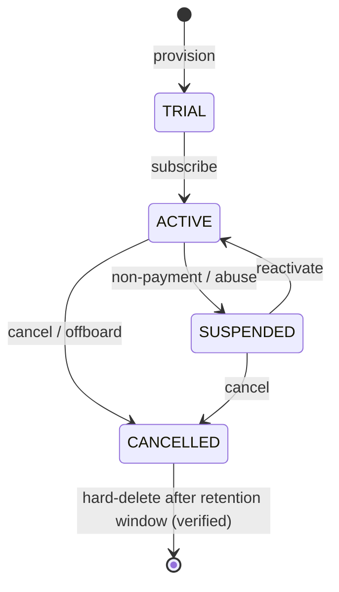

- **Provisioning** (`TenantLifecycle::provision`): create tenant, wallet, default chatbot, per-tenant DEK, storage prefix, seed plan.
- **Suspension:** block all outbound (Property-guarded), keep inbound logging; panels read-only.
- **Offboarding/export:** `export()` produces a portable archive (contacts, conversations, invoices) via signed URL; `offboard()` schedules deletion.
- **Hard-delete with verification:** after the retention window, a purge job deletes tenant rows across all tables **and vector store + object storage**, then a **verification pass** asserts zero residual rows/objects for that `tenant_id` and writes a signed deletion certificate to the audit log (right-to-delete evidence).

---

## Reliability & Fault Tolerance (Deep Dive)

> Extends NFR2. Regeneration adds criteria for circuit breakers (NFR2.3), transactional outbox (NFR2.4), saga compensation (NFR2.5 / B6), and DR targets (NFR2.6).

### Circuit breakers

Three breaker families, each `(scope, name)` scoped and persisted in `circuit_breakers` (Algorithm 7):

| Breaker | Trip threshold | Open duration | Half-open probes | Fallback |
|---|---|---|---|---|
| LLM provider (per provider, per tenant) | ≥5 fails / 30s or >50% err over 20 | 30s | 3 | secondary provider → local heuristic |
| Payment gateway (per gateway) | ≥5 fails / 60s | 60s | 3 | queue + retry; surface "try again" |
| Bridge (per session) | ≥3 fails / 30s | 15s | 2 | hold sends in queue; reconnect flow |

### Idempotency everywhere (outbox pattern)

- **Transactional outbox + relay** (Algorithm 6): any webhook fire / downstream notify / side effect is written to `outbox` **in the same transaction** as the state change, then a relay worker delivers it with a `dedup_key` header; consumers dedup. This turns dual-writes into a single atomic write, giving **effective exactly-once** (Property 16).
- **Dedup keys everywhere:** inbound webhooks dedup on `wa_message_id` (`ShouldBeUnique`), gateway on `gateway_event_id`, sends on `idempotency_key`, generic side effects via `IdempotencyStore::once(scope, key)`.

### Saga pattern for multi-step flows

Order → payment → fulfilment is a **saga** (Algorithm 8) with per-step compensations (reverse reservation, void payment link, cancel order). Sagas are persisted (`sagas`, `saga_steps`) so a crash resumes mid-flight; compensations are idempotent (Property 18).

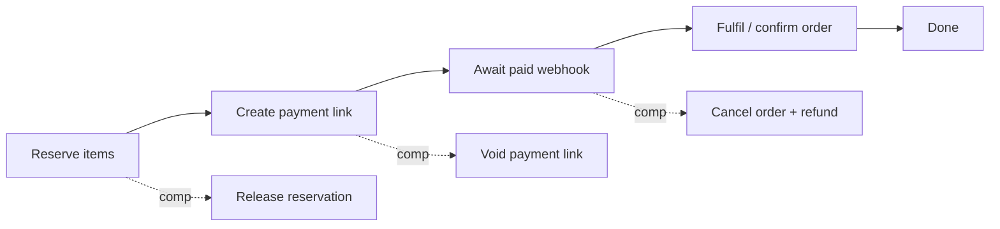

### Disaster recovery

| Target | Value |
|---|---|
| **RPO** (max data loss) | ≤ 5 min (binlog shipping / PITR); ≤ 15 min for object storage |
| **RTO** (max downtime) | ≤ 30 min (restore + reattach workers) |
| MySQL backup | nightly full + continuous binlog; **PITR** tested by restore drills |
| WA auth-state | per-tenant auth dirs backed up encrypted; bridge **session recovery** re-pairs from restored state or prompts re-scan |
| Multi-AZ | primary + standby in a second AZ; replica promotable; object storage cross-AZ replicated |
| Bridge session recovery | on bridge restart, sessions reconnect from persisted auth state; unrecoverable sessions flagged for tenant re-auth |
| DR runbook | documented restore order: DB → object storage → bridge auth → workers → smoke test; quarterly game-day |

---

## Security & Compliance Hardening (Deep Dive)

> Extends NFR3 / D5. Regeneration adds criteria for threat-model coverage (NFR3.5), key rotation (NFR3.6), data-subject requests (D5.5), and abuse/anti-fraud (D5.6).

### STRIDE threat model (main trust boundaries)

| Boundary | Threat (STRIDE) | Mitigation |
|---|---|---|
| Bridge → webhook | **S**poofing inbound events | HMAC signature verify + per-session shared secret; reject on mismatch |
| Gateway → webhook | **T**ampering / replay of payment events | Signature verify + idempotent on `gateway_event_id` + timestamp window |
| Panels (User/Admin) | **E**levation of privilege / cross-tenant | RBAC + global `TenantScope` + `CrossTenantAccessException`; platform guard + IP allowlist for admin |
| Public API | **S**poofing / **D**oS | Sanctum tokens, per-token rate limits, tenant scope, WAF/nginx limits |
| LLM egress | **I**nformation disclosure (PII) | `PiiRedactor` before egress (Property 15); tenant content only when AI enabled; no body logging |
| Vector store | **I**nfo disclosure cross-tenant | payload filter `tenant_id` on every query (Property 20); per-tenant namespaces |
| Audit log | **R**epudiation / tampering | append-only grants + hash-chain (Property 17) |
| Queue/workers | **D**oS via noisy tenant | fair scheduling + per-tenant concurrency caps + breakers |

### Encryption, secrets & key management

- **In transit:** TLS everywhere (nginx termination, internal service mTLS optional); bridge↔PHP over TLS or private network.
- **At rest:** MySQL TDE / disk encryption; **field-level envelope encryption** for sensitive columns (`FieldCipher`, per-tenant DEK).
- **Secrets management:** app secrets from **Vault / cloud KMS-backed secret store**; `.env` is the boundary of last resort in dev. Gateway/LLM keys live in `platform_settings` (secret, redacted) or the secret store; **never exposed to tenants**.
- **Key rotation:** KMS master key rotated on schedule; per-tenant DEKs rotated via `FieldCipher::rotate` (re-wrap, mark old `RETIRING`, lazy re-encrypt on write); webhook/HMAC secrets support **dual-secret rotation** (accept old+new during overlap).

### Compliance (GDPR / DPDP)

- **Data-subject requests:** access/portability via `TenantLifecycle::export`; **right-to-delete** pipeline purges the subject's rows across OLTP, vector store, object storage, and analytics warehouse, with a verification pass + signed deletion certificate.
- **Data retention:** per-tenant retention policy drives partition drops (`messages*`) and archival; configurable per data class.
- **PCI minimization:** hosted checkout / payment links only — **no card data touches the platform** (SAQ-A scope).
- **Audit-log integrity:** append-only + hash-chain (Property 17); admin actions, impersonation, and logins recorded.

### Abuse / anti-fraud

| Vector | Defense |
|---|---|
| Signup abuse (free-trial farming) | email+phone OTP, device/IP heuristics, velocity limits, trial quota caps |
| LLM prompt injection | guardrail input classifier + delimiter fencing + output validation (§AI 1.3); log to `abuse_events` |
| Rate-limit evasion | limits keyed by (tenant, session, contact); anomaly detection on burst patterns; no bypass parameter |
| WhatsApp ToS / ban risk | opt-out non-bypassable, warm-up caps hard-enforced, per-session risk scoring, tenant education, kill-switch for offending sessions |
| Payment fraud | gateway-side fraud tools + wallet non-negativity + chargeback handling via gateway events |

---

## Observability & Operations (Deep Dive)

> Extends D4 / NFR1. Regeneration adds criteria for tracing (D4.4), SLOs/error budgets (D4.5), cost attribution (D2.4), and deployment safety (NFR-ops).

### Distributed tracing & structured logging

- **Correlation/trace IDs** flow **panel → job → bridge → webhook**: a `trace_id` is minted at ingress (panel request or inbound webhook), stored on the job payload, propagated to the bridge via header and echoed on its webhook, and attached to every log line and `traces` row. `Tracer::startSpan` wraps engine stages and external calls.
- **Structured logging schema (JSON):** `{ts, level, trace_id, span_id, tenant_id, session_id?, conversation_id?, event, latency_ms, outcome, err_class?}`. **Phone numbers redacted, message bodies never logged** (only content hashes) — carried forward from the engine.
- **Metrics taxonomy:** `wacb_<subsystem>_<metric>` — e.g. `wacb_ai_reply_latency_ms` (histogram, tags `model,cache_hit,escalated`), `wacb_queue_depth{lane}`, `wacb_send_total{status}`, `wacb_breaker_state{scope,name}`, `wacb_llm_cost_micros{tenant}`. Exposed at `/metrics` (Prometheus).

### SLOs / SLIs & error budgets

| Subsystem | SLI | SLO | Error budget |
|---|---|---|---|
| Inbound→reply | % replies enqueued < 3s | 99% / 30d | 1% |
| Send pipeline | % sends delivered to bridge < 2s (excl. anti-ban wait) | 99.5% | 0.5% |
| Webhook intake | % 2xx & processed | 99.9% | 0.1% |
| Billing webhooks | % processed exactly-once < 10s | 99.95% | 0.05% |
| Panel availability | % 2xx < 1s | 99.9% | 0.1% |

Burning >2× budget triggers a freeze on risky deploys. **Alerting rules** (dedup via `alerts.fingerprint`): breaker OPEN, queue age p95 breach, replica lag, payment webhook failures, session disconnect storms. Each alert links a **runbook** (symptom → checks → mitigation → escalation). On-call playbook summaries live in `kb_articles`.

### Per-tenant dashboards & cost attribution

- Per-tenant dashboards (from `metrics_rollup`): message volume, delivery/read rates, bot deflection rate, handoff rate, AI reply latency, sentiment trend.
- **Cost attribution:** `llm_usage.cost_micros` + message counts + storage bytes rolled up per tenant → shown in admin (margin analysis) and optionally billed against `AI_CREDITS`/wallet.

### Deployment strategy

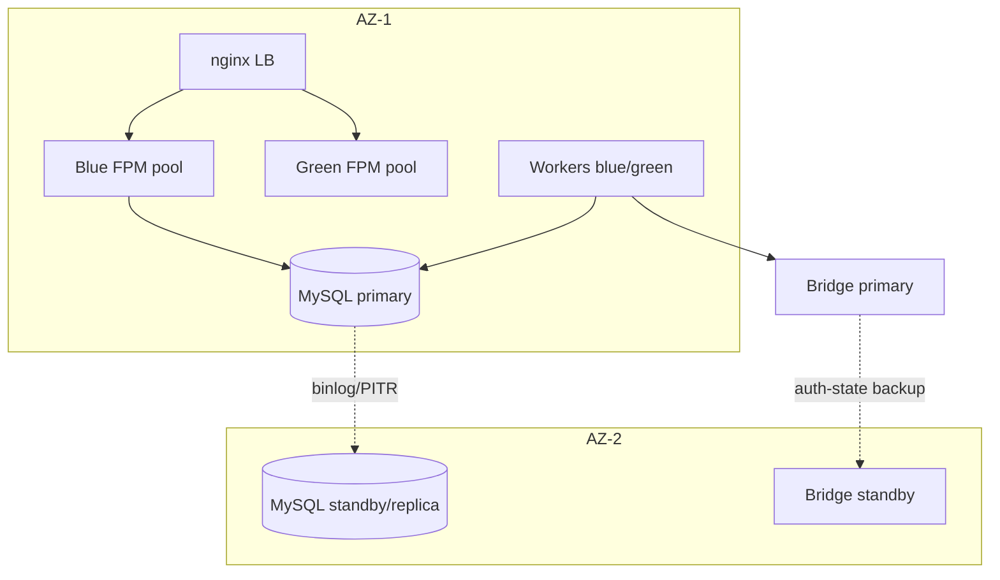

- **Blue-green / rolling** FPM pools behind nginx; workers drained gracefully (finish in-flight jobs, stop consuming) — **zero-downtime queue drain**.
- **Migration safety = expand-contract:** add columns/tables (expand) → deploy code that writes both → backfill → switch reads → drop old (contract), so schema and code are always compatible during rollout. Partitioned tables get partitions pre-created.
- **Feature-flag rollout:** new subsystems ship behind `feature_flags` (global or per-tenant), enabling canary tenants first.
- **Rollback:** code rollback is a pool swap; DB is forward-compatible by design (expand-contract), so rollback never requires a destructive down-migration.

---

## Advanced Chatbot Capabilities (Deep Dive)

> Extends B3–B8. Regeneration adds criteria for multi-agent routing (B4.6), tool registry (B7.5), A/B testing (B7.6), rich messages (B3.4), STT/media (B7.7), and drip sequences (B6.5).

### Multi-agent orchestration

A **router agent** classifies the inbound and dispatches to a **specialist agent/skill** (sales, support, billing, booking). Each skill scores `canHandle` and can emit a reply, request tool calls, or hand off. Skills are registered in `agents_registry`; the router uses structured output (JSON function-calling) to pick. Falls back to single-agent LLM when no router is configured.

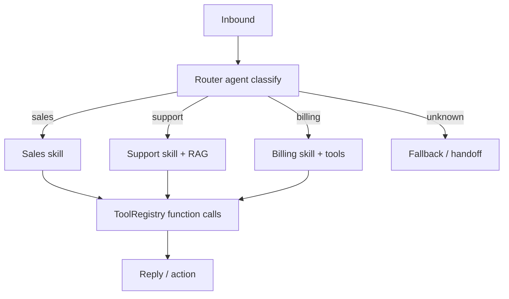

- **Tool/function-calling registry** (`tools_registry`): per-tenant tools with JSON Schemas exposed to the model; `ToolRegistry::invoke` validates args, runs the handler **idempotently**, returns typed results. Tools are the only way the model triggers side effects (create order, check status, book slot).

### A/B testing of flows & replies

`AbTester` gives **sticky** variant assignment per unit (conversation/contact, stored in `ab_assignments`) and records the metric (deflection, conversion, CSAT). Weighted variants; results surfaced with basic significance. Everyone gets control when A/B is disabled.

### Flow analytics & funnels

`flow_analytics_events` (ENTER/COMPLETE/DROP/ERROR per node) power **funnels** (drop-off per step, completion rate) rolled into `metrics_rollup`.

### Rich interactive WhatsApp messages & graceful degradation

Buttons, list messages, and product/catalog messages are modeled as typed `OutboundContent` variants. The `BridgeClient` reports capability; **if the bridge/session doesn't support a rich type, it degrades** to a numbered-text menu (the `menu` node already parses numeric choices), so flows work everywhere.

| Rich type | Native | Degraded fallback |
|---|---|---|
| Reply buttons | interactive buttons | "Reply 1/2/3" numbered text |
| List message | sectioned list | numbered text menu |
| Product/catalog | product cards | text w/ name, price, link |

### Voice notes (STT) & media understanding

Inbound voice notes are transcribed via `SpeechToText` (optional) into `media_transcripts`, then fed to the normal pipeline as text; images can be OCR'd/described (media understanding). Optional **TTS** for outbound voice degrades to text when disabled. No STT bound → ask the user to type (degraded, still functional).

### Scheduled / drip sequences & re-engagement

`campaign_sequences` + `sequence_enrollments` drive **drip** conversations and **re-engagement** triggered by conversation state (e.g. cart abandoned → follow-up at +1h/+24h). Steps respect opt-out, quiet hours, and quota (no bypass). A scheduler advances enrollments at `next_run_at`.

---

## Channel Mode — Pluggable Messaging Backends (Deep Dive)

> **Net-new subsystem.** Today the platform sends and receives WhatsApp traffic through exactly one backend: the thin **Node + Baileys "WA Bridge"** (WhatsApp Web multi-device protocol). This section generalizes that single wire into a **pluggable, per-tenant *and* per-session selectable messaging backend** — a **Channel Mode**. A tenant can choose, per connected number, *how* that number talks to WhatsApp: the unofficial Baileys web protocol (full features, higher ban risk), Meta's official Cloud API (lower ban risk, stricter rules), the legacy On-Premise API, or an official BSP/gateway partner (Twilio, 360dialog, Gupshup, …).
>
> **Scope note (new requirements implied).** This introduces a genuinely new capability that will require a **new requirement on regeneration: Requirement A8 — Channel Mode / pluggable messaging backends** (see §New Requirements). It deepens A2 (sessions), A3 (messaging/send gate, Algorithm 3), A4 (anti-ban), A5/A6 (groups/channels/extraction capability-gating), B1 (inbound webhook routing), and NFR2/NFR4 (reliability/maintainability).
>
> **MySQL-only / Baileys default still holds (Design Principle 3 & 9).** `BAILEYS` remains the zero-official-API default: a tenant needs **no** Meta WABA, no Cloud API token, and no BSP account to run the platform end-to-end. Every other mode is opt-in config; when its credentials are absent that mode simply cannot be selected, and the platform keeps working on Baileys.

### 2.1 Motivation & the abstraction

The existing `BridgeClient` interface already keeps the send/receive wire behind a swappable contract (Design Principle 1, NFR4.1). Channel Mode **generalizes `BridgeClient` into a driver family**: `BridgeClient` becomes the **transport contract** that every channel driver implements, and a `ChannelMode` value on each session selects *which* driver instance handles that session. The current `HttpBridgeClient` (Baileys) becomes **one driver among several** (`BaileysChannelDriver`) — no behavioural change for existing tenants.

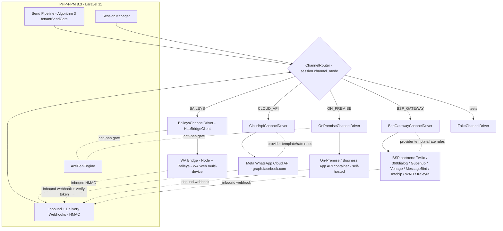

**Key structural points:**

- A single **`ChannelRouter`** resolves `session.channel_mode → ChannelDriver` for *every* outbound send, inbound webhook, and management operation. A message is dispatched to **exactly one** driver — the driver of its session's mode (Correctness Property 22).
- Baileys and On-Premise are **WhatsApp-web-protocol** modes → the existing **anti-ban gate** (warm-up ramp, gaussian delay, quiet hours, risk scoring) applies unchanged. Cloud API and BSP are **official** modes → they follow the **provider's own rate limits + template/24-hour-window rules** instead of the anti-ban warm-up ramp (documented branch below; Property 24).
- Capabilities differ per mode. Any operation a session's mode does not support is **rejected up-front with a typed `ModeCapabilityException`, never a crash** — reusing the existing capability-handshake/gating pattern used for rich messages and group-admin checks (Correctness Property 21).

### 2.2 The four modes (+ test double)

| # | Mode (`ChannelMode`) | Driver | What it is | Ban risk / compliance | Anti-ban engine |
|---|---|---|---|---|---|
| 1 | `BAILEYS` **(default)** | `BaileysChannelDriver` | Existing Node + Baileys bridge; **WhatsApp Web multi-device** reverse-engineered protocol | **Highest** — unofficial; anti-ban **mandatory** | **Applies (full)** |
| 2 | `CLOUD_API` | `CloudApiChannelDriver` | **Meta WhatsApp Cloud API** (official Business Platform, Meta-hosted) | **Lowest** — official; strict template/session-window rules | Provider rules (no warm-up ramp) |
| 3 | `ON_PREMISE` | `OnPremiseChannelDriver` | **WhatsApp Business App / On-Premise API** (legacy, self-hosted client container) | Low-medium — official but **deprecated by Meta** | **Applies** (web-protocol-adjacent, self-hosted) |
| 4 | `BSP_GATEWAY` | `BspGatewayChannelDriver` | **Third-party BSP / gateway partners** (Twilio, 360dialog, Gupshup, Vonage, MessageBird, Infobip, WATI, Kaleyra, …) on official partner routes | Low — official via partner; partner + Meta rules | Provider rules (per-provider) |
| — | *(tests)* | `FakeChannelDriver` | Deterministic in-memory driver | n/a | configurable |

**Mode 1 — Baileys Bridge (default, full feature set).** Unchanged from the current design: groups (create/admin/settings/approve/welcome/tagging), channels/newsletters, all media, member extraction + active-number filtering + export, templates-as-text, interactive buttons/lists where the WA version supports them. Because it rides the WhatsApp Web protocol on an unregistered/consumer number, **ban risk is real** → the **anti-ban engine is required and non-bypassable** (Req A4, unchanged). This is the only mode that needs **zero** official-API onboarding.

**Mode 2 — Meta WhatsApp Cloud API (official).**
- **Capabilities:** single + bulk send, media (image/doc/audio/video/sticker), **template messages** (pre-approved, for messages outside the 24-hour customer-service window), **interactive buttons/lists**, official **inbound webhooks** (with `verify_token` handshake) and **delivery/read receipts**, phone-number registration under a **WABA (WhatsApp Business Account)**.
- **Limitations vs Baileys (must degrade cleanly):** **no group management** (create/admin/tag/welcome), **no channels/newsletters management**, **no member extraction/scraping**, free-form messages only allowed **inside a 24-hour user-initiated window** — outside it, **only approved templates** may be sent. Bulk to cold audiences must be template-based and quality-rated (Meta messaging limits / tiered throughput). Every unsupported op → `ModeCapabilityException` (never crash).
- **Onboarding:** WABA id + phone-number id + system-user **access token** + webhook **verify token**; number is registered/migrated into the Cloud API (a number on Cloud API cannot simultaneously run on the consumer app). **Lower ban risk** and higher deliverability are the trade for stricter rules and per-conversation pricing.

**Mode 3 — WhatsApp Business App API / On-Premise (legacy, deprecated).**
- Self-hosted Business/On-Premise API client (container) — an **official** route historically used before Cloud API. **Meta has deprecated the On-Premise API**; new onboarding is closed and sunset is ongoing.
- **Supported for tenants who still run it**, with a **documented migration path → Cloud API** (`ON_PREMISE → CLOUD_API`: register the number on Cloud API, re-point webhooks, migrate templates). Capability set is close to Cloud API (templates, session window, media, interactive) but **self-hosted** (tenant runs the container). Marked **deprecated** in the capability matrix and UI so tenants are steered to Cloud API or a BSP.

**Mode 4 — Third-party BSP / Gateway providers (official partner routes).**
- One driver, **many providers** behind a per-provider adapter: **Twilio, 360dialog, Gupshup, Vonage (Nexmo), MessageBird, Infobip, WATI, Kaleyra**, and any future partner. Each is an official **Business Solution Provider** fronting Meta, so it inherits Cloud-API-style rules (templates, session window, official webhooks, delivery receipts) with **per-provider quirks** (endpoint, auth scheme, template sync API, media handling).
- Capabilities are declared by a **per-provider capability sub-matrix** (below) resolved at runtime from provider config, so the same `BspGatewayChannelDriver` reports different `supports()` per provider. Unsupported ops → `ModeCapabilityException`.

### 2.3 Capability matrix (mode → capability)

Every driver implements `supports(ChannelCapability): bool`. The router/pipeline consults it **before** dispatch; a `false` short-circuits to a typed `ModeCapabilityException` (Property 21). `✅ native · ⚠️ degraded/conditional · ❌ unsupported → ModeCapabilityException`.

| Capability (`ChannelCapability`) | `BAILEYS` | `CLOUD_API` | `ON_PREMISE` (deprecated) | `BSP_GATEWAY` |
|---|:---:|:---:|:---:|:---:|
| Single send (text) | ✅ | ✅ | ✅ | ✅ |
| Bulk send | ✅ (anti-ban paced) | ⚠️ template + quality tier | ⚠️ template + tier | ⚠️ per-provider tier |
| Media (image/doc/audio/video/sticker) | ✅ | ✅ | ✅ | ⚠️ per provider |
| Free-form text anytime | ✅ | ⚠️ only in 24h session window | ⚠️ 24h window | ⚠️ 24h window |
| Template messages (approved) | ⚠️ text-templated only | ✅ | ✅ | ✅ (provider template sync) |
| Buttons / lists / interactive | ⚠️ if WA version supports | ✅ | ✅ | ⚠️ per provider |
| Group management (create/admin/settings) | ✅ | ❌ | ❌ | ❌ |
| Auto-welcome on join | ✅ | ❌ | ❌ | ❌ |
| Group member extraction / active-number filter | ✅ | ❌ | ❌ | ❌ |
| Tagging (tag all / selective / custom) | ✅ | ❌ | ❌ | ❌ |
| Channels / newsletters management | ✅ | ❌ | ❌ | ❌ |
| Inbound webhooks (customer messages) | ✅ (bridge HMAC) | ✅ (Meta + verify token) | ✅ | ✅ (provider signature) |
| Delivery / read receipts | ✅ | ✅ | ✅ | ⚠️ per provider |
| Anti-ban warm-up / rate ramp needed | ✅ **mandatory** | ❌ (provider rules) | ✅ | ❌ (provider rules) |
| Zero official-API onboarding | ✅ | ❌ | ❌ | ❌ |

> **BSP per-provider sub-matrix** (resolved from `channel_credentials.meta`): e.g. Twilio & Vonage do buttons/lists via content templates; 360dialog/Gupshup/WATI expose Cloud-API-equivalent interactive + template-sync APIs; media size/type caps vary. The driver reports each provider's real `supports()` at runtime rather than assuming one profile.

### 2.4 Driver interface (PHP)

`ChannelDriver` **extends** the existing `BridgeClient` transport contract (so Baileys' current implementation satisfies it unchanged) and adds capability declaration, official-webhook handling, and template/registration hooks that only official modes use.

```php
namespace App\Services\Channel;

enum ChannelMode: string {
    case Baileys    = 'BAILEYS';       // default: Node + Baileys WA Web multi-device
    case CloudApi   = 'CLOUD_API';     // Meta WhatsApp Cloud API (official)
    case OnPremise  = 'ON_PREMISE';    // WhatsApp Business/On-Premise API (deprecated)
    case BspGateway = 'BSP_GATEWAY';   // Twilio / 360dialog / Gupshup / Vonage / ... (official BSP)
}

enum ChannelCapability: string {
    case SendSingle='SEND_SINGLE'; case SendBulk='SEND_BULK'; case Media='MEDIA';
    case FreeFormAnytime='FREE_FORM_ANYTIME'; case Template='TEMPLATE'; case Interactive='INTERACTIVE';
    case Groups='GROUPS'; case Welcome='WELCOME'; case Extraction='EXTRACTION'; case Tagging='TAGGING';
    case Channels='CHANNELS'; case InboundWebhook='INBOUND_WEBHOOK'; case DeliveryReceipts='DELIVERY_RECEIPTS';
}

/** Every messaging backend implements this. Baileys' existing HttpBridgeClient satisfies BridgeClient unchanged. */
interface ChannelDriver extends \App\Services\Bridge\BridgeClient
{
    public function mode(): ChannelMode;

    /** Capability gate — consulted BEFORE dispatch; false ⇒ ModeCapabilityException (never a crash). */
    public function supports(ChannelCapability $cap): bool;

    /** Whether this web-protocol mode must pass the anti-ban warm-up/rate gate (Baileys/On-Prem = true). */
    public function requiresAntiBan(): bool;

    /** Send an outbound message via this backend; MUST be idempotent on $content->idempotencyKey. */
    public function send(Session $session, OutboundContent $content): SendReceipt;

    /** Parse & verify a provider-specific inbound/delivery webhook into the platform's canonical event. */
    public function parseWebhook(Request $r, ChannelCredentials $creds): InboundEvent;

    /** Official modes only: send/sync approved templates. Baileys ⇒ ModeCapabilityException. */
    public function sendTemplate(Session $session, TemplateRef $tpl, array $vars): SendReceipt;

    /** Register/verify the number for this mode (Cloud API: WABA/phone-number id; BSP: provider number). */
    public function register(Session $session, ChannelCredentials $creds): RegistrationResult;

    public function healthCheck(ChannelCredentials $creds): ChannelHealth;
}

/** Resolves session.channel_mode → the correct driver, for send / inbound / management. */
interface ChannelRouter
{
    public function driverFor(Session $session): ChannelDriver;      // exactly-one (Property 22)
    public function driverForMode(ChannelMode $mode, Tenant $t): ChannelDriver;

    /** Optional per-tenant failover chain (e.g. CLOUD_API primary → BAILEYS fallback), circuit-breaker gated. */
    public function failoverChain(Session $session): array;          // [primaryDriver, ...fallbacks]

    /** Throws ModeCapabilityException if the session's mode does not support $cap. */
    public function assertSupported(Session $session, ChannelCapability $cap): void;
}

/** Per-tenant, per-mode credentials/config — secret-redacted, envelope-encrypted (FieldCipher). */
interface ChannelCredentialStore
{
    public function for(Tenant $t, ChannelMode $mode): ChannelCredentials; // decrypted in-request only
    public function put(Tenant $t, ChannelMode $mode, array $secretConfig): void; // encrypted at rest
}
```

Concrete drivers: **`BaileysChannelDriver`** (wraps the existing `HttpBridgeClient` — the current bridge, unchanged), **`CloudApiChannelDriver`**, **`OnPremiseChannelDriver`**, **`BspGatewayChannelDriver`** (with per-provider adapters), plus **`FakeChannelDriver`** for tests. All are bound behind `ChannelDriver`, so adding a future backend is a new class + enum case + credential shape — never a rewrite (NFR4).

### 2.5 Per-session mode selection & the send/inbound path

Each WhatsApp session stores **which mode it uses** (`sessions_wa.channel_mode`, default `BAILEYS`). Every subsystem respects it:

- **`SessionManager::create`** records the chosen `channel_mode` and, for official modes, calls `driver->register(...)` (Cloud API WABA/phone-number verification, BSP number provisioning) before marking the session live. A Baileys session still just pairs via QR.
- **Send pipeline (Algorithm 3 `tenantSendGate`)** — extended to resolve the driver and branch anti-ban by mode (Algorithm 9 below). Plan gate + quota are **mode-independent** (a message is a message for billing); the **anti-ban gate runs only when `driver->requiresAntiBan()`** — otherwise the provider's own template/rate rules apply.
- **Inbound webhook routing (B1)** — the webhook controller resolves tenant + session, then `router->driverFor(session)->parseWebhook(...)` normalizes the provider-specific payload (Baileys HMAC / Meta `verify_token` + signature / BSP signature) into one canonical `InboundEvent` fed to the ConversationEngine. Provider→session mapping lives in `channel_webhook_routes`.
- **Capability-sensitive services** (groups, welcome, extraction, tagging, channels) call `router->assertSupported(session, cap)` first; on an official mode this throws `ModeCapabilityException` **before** any driver call — exactly how group-admin checks already reject ops pre-Bridge-call (Req A5.2 pattern).

### Algorithm 9 — Mode-aware send gate (extends Algorithm 3)

```php
function channelSendGate(session, message): GateVerdict
```
**Preconditions:** `session.tenant_id = message.tenant_id`; `session.channel_mode` set; plan/quota gate (Algorithm 3) already passed or is composed before this step.
**Postconditions:** message is handed to **exactly one** driver — the one for `session.channel_mode`; an operation unsupported by that mode is rejected with `ModeCapabilityException` and never dispatched; anti-ban warm-up/rate applies **iff** the mode is a web-protocol mode; official modes enforce template/session-window rules instead.

```pascal
ALGORITHM channelSendGate(session, message)
BEGIN
    driver <- channelRouter.driverFor(session)          // exactly-one by session.channel_mode

    cap <- capabilityFor(message)                       // e.g. GROUPS, TEMPLATE, INTERACTIVE, SEND_BULK
    IF NOT driver.supports(cap) THEN
        RETURN block(MODE_CAPABILITY, ModeCapabilityException(session.channel_mode, cap))
    END IF

    IF driver.requiresAntiBan() THEN                    // BAILEYS, ON_PREMISE
        v <- antiBanEngine.gate(message)                // unchanged warm-up/rate/quiet-hours
        IF v.defer THEN RETURN defer(v.seconds) END IF
        IF v.block THEN RETURN block(v.reason) END IF
    ELSE                                                // CLOUD_API, BSP_GATEWAY
        IF outsideSessionWindow(session, message) AND NOT message.isApprovedTemplate THEN
            RETURN block(TEMPLATE_REQUIRED)             // official 24h-window rule
        END IF
        r <- driver.providerRateVerdict(message)        // provider tier / messaging limit
        IF r.defer THEN RETURN defer(r.seconds) END IF
    END IF

    RETURN allow(driver)                                // caller dispatches via this exact driver
END
```

### 2.6 Routing & fallback

- **Routing:** `ChannelRouter::driverFor(session)` is the single point that maps `channel_mode → driver`; the send pipeline, inbound webhook, and management services all go through it, so routing is **exactly-once and centralized** (Property 22).
- **Optional per-tenant multi-mode failover** (opt-in, plan-gated): a tenant may configure a chain, e.g. **`CLOUD_API` primary → `BAILEYS` fallback**. If the primary driver's **circuit breaker** (reuse §Reliability `CircuitBreaker`, scope `(channel, mode:sessionId)`) is OPEN or the send fails as retryable, the router advances to the next driver in `failoverChain(session)`. **Trade-offs, documented:** a Cloud-API→Baileys fallback silently changes ban-risk profile and re-enables anti-ban pacing; template-only content cannot fail back to a free-form Baileys send without a text rendering; a number registered on Cloud API generally cannot also be live on Baileys simultaneously — so failover is best across **different numbers/sessions** of the tenant, not the same number. Default is **no failover** (single mode per session) for predictability; failover is an explicit, audited tenant choice.

### 2.7 Config & credentials (per tenant, per mode)

Each mode carries its own config, stored **per tenant** in `channel_credentials`, **secret-redacted in UI/logs** and **envelope-encrypted at rest** via the existing `FieldCipher` (per-tenant KMS-wrapped DEK, consistent with §Security). Never exposed to other tenants; platform-level BSP master keys (if any) live in `platform_settings` (secret).

| Mode | Required config | Secret fields (encrypted) |
|---|---|---|
| `BAILEYS` | bridge base URL, QR/pairing (interactive) | bridge shared token / HMAC secret |
| `CLOUD_API` | WABA id, phone-number id, API version | system-user **access token**, webhook **verify token**, app secret |
| `ON_PREMISE` | on-prem base URL, phone number | client API user/password/token, webhook secret |
| `BSP_GATEWAY` | provider (enum), endpoint/base URL, sender id/number | provider **api key/secret**, webhook signing secret |

### 2.8 Decision / trade-off table (which mode when)

| Mode | Chosen for | Rejected/avoid when | Rationale (ban-risk vs features vs rules) |
|---|---|---|---|
| `BAILEYS` **(default)** | Full feature set (groups, channels, extraction, tagging, welcome); no official onboarding; SMB / community | High-volume cold outreach; ban-averse brands; regulated senders | **Full features, highest ban risk** → anti-ban engine **mandatory**; zero-setup default keeps the MySQL-only/Baileys promise |
| `CLOUD_API` | Official deliverability, brand safety, notifications/OTP/template campaigns, verified business | Group management, member extraction, scraping (unsupported) | **Lowest ban risk, stricter rules** (templates + 24h window, per-conversation pricing); no groups/extraction → those ops `ModeCapabilityException` |
| `ON_PREMISE` | Tenants already running the legacy self-hosted API; data-locality needs | New deployments (Meta deprecated it) | Official but **deprecated** → documented **migration to Cloud API**; self-hosted operational burden |
| `BSP_GATEWAY` | Official reach without direct WABA ops, per-region partner, existing Twilio/360dialog/etc. contract | Needing groups/extraction; providers lacking a needed capability | Official via partner, **low ban risk**, provider-specific capability + pricing; one driver, many providers |

**Compliance/ban-risk summary:** official modes (`CLOUD_API`, `BSP_GATEWAY`) trade features (no groups/extraction) and free-form freedom (template + 24h window) for **low ban risk, higher deliverability, and Meta-sanctioned scale**; unofficial `BAILEYS` (and self-hosted `ON_PREMISE`'s web-adjacent surface) trade ban risk for **full features** — so anti-ban is **mandatory and non-bypassable** there (Req A4, unchanged).

---

## WhatsApp Groups — Full Management Design (Deep Dive)

> **Completeness note.** Requirement **A5** and the reused single-tenant `GroupService` are itemized here to **full, production-ready** completeness — every group lifecycle operation, with its `GroupService` method, the data models it touches, the capability it requires, and the exact WA status-code mapping. No group operation is a stub. All operations are **tenant-scoped** (`BelongsToTenant`), **capability-gated** (`Groups` capability → Baileys-only; official modes reject with `ModeCapabilityException`, Property 21), and **admin-guarded before any bridge call** (Req A5.2, Property 25 below).

### G.1 `GroupService` interface (PHP)

```php
namespace App\Services\Groups;

interface GroupService
{
    // ---- Lifecycle & metadata ----
    public function create(Session $s, string $subject, array $participants = []): GroupRef;
    public function delete(Session $s, GroupRef $g): void;                       // leave + tombstone
    public function updateMetadata(Session $s, GroupRef $g, GroupMetadata $meta): void; // name/description/icon

    // ---- Invite links ----
    public function inviteLink(Session $s, GroupRef $g): InviteLink;             // get current
    public function revokeInviteLink(Session $s, GroupRef $g): InviteLink;       // rotate -> new code
    public function joinViaLink(Session $s, string $code): JoinResult;

    // ---- Admin management (returns per-target WA status) ----
    public function addParticipants(Session $s, GroupRef $g, array $jids): ParticipantOpResult;   // ADDED|INVITE_SENT|ALREADY_MEMBER|FAILED
    public function removeParticipants(Session $s, GroupRef $g, array $jids): ParticipantOpResult;
    public function promote(Session $s, GroupRef $g, array $jids): ParticipantOpResult;
    public function demote(Session $s, GroupRef $g, array $jids): ParticipantOpResult;

    // ---- Settings (audited) ----
    public function setSettings(Session $s, GroupRef $g, GroupSettings $settings): void; // announcement/locked/ephemeral/approval

    // ---- Join-request inbox + auto-approve rules ----
    public function pendingJoinRequests(Session $s, GroupRef $g): array;         // JoinRequest[]
    public function resolveJoinRequest(Session $s, GroupRef $g, string $jid, JoinDecision $d): void; // approve|reject
    public function evaluateAutoApprove(Session $s, GroupRef $g, JoinRequest $r): JoinDecision;       // ordered rules

    // ---- Reconciliation & bulk ----
    public function reconcileMembers(Session $s, GroupRef $g): ReconcileReport;  // bridge truth -> DB
    public function bulkAddParticipants(Session $s, GroupRef $g, iterable $jids, int $chunk = 50): BatchRef; // chunked jobs

    // ---- Welcome ----
    public function sendWelcome(Session $s, GroupRef $g, array $newMembers): void; // per-member|combined, media, dynamic card w/ text fallback, duplicate-guard

    // ---- Extraction & export ----
    public function extractMembers(Session $s, GroupRef $g, ExtractOptions $o): \Generator; // generator, temp-table de-dup, active-filter
    public function export(Session $s, GroupRef $g, ExportFormat $fmt): SignedUrl;

    // ---- Tagging ----
    public function tagAll(Session $s, GroupRef $g, TagOptions $o): TagResult;    // hidden mentions, 200/chunk, cooldown, admin-only
    public function tagSelective(Session $s, GroupRef $g, array $jids, TagOptions $o): TagResult;
}

interface GroupAdminGuard {
    /** Throws NotGroupAdminException BEFORE any bridge mutation (Req A5.2, Property 25). */
    public function assertBotIsAdmin(Session $s, GroupRef $g): void;
    public function botIsAdmin(Session $s, GroupRef $g): bool;   // cached from last reconcile
}
```

Every admin-requiring method calls `GroupAdminGuard::assertBotIsAdmin` (and `ChannelRouter::assertSupported($s, Groups)`) **first**, so an op is rejected **before** any bridge call when the bot is not an admin or the session's mode is official (Property 21 + Property 25).

### G.2 Participant op — WA status-code mapping

`addParticipants`/`removeParticipants`/`promote`/`demote` return a `ParticipantOpResult` mapping each target JID to a normalized status derived from the WhatsApp participant-action response codes:

| Normalized status | Meaning | Typical WA code |
|---|---|---|
| `ADDED` | Added directly to the group | 200 |
| `INVITE_SENT` | Privacy settings blocked direct add; invite link sent instead | 403 / 409 (privacy) |
| `ALREADY_MEMBER` | Target already in the group | 409 (present) |
| `FAILED` | Not on WhatsApp / bad JID / other error | 404 / 500 |

The mapping is deterministic and unit-tested; the UI shows a per-target result table so a bulk add never fails opaquely.

### G.3 Settings control (audited)

`setSettings` toggles are written to the group and **audited** (`audit_logs`, hash-chained): **announcement** (only admins post), **locked** (only admins edit metadata), **ephemeral** (disappearing-message timer), **approval mode** (membership approval on/off). Each toggle requires bot-admin and records `{group, field, from, to, actor}`.

### G.4 Join-request inbox + ordered auto-approve rules

Pending join requests populate a tenant inbox (`pendingJoinRequests`). Auto-approval evaluates rules in a **fixed, first-decisive order** so behavior is predictable (mirrors the resolution-pipeline pattern):

1. **Blocklist** — if the requester is on the tenant/global blocklist → **reject** (short-circuit, highest priority).
2. **Country code** — allow/deny by configured country-code allow/deny lists.
3. **Regex** — match the requester's number/name against tenant regex rules.
4. **Manual** — no rule decisive → leave **pending** for a human in the inbox.

```pascal
ALGORITHM evaluateAutoApprove(request)
BEGIN
    IF blocklist.contains(request.jid) THEN RETURN REJECT END IF       // rule 1 (wins)
    IF countryRule.decisive(request.cc) THEN RETURN countryRule.decision END IF  // rule 2
    IF regexRule.matches(request) THEN RETURN regexRule.decision END IF          // rule 3
    RETURN PENDING                                                      // rule 4: manual
END
```

### G.5 Auto-welcome (exactly once per join)

`sendWelcome` supports **per-member** vs **combined** welcome, **media welcome**, and a **dynamic card** (rich message) with **text fallback** when the session/mode can't render the card (degradation table, §Advanced Chatbot). A **duplicate-guard** ensures the welcome is sent **exactly once per join** even on rejoin spam (Req A5.3): a `(group_id, jid, join_epoch)` guard row is inserted transactionally before send; a rejoin with the same epoch is a no-op. **Welcome template rotation / A-B** picks the next template variant (sticky via `AbTester` when A/B is enabled) so repeated welcomes vary. Covered by **Correctness Property 25** (welcome exactly once) — see updated properties.

### G.6 Number extraction, reconciliation, bulk & export

- **Extraction** (`extractMembers`) is **generator-based** (streams members, never loads the whole group into memory), de-dups through a **temp table** keyed by normalized JID, and applies **active-number filtering** (only numbers currently on WhatsApp). Requires the `Extraction` capability (Baileys) and bot-admin.
- **Reconciliation** (`reconcileMembers`) pulls the bridge's ground-truth participant list and updates the DB (adds/removes), caching bot-admin status for the guard.
- **Bulk participant jobs** (`bulkAddParticipants`) split the target list into **chunked** queued jobs (default 50/chunk) so a large add is retry-safe and rate-paced by anti-ban.
- **Export** streams to CSV/TXT/JSON/XLSX/vCard under the tenant storage prefix, served via a **signed expiring URL** (A6.3, §Base URL).

### G.7 Tag-all / selective / custom tagging

`tagAll`/`tagSelective` send **hidden mentions** (mention JIDs without visible @text where supported), **split into 200-mentions-per-chunk** messages (WA mention cap), apply a **per-group cooldown** (anti-spam, reuses anti-ban), and are **admin-only guarded**. Custom tagging accepts an arbitrary JID subset + message template.

### G.8 Group lifecycle (diagram)

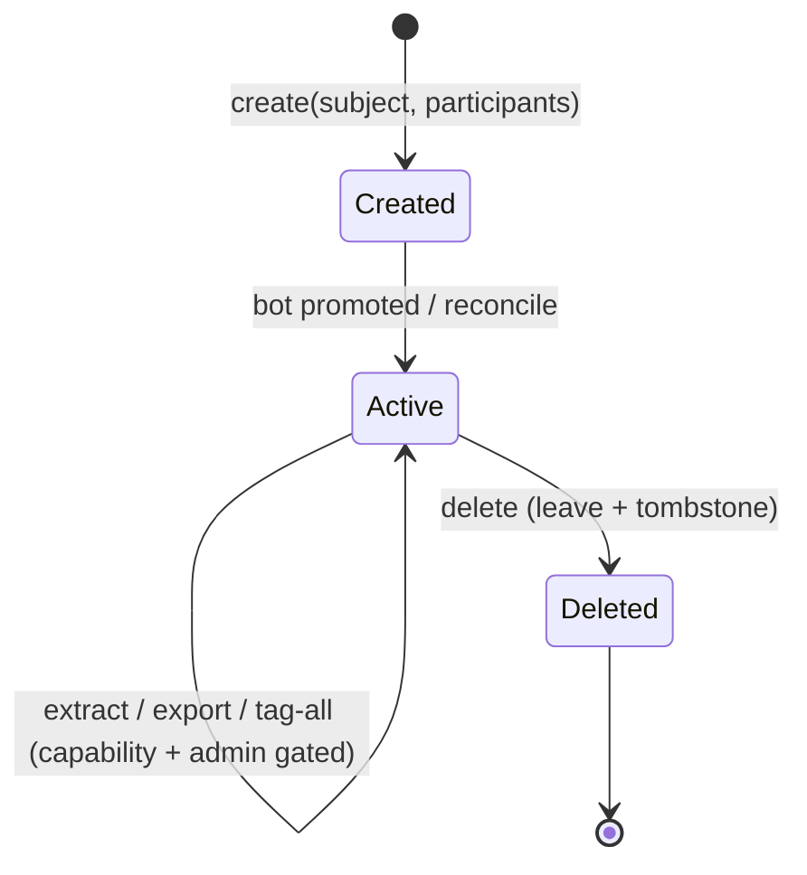

**Capability & guard summary:** all group ops require `Groups` capability (Baileys; official modes → `ModeCapabilityException` before dispatch) **and** bot-admin (`assertBotIsAdmin` before any bridge mutation). Extraction/tagging additionally require `Extraction`/`Tagging` capabilities. Data models touched: reused `groups`, `group_members`, `group_settings`, `welcome_*`, `opt_outs`, plus tenant-prefixed export files.

---

## WhatsApp Channels — Full Management Design (Deep Dive)

> **Completeness note.** Requirement **A6** (channels/newsletters) is itemized here to **full, production-ready** completeness across the applicable channel modes. Channels/newsletters are a **Baileys-only** capability (`Channels` capability); on official modes (`CLOUD_API`/`ON_PREMISE`/`BSP_GATEWAY`) every channel op is rejected with a typed `ModeCapabilityException` **before** any driver call (Property 21) — never a crash, never a silent no-op. All ops are tenant-scoped.

### CH.1 `ChannelService` interface (PHP)

```php
namespace App\Services\Channels;

interface ChannelService
{
    // ---- Lifecycle & metadata ----
    public function create(Session $s, string $name, ?string $description = null): ChannelRef; // newsletter
    public function delete(Session $s, ChannelRef $c): void;
    public function updateMetadata(Session $s, ChannelRef $c, ChannelMetadata $m): void; // name/description/picture

    // ---- Subscriber / member management ----
    public function subscribers(Session $s, ChannelRef $c): \Generator;          // streamed
    public function addAdmin(Session $s, ChannelRef $c, string $jid): void;
    public function removeAdmin(Session $s, ChannelRef $c, string $jid): void;
    public function follow(Session $s, ChannelRef $c): void;
    public function mute(Session $s, ChannelRef $c, bool $muted): void;

    // ---- Posting ----
    public function post(Session $s, ChannelRef $c, ChannelPost $p): PostRef;     // text/media/poll
    public function schedulePost(Session $s, ChannelRef $c, ChannelPost $p, Schedule $when): PostRef; // once + recurring
    public function calendar(Session $s, ChannelRef $c, DateRange $r): array;     // content calendar

    // ---- Analytics ----
    public function analytics(Session $s, ChannelRef $c, DateRange $r): ChannelAnalytics; // subscribers/reach/engagement, delta-from-snapshots
}
```

Every method calls `ChannelRouter::assertSupported($s, Channels)` first; an official-mode session throws `ModeCapabilityException` before any bridge call.

### CH.2 Posting & content

- **Post types:** `text`, `media` (image/doc/audio/video), `poll`. Rich types degrade per the §Advanced Chatbot degradation table when the session can't render them.
- **Scheduled + recurring posts** use the same `Scheduler` (`cron-expression`) as messaging; a **content calendar** view (`calendar`) shows scheduled + published posts over a date range.
- Posts flow through the anti-ban gate (Baileys is a web-protocol mode → `requiresAntiBan()=true`), so channel broadcasts are paced.

### CH.3 Analytics (delta-from-snapshots)

`analytics` reports **subscribers, reach, and engagement**. Because WhatsApp exposes point-in-time counters, the platform stores periodic **snapshots** and computes **deltas** (growth, reach change, engagement rate) between snapshots — never trusting a single instantaneous read. Rolled into `metrics_rollup` for the User Panel reports.

### CH.4 Capability gating per ChannelMode

| Channel capability | `BAILEYS` | `CLOUD_API` | `ON_PREMISE` | `BSP_GATEWAY` |
|---|:---:|:---:|:---:|:---:|
| Create / delete channel | ✅ | ❌ | ❌ | ❌ |
| Edit metadata (name/desc/picture) | ✅ | ❌ | ❌ | ❌ |
| Subscriber / admin management | ✅ | ❌ | ❌ | ❌ |
| Auto post (text/media/poll) | ✅ | ❌ | ❌ | ❌ |
| Scheduled / recurring posts + calendar | ✅ | ❌ | ❌ | ❌ |
| Analytics (subscribers/reach/engagement) | ✅ | ❌ | ❌ | ❌ |

`❌` = `ModeCapabilityException` before any driver call. This is consistent with the master capability matrix in §Channel Mode 2.3 (Channels/newsletters = Baileys-only).

### CH.5 Channel post flow (diagram)

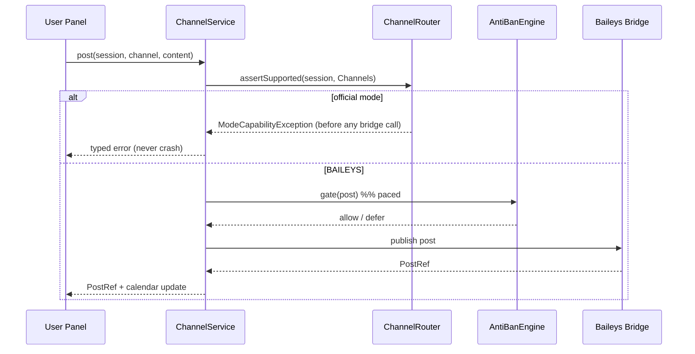

**Data models touched:** reused `channels`/`newsletters`, `channel_posts`, `channel_snapshots` (for delta analytics), plus `channel_send_log` (per-post capability-block audit). Errors: `ModeCapabilityException` (unsupported mode), `NotChannelAdminException` (admin-requiring op without admin), both typed and non-crashing.

---

## Base URL / APP_URL Configuration (Deep Dive)

> **Net-new configuration surface.** A single **configurable Base URL** (deployment domain, e.g. `bot.getxtrra.in`) is the canonical origin from which every absolute URL the platform emits is built. This introduces a **new requirement on regeneration: Requirement A9 — Base URL / deployment domain configuration** (see §New Requirements). It underpins webhook registration (A8, B1), signed export/payment URLs (A6.3, B6.4), per-tenant subdomain routing (A1), and OAuth/OTP redirects (C1).

### U.1 What the Base URL drives

| Consumer | How the Base URL is used |
|---|---|
| API & panels | Absolute links in API responses, emails, and Livewire redirects are built from the canonical base, not the request `Host` header |
| **Webhook callback registration** | The callback URL registered with the WA Bridge, **Meta Cloud API**, **On-Premise**, and **BSP** providers (per `ChannelMode`), and with **payment gateways** (Razorpay/Stripe/UPI), is `{baseUrl}/webhooks/...` |
| **Signed / expiring URLs** | Export download links and payment links are **signed** against the canonical host so the signature is host-stable and tamper-evident (A6.3, B6.4) |
| **Per-tenant subdomain routing** | `tenant.{slug}.{subdomain}` (e.g. `acme.app.bot.getxtrra.in`) resolves the tenant; the base host defines the apex the subdomain hangs off |
| OAuth / OTP redirects | Redirect/callback URIs for social login and OTP verification are built from the base so they match registered allowlists |

### U.2 Where it is stored & precedence

- **`config/app.php` `APP_URL` (env `APP_URL`)** — the deployment default, single source of truth in code.
- **`platform_settings['base_url']`** — an admin-editable **override** (Admin Panel → System settings) that takes precedence over env at runtime, so ops can change the domain without a redeploy (cache-invalidated on save).
- **Per-tenant custom domain (optional)** — a tenant may map a `custom_domain` (verified via DNS/ACME); when present, that tenant's absolute/subdomain URLs and webhook callbacks use the custom domain instead of the platform apex.

**Precedence:** per-tenant `custom_domain` → `platform_settings['base_url']` → `config('app.url')`.

### U.3 `UrlBuilder` / `BaseUrl` helper (PHP)

```php
namespace App\Services\Url;

interface BaseUrl
{
    /** The canonical platform base (never derived from the request Host header). */
    public function platform(): string;
    /** The base for a specific tenant (custom domain → subdomain → platform apex). */
    public function forTenant(Tenant $t): string;
}

interface UrlBuilder
{
    public function absolute(string $path, ?Tenant $t = null): string;
    /** Webhook callback URL registered with a provider for a session's channel mode. */
    public function webhook(string $provider, Session $s): string;      // {base}/webhooks/{provider}/{routeKey}
    /** Signed, expiring URL for exports / payment links, signed against the canonical host. */
    public function signed(string $path, \DateTimeInterface $expiresAt, ?Tenant $t = null): string;
    public function tenantSubdomain(Tenant $t): string;                 // tenant.{slug}.{apex}
}
```

### U.4 Flow into webhook registration & signed URLs

- **Webhook registration:** when a session is created/registered (`ChannelDriver::register`), the driver registers `UrlBuilder::webhook($provider, $session)` with the provider (Meta callback URL + verify token, BSP callback, bridge HMAC endpoint). The `route_key` is stored in `channel_webhook_routes` so inbound webhooks map back to `(tenant, session, driver)` (§Channel Mode 2.5).
- **Signed URLs:** `UrlBuilder::signed(...)` signs the path + expiry against the **canonical host**, so a link works regardless of which node served it and the signature can't be replayed against a different host.

### U.5 Security consideration (canonical host, no host-header injection)

The Base URL is **never** derived from the incoming `Host`/`X-Forwarded-Host` header for URL generation (Laravel `TrustProxies` / `TrustHosts` restricts accepted hosts). Building absolute/webhook/signed URLs from the request host would allow **host-header injection** (poisoned password-reset links, cache poisoning, webhook redirection). Instead:

- Absolute/webhook/signed URLs are built **only** from the configured canonical base (`BaseUrl::platform()`/`forTenant()`).
- Accepted request hosts are allowlisted (platform apex + verified tenant subdomains/custom domains); an unrecognized host is rejected.
- Signed URLs bind the canonical host into the signature so a valid signature can't be transplanted to another host.

Covered by **Correctness Property 27** (canonical-host URL generation) — see updated properties.

---

## Definition of Done / Completeness Guarantees

> **Purpose.** This section makes the platform's "100% working condition" explicit: **every** feature listed in this design ships **fully implemented** — no stubs, no mocks, no TODOs in production code paths. `Fake*` doubles (`FakeBridgeClient`, `FakeChannelDriver`, `FakeLlmProvider`, `FakeGateway`, `FakeVectorStore`, `FakeEmbedder`, `FakeStt`, `FakeKms`) exist **only** in the test suite and are bound solely in the testing container — never in production.

### DoD.1 Per-feature completeness checklist

A feature (User Panel item, Admin Panel item, channel capability, group capability, or channel mode) is **Done** only when **all** of the following hold:

1. **Fully implemented** — real service + real driver/gateway/provider behind its interface; no placeholder returning canned data in production.
2. **Tested** — unit + feature tests, and a **property-based test** where a universal property applies (Properties 1–28); test lists the property number it validates.
3. **Error-handled** — every failure path maps to a typed exception in the `AppException` hierarchy with a defined HTTP/retry disposition (see §Error Handling); no unhandled crash.
4. **Tenant-scoped** — reads/writes are structurally confined to the tenant (`BelongsToTenant`), verified by the isolation property (Property 1) / retrieval isolation (Property 20).
5. **Plan-gated & quota-metered** — access via `PlanGate`, consumption via `QuotaGuard`; over-limit **defers/blocks with explanation**, never silently drops (NFR2.1).
6. **Capability-aware** — an op unsupported by the session's `channel_mode` is rejected with `ModeCapabilityException` **before** dispatch (Property 21), rendered as disabled-with-reason in the UI.
7. **Observable** — emits `trace_id`-tagged structured logs (phone-redacted, no message bodies) and `wacb_*` metrics; surfaced in the relevant dashboard.

### DoD.2 No-stub guarantee (production paths)

- Production service-container bindings resolve **only** concrete implementations (`HttpBridgeClient`/`BaileysChannelDriver`, `OpenAiProvider`/`GeminiProvider`, `RazorpayGateway`/`StripeGateway`/`UpiLinkGateway`, real `ChannelService`/`GroupService`/`UrlBuilder`, etc.). Optional/scale-up dependencies that are absent **degrade gracefully** to a real MySQL/Baileys default (see §Dependencies degradation table) — degradation is a *real, tested code path*, not a stub.
- A CI check asserts no `Fake*`/`Stub*` class is referenced from a non-test namespace and no `throw new NotImplementedException` / `// TODO` remains in `app/`.

### DoD.3 Coverage / traceability

Because the Design-First workflow regenerates `requirements.md` and `tasks.md` from this design, completeness is **traceable**: every one of the **28 User Panel features** (§4.1, C1–C6), **28 Admin Panel features** (§4.2, D1–D6), each **channel-management capability** (§Channels Full Mgmt, A6), each **group-management capability** (§Groups Full Mgmt, A5), and each **`ChannelMode`** (§Channel Mode, A8) maps to at least one task in `tasks.md` on regeneration, and each such task references its requirement clause and the correctness property (if any) it validates. The regenerated `tasks.md` MUST contain a task for every row of the §4.1 and §4.2 tables, every `GroupService`/`ChannelService` method, every `ChannelMode`, and the `BaseUrl`/`UrlBuilder` helper — so the mapping is 1:1 and auditable.

---

## Data Architecture & Analytics (Deep Dive)

> Extends B7 / D4. Regeneration adds criteria for event sourcing (B7.8), analytics pipeline (D4.6), conversation search (B7.9), and reporting model (D4.7).

### Event sourcing (scoped)

**Scope decision** — event sourcing is applied to **conversations, messaging lifecycle, orders, and sessions** (high-value audit + replay), **not** to CRUD-heavy config tables (plans, settings) which stay state-oriented.

| Scope option | Chosen / Rejected | Rationale |
|---|---|---|
| Event-source conversation/order/session streams only | **Chosen** | Full auditability + projection rebuild where it matters; avoids event-sourcing tax on config CRUD |
| Event-source everything | Rejected | Overhead and complexity on low-value tables |
| No event log (mutable rows only) | Rejected | Loses audit/replay; harder analytics; weaker compliance evidence |

`event_log` is **append-only, monotonically versioned per stream** (Property 14). Read models (`conversations`, `orders`) are **projections** rebuilt from events; `projection_checkpoints` track progress so projections can be rebuilt or corrected without touching source events.

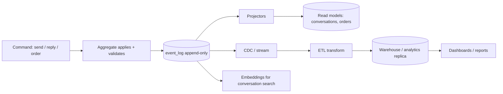

### Analytics pipeline (OLTP → warehouse)

- **CDC/ETL:** `event_log` (and binlog CDC as an alternative) feeds an **ETL** into a **warehouse** (or a dedicated **MySQL analytics replica** as the zero-extra-infra default). Real-time metrics come from `metrics_rollup` (updated incrementally); heavy historical reports run **batch** on the warehouse/replica.
- **Star schema (reporting model):** fact tables `fact_messages`, `fact_conversations`, `fact_orders`, `fact_llm_usage`; dimensions `dim_tenant`, `dim_date`, `dim_chatbot`, `dim_channel`, `dim_agent`. Real-time vs batch split keeps dashboards fast and history cheap.

### Conversation search

- **Lexical:** MySQL `FULLTEXT` over message text (always on).
- **Semantic:** per-message/embedding search via the same vector store (scale-up) for "find conversations about refunds"; degrades to FULLTEXT when vectors are off. Reuses the RAG embeddings store (`embeddings`, `owner_type=conversation`).

### Reporting model (business metrics)

Funnels, cohort/retention, revenue, **bot deflection rate** (resolved-without-human / total), **handoff rate**, **CSAT** and **sentiment trends** — all computed from facts + `metrics_rollup`, per tenant and platform-wide (platform-wide via replica/warehouse, never live-table scans, per D4.3).

---

## Security & Compliance Considerations

| Concern | Mitigation |
|---|---|
| Cross-tenant data leak | Global `TenantScope` + auto-fill `tenant_id`; `CrossTenantAccessException` as defense-in-depth; property test on every read path |
| Tenant file leakage | Per-tenant storage prefix `storage/tenants/{id}/`; ULID filenames; signed expiring URLs |
| Platform-admin power | Distinct `platform-admin` guard, IP allowlist, forced-strong-password, full audit of impersonation/login-as (reuses existing default-admin guard rails) |
| Impersonation ("login-as") | Explicit, audited, time-boxed; banner shown; certain destructive ops still blocked while impersonating |
| Payment security | Gateway keys in `platform_settings` (secret, redacted); webhook signature verified; PCI scope minimized (hosted checkout / links, no card storage) |
| LLM data exposure | Tenant content sent to LLM only when tenant enabled AI; provider keys are platform-level and never exposed to tenants; message bodies still never logged (only hashes) |
| Compliance (opt-out, anti-ban) | Enforced per tenant with no bypass parameter (unchanged guarantee); rate/warm-up caps hard-enforced |
| Data retention & deletion | Per-tenant retention policy + right-to-delete purge jobs; tenant cancellation triggers scheduled data deletion |
| Threat model / encryption / abuse | See **§Security & Compliance Hardening (Deep Dive)**: STRIDE table, envelope encryption + key rotation, GDPR/DPDP DSR pipeline, prompt-injection & anti-fraud defenses |

---

## Dependencies

- **Reused:** Laravel 11, PHP 8.3, MySQL 8, Livewire 3, Alpine, Tailwind, Supervisor, nginx + PHP-FPM, Node + Baileys bridge, Sanctum, `maatwebsite/excel`, Intervention Image, `dragonmantank/cron-expression`.
- **New (core):** an LLM SDK/HTTP client for OpenAI + Gemini (behind `LlmProvider`), payment gateway SDKs (Razorpay/Stripe) behind `PaymentGateway`, a PDF generator for invoices (e.g. `barryvdh/laravel-dompdf`).
- **Channel Mode backends (all behind the `ChannelDriver` interface):** the existing **Node + Baileys bridge** is the default driver (`BAILEYS`, reused, no new dependency). Additional selectable backends are **opt-in per tenant** and each degrades to the Baileys default when its credentials are absent: **Meta WhatsApp Cloud API** (`CLOUD_API`, HTTP to `graph.facebook.com` — WABA id, phone-number id, access token, verify token), the legacy **WhatsApp Business/On-Premise API** (`ON_PREMISE`, self-hosted client container — **deprecated by Meta, migration path to Cloud API**), and **third-party BSP/gateway SDKs/HTTP** (`BSP_GATEWAY`: Twilio, 360dialog, Gupshup, Vonage, MessageBird, Infobip, WATI, Kaleyra — provider api key/endpoint). Per-mode secrets are envelope-encrypted via `FieldCipher`.
- **New (optional / scale-up — each MUST degrade gracefully when absent):**

| Dependency | Purpose | Fallback when absent (MySQL-only default still works) |
|---|---|---|
| Redis | queue/cache/locks/rate-limit/broadcast | MySQL `jobs`/`cache`/`cache_locks`, `wire:poll` |
| Vector store (Qdrant / pgvector) | semantic RAG + conversation search | MySQL `FULLTEXT` lexical retrieval (`RAG_DRIVER=mysql`) |
| Embeddings API | KB/query embeddings | RAG disabled → keyword/FAQ only |
| Reranker (cross-encoder) | retrieval precision | LLM-as-reranker or RRF-only ordering |
| KMS / Vault | envelope encryption + secrets | Laravel app-key encryption + `.env`/`platform_settings` (dev/small) |
| STT / TTS provider | voice-note transcription / voice out | ask user to type; text-only replies |
| Warehouse / analytics replica | historical reporting | MySQL read replica or `metrics_rollup` on primary |
| OTLP collector (Prometheus/tracing) | metrics + distributed traces | `/metrics` scrape + MySQL `traces` ring-buffer |
| Second LLM provider | fallback chain | local heuristic (FAQ/templated) after primary breaker opens |
| Meta Cloud API (`CloudApiChannelDriver`) | official low-ban-risk messaging mode | mode unavailable; tenant stays on `BAILEYS` default (zero official-API setup) |
| On-Premise API container (`OnPremiseChannelDriver`) | legacy official self-hosted mode | mode unavailable; **deprecated** → steer to Cloud API / Baileys |
| BSP/gateway SDKs (`BspGatewayChannelDriver`: Twilio/360dialog/Gupshup/…) | official partner messaging mode | mode/provider unavailable; tenant stays on `BAILEYS` default |

Every optional dependency sits behind an interface (`ChannelDriver`, `VectorStore`, `Embedder`, `FieldCipher`, `SpeechToText`, `Tracer`, `LlmProvider`, ...) so it is swappable and its absence is a config flip, never a rewrite.

---

## Key Design Decisions & Trade-offs

| # | Decision | Trade-off accepted |
|---|---|---|
| 1 | Row-level multi-tenancy (`tenant_id` + global scope) | Weaker physical isolation than DB-per-tenant; in exchange, simple ops on MySQL and cheap per-tenant cost |
| 2 | Conversation engine as ordered, feature-gated stages | Fixed priority order is less flexible than a rules DSL; in exchange, predictable, testable, and safe-by-default behavior |
| 3 | Flow graph interpreted at runtime, not code-generated | Slight interpretation overhead; in exchange, no-code safety and no code execution from user input |
| 4 | Flow validated at save time (reachability + termination) | Rejects some author intent; in exchange, no broken flow can ever run |
| 5 | LLM on a dedicated queue lane behind an interface | Extra lane to supervise; in exchange, provider slowness/outage is contained and providers are swappable |
| 6 | Quota consumed after bridge confirms, keyed by idempotency | Slightly more bookkeeping; in exchange, retries never double-count and usage billing is exact |
| 7 | Payment via hosted checkout / links, no card storage | Less UI control; in exchange, minimal PCI scope |
| 8 | Reuse single-tenant engine unchanged, add scope on top | Some engine tables need `tenant_id` backfill; in exchange, all 50 core features are inherited, not rewritten |
| 9 | MySQL default, Redis documented upgrade | Lower ceiling out of the box; in exchange, deployment stays PHP + MySQL only until scale demands more |
| 10 | Hybrid RAG (dense ANN + lexical fusion + rerank), vector store behind interface, MySQL FULLTEXT fallback | Extra retrieval components; in exchange, grounded answers, high recall, and zero-dep default |
| 11 | Two-tier conversation memory (recent verbatim + rolling summary/episodic) with token budgeting | Summarization cost + slight recall loss on eviction; in exchange, bounded context cost and long conversations that don't blow the window |
| 12 | Semantic reply cache + cheap→strong model routing | Cache-invalidation & routing logic; in exchange, large cost/latency wins on FAQ traffic |
| 13 | LLM fallback chain + circuit breaker (per provider & per tenant) | Breaker state to manage; in exchange, provider outages never crash the pipeline and a tenant can't open everyone's breaker |
| 14 | Transactional outbox + relay for side effects | Extra table + relay worker; in exchange, effective exactly-once and no dual-write races |
| 15 | Saga with compensations for order→pay→fulfil | Compensation logic per step; in exchange, no partial/orphaned side effects across a multi-step flow |
| 16 | Tenant tiers (SHARED → DEDICATED_WORKER → DEDICATED_DB) via router | Router + provisioning complexity; in exchange, isolation/residency without forking code — tier is a config flip |
| 17 | Envelope encryption (per-tenant KMS-wrapped DEK) for sensitive fields | Key management overhead; in exchange, per-tenant crypto isolation + rotation + residency |
| 18 | Scoped event sourcing (conversation/order/session only) + projections | Event-log storage + projector code; in exchange, audit/replay/analytics where it matters, without event-sourcing tax on config CRUD |
| 19 | Time-based RANGE partitioning now, tenant sharding later | Partition management; in exchange, cheap retention + a clear horizontal-scale path |
| 20 | Expand-contract migrations + blue-green + feature flags | Multi-step migrations; in exchange, zero-downtime deploys and always-safe rollback |
| 21 | **Channel Mode**: pluggable per-session messaging backend (`ChannelDriver` generalizes `BridgeClient`), Baileys as default driver + Cloud API / On-Premise / BSP as opt-in modes | Per-mode capability differences + credential/config surface + a routing/failover layer; in exchange, one interface for all WhatsApp backends, tenant choice of ban-risk-vs-features, and **zero official-API setup by default** (Baileys) — a new backend is a class + enum case, never a rewrite |
| 22 | Capability-gate every mode (`supports()` → `ModeCapabilityException`) and branch anti-ban by mode (web-protocol vs official) | Extra capability handshake + a mode-aware send gate (Algorithm 9); in exchange, unsupported ops fail cleanly (never crash), official modes follow provider template/window rules, and Baileys/on-prem keep the non-bypassable anti-ban guarantee |

---

## New Requirements & New Tasks Implied by This Upgrade

This design upgrade deepens existing behaviour and introduces net-new subsystems. Because the Design-First workflow regenerates `requirements.md` and `tasks.md` from this document, the following **new/extended requirements** and **new tasks** are expected on regeneration. Existing requirement IDs are referenced where the new behaviour deepens them; suggested new IDs are noted for genuinely new capabilities.

**New / extended requirements (suggested IDs):**

| Area | Suggested requirement | Deepens / relates to |
|---|---|---|
| **Channel Mode** | **A8 — Channel Mode / pluggable messaging backends.** THE system SHALL support a per-tenant, per-session selectable `channel_mode` (`BAILEYS` default, `CLOUD_API`, `ON_PREMISE`, `BSP_GATEWAY`) behind one `ChannelDriver` interface, with sub-criteria: **A8.1** each session declares exactly one mode; **A8.2** an operation unsupported by a session's mode SHALL be rejected with `ModeCapabilityException` before dispatch (never a crash); **A8.3** an outbound message SHALL route to exactly the driver of its session's `channel_mode`, and inbound webhooks parse via that driver; **A8.4** each mode's credentials/config SHALL be stored per tenant, secret-redacted and envelope-encrypted; **A8.5** anti-ban warm-up/rate SHALL apply iff the mode is a web-protocol mode (Baileys/On-Premise), while official modes (Cloud API/BSP) enforce template/24h-window/provider-rate rules; **A8.6** On-Premise is deprecated with a documented migration path to Cloud API; **A8.7** optional per-tenant multi-mode failover (e.g. Cloud API→Baileys) SHALL reuse the circuit-breaker machinery. | A2 (sessions), A3 (Alg 3/9 send gate), A4 (anti-ban), A5/A6 (capability-gated groups/extraction/channels), B1 (inbound routing), NFR3 (secrets), NFR4 (interface) — Props 21–24 |
| **Base URL** | **A9 — Base URL / deployment domain configuration.** THE system SHALL build every absolute link, webhook callback, signed/expiring URL, and OAuth/OTP redirect from a configurable canonical base (`APP_URL` + `platform_settings` override + optional per-tenant custom domain), with sub-criteria: **A9.1** URLs SHALL be generated from the canonical base, never the request `Host` header; **A9.2** webhook callbacks registered with the Bridge/Cloud API/On-Premise/BSP/payment gateways SHALL use the canonical base per `ChannelMode`; **A9.3** per-tenant subdomain (`tenant.slug.subdomain`) and optional verified custom domain SHALL resolve the tenant; **A9.4** accepted request hosts SHALL be allowlisted and signed URLs SHALL bind the canonical host (no host-header injection). | A1 (subdomain routing), A6.3/B6.4 (signed/payment URLs), A8/B1 (webhook registration), C1 (OAuth/OTP), NFR3.2 — Property 27 |
| **Full User Panel** | **C1–C6 completed & itemized** — all **28** tenant self-service features designed with component/route/service/tenant-scope/plan-gate/degradation (§4.1); each maps to a task. | C1–C6 (Property 1, 28) |
| **Full Admin Panel** | **D1–D6 completed & itemized** — all **28** super-admin features designed with component/route/service/platform-admin-guard/audit (§4.2); each maps to a task. | D1–D6 (Property 1, 17, 28) |
| **Full Group mgmt** | **A5 completed** — full lifecycle: create/delete/metadata, invite link get/revoke/join, admin mgmt with WA status-code mapping, settings (audited), join-request inbox + ordered auto-approve, reconciliation, chunked bulk jobs, welcome exactly-once + rotation/A-B, generator extraction + active filter, export, tag-all/selective (hidden mentions, 200/chunk, cooldown, admin-guard); `GroupService`/`GroupAdminGuard` interfaces. | A5 (Props 25, 26) |
| **Full Channel mgmt** | **A6 (channels) completed** — full lifecycle: create/delete/metadata, subscriber/admin mgmt, follow/mute, text/media/poll auto-post, scheduled+recurring + content calendar, delta-from-snapshot analytics, capability-gated per `ChannelMode`; `ChannelService` interface. | A6 (Props 21, 26) |
| **Definition of Done** | **DoD completeness guarantee** — every listed User/Admin/channel/group/mode feature ships fully implemented (no stubs/mocks in prod paths; `Fake*` in tests only), each with tests, error handling, tenant-scoping, plan-gating, capability-awareness, and observability; 1:1 feature→task traceability on regeneration. | C1–C6, D1–D6, A5, A6, A8, A9 (Property 28) |
| RAG grounding | B4.5 — grounded answers with verifiable citations; ungrounded factual claims suppressed/escalated | B4.1 (Props 11, 20) |
| Conversation memory | B4.6 — two-tier memory + token budgeting + compaction | B4.1 (Alg 5) |
| Prompt guardrails / PII | NFR3.5 — PII redaction before LLM egress; jailbreak/injection defense | NFR3.2/3.3 (Prop 15) |
| Semantic cache | NFR1.4 — semantic reply caching with version-aware invalidation | NFR1.1 (Prop 12) |
| LLM resilience | NFR2.3 — fallback chain + circuit breaker; no crash on provider outage | B4.4, NFR2 (Prop 13) |
| Outbox / idempotency | NFR2.4 — transactional outbox exactly-once side effects | D2.2, NFR2.2 (Prop 16) |
| Saga | B6.5 — multi-step order flow is atomic-or-compensated | B6.3/6.4 (Prop 18) |
| Tenant tiers | A1.6 — tenant tiers + noisy-neighbor fair scheduling | A1, NFR1.2 (Prop 19) |
| Per-tenant encryption | NFR3.6 — envelope encryption + key rotation + residency | NFR3 |
| Tenant lifecycle | D5.5 — export + verified hard-delete (right-to-delete) | D5.2 |
| Event sourcing | B7.5 — append-only event log + projections | A3.3, B7.4 (Prop 14) |
| Audit integrity | D1.5 — hash-chained append-only audit log | D1.2 (Prop 17) |
| Observability | D4.5 — distributed tracing, SLOs/error budgets, dedup alerts | D4 |
| Cost attribution | D2.4 — per-tenant LLM/message/storage cost attribution | D2 |
| Multi-agent / tools | B4.7, B7.6 — router+specialist agents, function-calling tool registry | B4, B7.1 |
| A/B testing & funnels | B7.7 — sticky A/B variants + flow funnels | B7.4 |
| Rich messages | B3.4 — buttons/list/product messages with graceful degradation | B3 |
| STT/media | B7.8 — voice-note transcription / media understanding | B7 |
| Drip sequences | B6.6 — scheduled/re-engagement sequences (opt-out/quota respected) | B6 |
| Deployment safety | NFR-ops — expand-contract migrations, blue-green, zero-downtime drain | — |

**New tasks implied (to be added on `tasks.md` regeneration):** **Channel Mode** — `channel_mode` column on `sessions_wa` + `channel_credentials`/`cloud_api_templates`/`channel_webhook_routes`/`channel_send_log` migrations; `ChannelMode`/`ChannelCapability`/`BspProvider` enums; `ChannelDriver` interface generalizing `BridgeClient`; `BaileysChannelDriver` (wrap existing `HttpBridgeClient`), `CloudApiChannelDriver`, `OnPremiseChannelDriver`, `BspGatewayChannelDriver` (per-provider adapters) + `FakeChannelDriver`; `ChannelRouter` + `ChannelCredentialStore` (envelope-encrypted); extend Algorithm 3 send gate → Algorithm 9 (mode-aware anti-ban branch + capability gate); mode-aware inbound-webhook routing (Meta verify-token / BSP signature) + provider→session mapping; Cloud API/BSP template sync + 24h-window enforcement; optional multi-mode failover via `CircuitBreaker`; User/Admin panel mode selection + per-mode credential entry (secret-redacted) — carries property tests for Properties 21–24. RAG ingestion pipeline + `VectorStore`/`Embedder`/`Retriever`; memory compactor; `PiiRedactor`/`Guardrail`; semantic cache + `ModelRouter`; `CircuitBreaker`/`Outbox`/`IdempotencyStore`/`SagaOrchestrator` + relay worker; `TierResolver`/`TenantLifecycle`/`FieldCipher` + KMS; `Tracer`/`Metrics` + `/metrics` + rollups + alerting; `AgentRouter`/`Skill`/`ToolRegistry`/`AbTester`; rich-message `OutboundContent` + degradation; `SpeechToText`/`TextToSpeech`; drip `campaign_sequences` engine; `event_log` + projectors + checkpoints + CDC/ETL + star-schema reporting. Each carries property-based tests for Properties 11–20 and the new `Fake*` doubles listed in Testing Strategy. **Full User Panel (§4.1)** — a task per each of the 28 tenant features (component + route + service wiring + plan-gate/quota + degradation state) carrying tenant-scope tests (Property 1). **Full Admin Panel (§4.2)** — a task per each of the 28 super-admin features (component + route + platform-admin guard + IP allowlist + audit) carrying audit-integrity tests (Property 17). **Full Group mgmt (§Groups)** — `GroupService` + `GroupAdminGuard`; lifecycle/metadata, invite-link get/revoke/join, participant add/remove/promote/demote + WA status-code mapping, audited settings, join-request inbox + ordered auto-approve (blocklist→country→regex→manual), reconciliation, chunked bulk jobs, welcome exactly-once + rotation/A-B, generator extraction + temp-table de-dup + active filter, export, tag-all/selective (hidden mentions, 200/chunk, cooldown) — property tests for Properties 25, 26. **Full Channel mgmt (§Channels)** — `ChannelService`; create/delete/metadata, subscriber/admin mgmt, follow/mute, text/media/poll post, scheduled+recurring + calendar, delta-from-snapshot analytics + `channel_snapshots`, capability-gating — property test for Property 26. **Base URL (§Base URL)** — `BaseUrl`/`UrlBuilder` helpers, `platform_settings['base_url']` override + per-tenant `custom_domain`, `TrustHosts` allowlist, canonical-host signed/webhook URL generation, subdomain routing — property test for Property 27. **Definition of Done** — a CI completeness task (no `Fake*`/`Stub*`/`NotImplementedException`/`TODO` reachable from `app/`; 1:1 feature→task audit) — Property 28. Every §4.1/§4.2 row, every `GroupService`/`ChannelService` method, every `ChannelMode`, and the `BaseUrl`/`UrlBuilder` helper MUST have a corresponding task so coverage is complete and traceable.

---

## Sources

- [Baileys — WebSocket-based WhatsApp Web API (TypeScript)](https://github.com/whiskeysockets/Baileys)
- [Laravel Multi-Tenancy patterns (single DB, row-level scoping)](https://laravel.com/docs/11.x/eloquent#global-scopes)

*Content was rephrased for compliance with licensing restrictions.*
