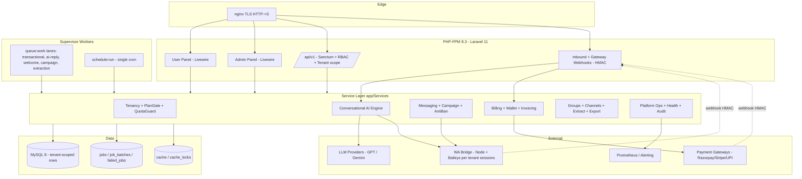
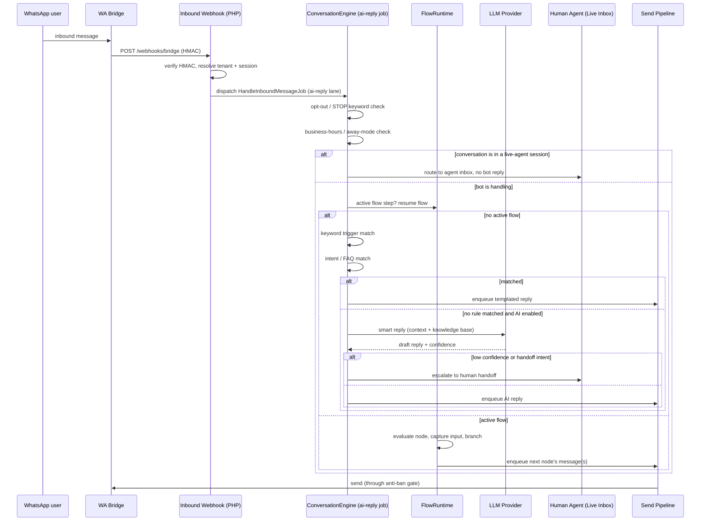

# Design Document — WhatsApp Chatbot Platform (Multi-Tenant SaaS)

## Overview

This document designs a **multi-tenant SaaS platform** built on the proven **Laravel 11 / PHP 8.3 / MySQL 8** monolith and the thin **Node + Baileys "WA Bridge"** sidecar established by the existing `whatsapp-auto-messenger` spec. It keeps every core messaging, group, channel, extraction, and anti-ban capability of that system and adds three large net-new subsystems:

1. **Multi-tenancy + Billing** — many isolated tenants (customers), each with their own WhatsApp numbers, contacts, campaigns, chatbots, plan, quota, and wallet.
2. **Conversational AI Engine** — auto-reply, keyword triggers, LLM smart replies, visual flow builder, intent/FAQ, business-hours/away mode, lead capture, order/booking, payments, multi-language, sentiment, human handoff, and conversation analytics. This is the biggest new subsystem and is designed with both high-level and low-level detail below.
3. **User Panel + Admin Panel** — a customer-facing self-service dashboard (28 features) and a super-admin/platform-owner control plane (28 features).

The document is intentionally **both High-Level (architecture, sequence diagrams, interfaces, data models) and Low-Level (formal PHP interfaces, algorithmic pseudocode with pre/postconditions and loop invariants, correctness properties)**, because both artifact levels were requested.

**Design principles carried forward and extended:**

1. **PHP owns everything** — data, decisions, scheduling, UI. The Bridge stays a dumb, replaceable wire.
2. **Queue-first** — every outbound send and every AI reply flows through the durable MySQL `jobs` queue.
3. **MySQL-only default** — queue, cache, locks, sessions on MySQL; Redis is an optional performance upgrade (recommended once tenant count grows).
4. **Tenant isolation is non-negotiable** — every domain row carries a `tenant_id`; a global query scope makes cross-tenant reads structurally impossible.
5. **Compliance & anti-ban are hard-enforced per tenant** — opt-out filtering and rate limits have no bypass parameter, exactly as before, now scoped per tenant.
6. **Plan gates everything** — messaging volume, session count, and feature access are gated by the tenant's plan; enforcement lives in one place, not scattered.
7. **Fail loud, degrade gracefully** — unsupported operations and exhausted quotas produce clean, typed errors, never silent no-ops.

---

## Relationship to `whatsapp-auto-messenger`

This is a **new, separate spec**. It does not modify the existing one. Conceptually, `whatsapp-auto-messenger` becomes the **single-tenant engine core** that this platform wraps and multiplies:

| Existing (single-tenant) | This platform (multi-tenant SaaS) |
|---|---|
| One implicit owner, `admin`/`admin` | Many tenants + platform super-admin above them |
| Global sessions, contacts, campaigns | Every row scoped by `tenant_id` |
| Config-file rate/warm-up caps | Per-plan quotas + config caps, whichever is stricter |
| No billing | Plans, wallets/credits, invoices, coupons, gateway |
| Manual replies only | Full conversational AI / chatbot engine |
| Single dashboard | User Panel (tenant) + Admin Panel (platform) |

The 22 existing domain tables are reused with an added `tenant_id` column and a global scope; new tables are added for tenancy, billing, and the AI engine.

---

## Architecture



**What changed vs the single-tenant architecture:**

- A **Tenancy layer** sits in front of every service. Requests are resolved to a tenant (by subdomain, panel session, or API key), a global Eloquent scope is applied, and `PlanGate`/`QuotaGuard` are consulted before any billable action.
- A **Conversational AI Engine** consumes inbound-message webhooks and produces replies through the same anti-ban send pipeline.
- A **Billing subsystem** manages plans, wallets/credits, invoices, coupons, and payment-gateway webhooks.
- Two Livewire panels replace the single dashboard: **User Panel** (tenant self-service) and **Admin Panel** (platform super-admin).

### Multi-tenancy model

**Single database, shared schema, row-level isolation** (`tenant_id` on every domain table) is the chosen model.

| Model | Verdict | Rationale |
|---|---|---|
| Row-level `tenant_id` + global scope | **Chosen** | Simplest to operate on MySQL, cheapest per tenant, matches "PHP + MySQL only" constraint; isolation enforced in one global scope + tests |
| Database-per-tenant | Rejected for v1 | Migration/backup fan-out, connection sprawl; revisit only for enterprise isolation tiers |
| Schema-per-tenant | Rejected | MySQL schema = database; same cost as DB-per-tenant without the benefit |

Isolation is guaranteed by `BelongsToTenant` (a global scope + auto-fill of `tenant_id` on create). The WhatsApp **auth-state files** and **export files** are stored under a per-tenant path prefix (`storage/tenants/{tenantId}/...`) so a filesystem bug can't leak across tenants either.

### Bridge multi-tenancy

The Bridge stays logic-free. Sessions are already keyed by an opaque `sessionId` (ULID); the platform simply guarantees every `sessionId` maps to exactly one tenant (`sessions_wa.tenant_id`). The Bridge never learns about tenants — PHP resolves tenant → session set and only ever asks the Bridge about session IDs the tenant owns. Auth-state directories are namespaced per tenant on disk.

---

## Conversational AI Engine — High-Level Design

This is the largest net-new subsystem. It turns an inbound WhatsApp message into a reply by running it through a deterministic **resolution pipeline** whose stages are ordered from cheapest/most-specific to most-expensive/most-general.



### Resolution pipeline order (deterministic, first-win)

1. **Compliance short-circuit** — opt-out keyword (`STOP`/`UNSUBSCRIBE`) always wins; records opt-out, sends confirmation, stops.
2. **Live-agent lock** — if a human agent has taken over this conversation, the bot stays silent (agent-only).
3. **Business-hours / away-mode** — outside configured hours, send the away message and (optionally) suppress further stages.
4. **Active flow resume** — if the contact is mid-flow, resume that flow's runtime (highest priority among bot logic).
5. **Keyword triggers** — exact / contains / regex matchers, tenant-ordered.
6. **Intent & FAQ** — classify intent (rule-based first, LLM-assisted optional) → matched FAQ answer.
7. **LLM smart reply** — only if enabled for the tenant and nothing above matched; uses conversation context + tenant knowledge base; low confidence or explicit "talk to human" intent → handoff.
8. **Default fallback** — configured fallback message, or silent.

Every stage is **feature-gated by plan** and **quota-metered** (LLM calls consume AI credits; outbound replies consume message quota). The order is fixed in code so behavior is predictable and testable.

### Visual Chatbot / Flow Builder (no-code)

- The builder is a **Livewire + Alpine** drag-and-drop canvas producing a **flow graph JSON** (nodes + edges) — no code generation, the graph is interpreted at runtime.
- **Node types:** `message`, `question` (capture input to a variable), `condition` (branch on variable/intent), `menu` (numbered options), `action` (call webhook / write to CRM / Google Sheet), `handoff` (to human), `end`.
- The graph is **validated** on save (reachability, no dangling edges, exactly one entry node, terminal nodes reachable) so a broken flow can never be published.
- Flow state per contact lives in `conversation_states` (current node id + captured variables), so runtime is stateless and horizontally scalable.

### Human handoff / Live Agent inbox

- A conversation can be in mode `BOT`, `HANDOFF_REQUESTED`, or `AGENT`.
- When escalated, it appears in the tenant's **Live Inbox** (Livewire, `wire:poll`), bot replies are suppressed, and agent messages go out through the same send pipeline (still rate-limited/anti-ban'd).
- Agent can **release** back to the bot; SLA timers and unassigned-timeout can auto-escalate or auto-reply.

---

## Components and Interfaces

All namespaces under `App\`. New/changed components are shown; unchanged single-tenant engine services (SessionManager, AntiBanEngine, GroupService, etc.) are reused as-is with tenant scoping applied by the global scope.

### 1. Tenancy layer

```php
namespace App\Services\Tenancy;

interface TenantContext
{
    public function current(): ?Tenant;          // null in platform-admin/global context
    public function set(Tenant $tenant): void;
    public function actingAsPlatform(): bool;     // super-admin bypasses tenant scope for admin panel
    public function forget(): void;
}

/** Global Eloquent scope + creating() hook mixed into every tenant-owned model. */
trait BelongsToTenant
{
    // adds: static::addGlobalScope(new TenantScope);
    //       static::creating(fn ($m) => $m->tenant_id ??= app(TenantContext::class)->current()?->id);
}

final class PlanGate
{
    /** True if the tenant's plan includes a feature flag. */
    public function allows(Tenant $t, string $feature): bool;

    /** Throws FeatureNotInPlanException if not allowed. */
    public function authorize(Tenant $t, string $feature): void;
}

final class QuotaGuard
{
    public function verdict(Tenant $t, QuotaKind $kind, int $units = 1): QuotaVerdict; // allow|defer|block
    public function consume(Tenant $t, QuotaKind $kind, int $units = 1): void;          // atomic
    public function remaining(Tenant $t, QuotaKind $kind): int;
}
```

`QuotaKind` enum: `MESSAGES_MONTHLY`, `MESSAGES_DAILY`, `SESSIONS`, `CONTACTS`, `AI_CREDITS`, `CAMPAIGNS_CONCURRENT`. Quota state lives in `tenant_usage` (period-bucketed counters) updated atomically via `Cache::lock()`.

### 2. Billing subsystem

```php
namespace App\Services\Billing;

interface PaymentGateway
{
    public function createCheckout(Tenant $t, Plan $p, Money $amount, array $meta = []): CheckoutSession;
    public function createPaymentLink(Tenant $t, Money $amount, string $ref): PaymentLink; // for chatbot order/booking
    public function verifyWebhook(Request $r): GatewayEvent;   // HMAC / signature verify
}

final class SubscriptionService
{
    public function subscribe(Tenant $t, Plan $p, ?Coupon $c = null): Subscription;
    public function changePlan(Tenant $t, Plan $to): Subscription;   // prorate
    public function cancel(Tenant $t, bool $atPeriodEnd = true): void;
    public function onGatewayEvent(GatewayEvent $e): void;           // activate/renew/dunning
}

final class WalletService
{
    public function balance(Tenant $t): Money;
    public function topUp(Tenant $t, Money $amount, string $source): WalletTxn;   // idempotent by source ref
    public function debit(Tenant $t, Money $amount, string $reason): WalletTxn;   // never below zero
}

final class InvoiceService
{
    public function issue(Tenant $t, Subscription $s): Invoice;      // PDF, sequential number
    public function markPaid(Invoice $i, GatewayEvent $e): void;
}
```

Implementations: `RazorpayGateway`, `StripeGateway`, `UpiLinkGateway` (payment links / UPI intents), plus `FakeGateway` for tests. Gateways sit behind the `PaymentGateway` interface so a tenant/admin can switch provider without touching billing logic.

### 3. Conversational AI Engine

```php
namespace App\Services\Chatbot;

final class ConversationEngine
{
    /** Entry point from HandleInboundMessageJob. Returns the action taken. */
    public function handle(InboundMessage $in): EngineOutcome;
}

interface ResolverStage
{
    /** Returns a StageResult: handled(reply)|passthrough|halt. Ordered by priority(). */
    public function resolve(ConversationContext $ctx): StageResult;
    public function priority(): int;
    public function requiresFeature(): ?string;   // plan gate key, or null
}

// Concrete stages, highest priority first:
//   OptOutStage, LiveAgentStage, BusinessHoursStage, ActiveFlowStage,
//   KeywordTriggerStage, IntentFaqStage, LlmReplyStage, FallbackStage

final class FlowRuntime
{
    public function start(ConversationContext $ctx, Flow $flow): FlowStep;
    public function resume(ConversationContext $ctx): FlowStep;   // uses conversation_states
    public function evaluateNode(FlowNode $node, ConversationContext $ctx): NodeResult;
}

interface LlmProvider
{
    public function reply(LlmRequest $req): LlmResponse;   // {text, confidence, intent, tokensUsed}
    public function detectIntent(string $text, array $intents): IntentMatch;
    public function detectLanguage(string $text): string;  // ISO code, e.g. 'hi' | 'en'
    public function sentiment(string $text): Sentiment;    // -1..1 + label
}

final class HandoffService
{
    public function request(Conversation $c, string $reason): void;    // BOT -> HANDOFF_REQUESTED
    public function assign(Conversation $c, User $agent): void;         // -> AGENT
    public function release(Conversation $c): void;                    // -> BOT
    public function agentSend(Conversation $c, User $agent, OutboundContent $m): void;
}
```

Implementations: `OpenAiProvider`, `GeminiProvider` behind `LlmProvider`; `FakeLlmProvider` for tests (deterministic canned responses + injectable confidence). Language detection and sentiment can be provider-backed or a lightweight local heuristic when AI credits are exhausted.

### 4. Panels

- **User Panel** (`app/Livewire/Panel/*`) — tenant-scoped; every component runs inside the resolved tenant context.
- **Admin Panel** (`app/Livewire/Admin/*`) — platform super-admin; runs in `actingAsPlatform()` mode so the tenant global scope is bypassed and cross-tenant data is visible. Guarded by a distinct `platform-admin` guard, IP allowlist, and full audit logging (reusing the existing default-admin guard rails).

---

## Data Models

New and changed tables (the 22 existing engine tables are reused, each gaining `tenant_id` + `idx(tenant_id, ...)`). New tables shown below.

```
-- ---------- Tenancy & access ----------
tenants                 id(ulid), name, slug(uniq), subdomain(uniq null),
                        status(ACTIVE|SUSPENDED|TRIAL|CANCELLED), plan_id->plans,
                        trial_ends_at, timezone, locale, created_at
                        idx(status)

tenant_users            id, tenant_id->tenants, user_id->users, role(owner|admin|operator|viewer|agent),
                        invited_at, joined_at   uniq(tenant_id, user_id)
                        -- a User can belong to multiple tenants; platform super-admins have tenant_id NULL

tenant_usage            id, tenant_id->, kind(enum QuotaKind), period_key(e.g. 2025-06 / 2025-06-14),
                        used(int), limit(int), updated_at   uniq(tenant_id, kind, period_key)

-- ---------- Billing ----------
plans                   id, name, slug(uniq), price_cents, currency, interval(MONTH|YEAR),
                        features(json feature flags), limits(json QuotaKind->int),
                        active, sort   idx(active)

subscriptions           id, tenant_id->(uniq active partial), plan_id->plans, status(TRIALING|ACTIVE|PAST_DUE|CANCELLED),
                        gateway, gateway_ref, current_period_start, current_period_end,
                        cancel_at_period_end, coupon_id->coupons
                        idx(status, current_period_end)

wallets                 id, tenant_id->(uniq), balance_cents, currency, updated_at
wallet_txns             id, tenant_id->, wallet_id->, type(TOPUP|DEBIT|REFUND|ADJUST),
                        amount_cents, balance_after, reason, source_ref(uniq null), created_at
                        idx(tenant_id, created_at)

invoices                id, tenant_id->, number(uniq), subscription_id->, amount_cents, currency,
                        status(DRAFT|OPEN|PAID|VOID), issued_at, paid_at, pdf_ref, line_items(json)
                        idx(tenant_id, status)

coupons                 id, code(uniq), type(PERCENT|FIXED), value, max_redemptions, redeemed,
                        expires_at, active   idx(active)

payment_events          id, tenant_id->null, gateway, gateway_event_id(uniq), type, payload(json),
                        processed_at, created_at   -- idempotent gateway webhook log

-- ---------- Conversational AI ----------
chatbots                id, tenant_id->, name, enabled, ai_enabled, default_flow_id->flows null,
                        away_message, fallback_message, settings(json), created_at
                        idx(tenant_id, enabled)

flows                   id, tenant_id->, chatbot_id->chatbots, name, version, status(DRAFT|PUBLISHED|ARCHIVED),
                        graph(json nodes+edges), entry_node_id, is_current
                        uniq(chatbot_id, name, version)

keyword_triggers        id, tenant_id->, chatbot_id->, match_type(EXACT|CONTAINS|REGEX), pattern,
                        priority, response_type(TEXT|TEMPLATE|FLOW), response_ref, enabled
                        idx(tenant_id, chatbot_id, priority)

intents                 id, tenant_id->, chatbot_id->, name, samples(json), answer, faq_group, enabled
knowledge_base          id, tenant_id->, chatbot_id->, title, content, embedding_ref null, tags(json)

conversations           id, tenant_id->, session_id->sessions_wa, contact_id->contacts, chatbot_id->,
                        mode(BOT|HANDOFF_REQUESTED|AGENT), assigned_agent_id->users null,
                        language, last_inbound_at, last_outbound_at, sentiment_avg, status(OPEN|CLOSED)
                        uniq(tenant_id, session_id, contact_id), idx(tenant_id, mode)

conversation_states     id, conversation_id->(uniq), flow_id->flows, current_node_id,
                        variables(json), expires_at, updated_at

messages_inbound        id(ulid), tenant_id->, conversation_id->, wa_message_id(uniq), body,
                        media_ref, intent, sentiment, language, handled_by(enum), created_at
                        idx(conversation_id, created_at)

leads                   id, tenant_id->, conversation_id->, contact_id->, form_id->lead_forms null,
                        fields(json), status, created_at
lead_forms              id, tenant_id->, chatbot_id->, name, fields(json schema)

orders                  id, tenant_id->, conversation_id->, contact_id->, items(json), total_cents,
                        currency, status(CART|PLACED|PAID|CANCELLED), payment_link, created_at
catalog_items           id, tenant_id->, name, description, price_cents, currency, sku, media_ref, active

handoff_events          id, tenant_id->, conversation_id->, from_mode, to_mode, agent_id->users null,
                        reason, created_at   idx(conversation_id, created_at)

-- ---------- Platform ops ----------
feature_flags           id, key(uniq), description, enabled_globally, tenant_overrides(json)
announcements           id, title, body, audience(json segment), publish_at, expires_at, created_by
platform_settings       key(pk), value(json), secret(bool), updated_at   -- SMTP, gateway keys, LLM keys, defaults
support_tickets         id, tenant_id->, user_id->, subject, status(OPEN|PENDING|CLOSED), priority,
                        assigned_admin_id->users null, created_at   idx(status)
support_messages        id, ticket_id->, author_id->users, body, attachments(json), created_at
kb_articles             id, category, title, body_md, published, sort   -- platform knowledge base / help center
```

**Enums (PHP 8.3 backed enums):**

```php
enum TenantStatus: string { case Active='ACTIVE'; case Suspended='SUSPENDED'; case Trial='TRIAL'; case Cancelled='CANCELLED'; }
enum ConversationMode: string { case Bot='BOT'; case HandoffRequested='HANDOFF_REQUESTED'; case Agent='AGENT'; }
enum QuotaKind: string { case MessagesMonthly='MESSAGES_MONTHLY'; case MessagesDaily='MESSAGES_DAILY'; case Sessions='SESSIONS'; case Contacts='CONTACTS'; case AiCredits='AI_CREDITS'; case CampaignsConcurrent='CAMPAIGNS_CONCURRENT'; }
enum FlowNodeType: string { case Message='message'; case Question='question'; case Condition='condition'; case Menu='menu'; case Action='action'; case Handoff='handoff'; case End='end'; }
enum SubscriptionStatus: string { case Trialing='TRIALING'; case Active='ACTIVE'; case PastDue='PAST_DUE'; case Cancelled='CANCELLED'; }
```

Reused engine enums (`SessionStatus`, `MessageStatus`, `WaStatus`) are unchanged.

---

## Algorithmic Pseudocode (Low-Level Design)

### Algorithm 1 — Conversation resolution pipeline

```php
function resolveInbound(inbound): EngineOutcome
```

**Preconditions:**
- `inbound` is a webhook event that passed HMAC verification.
- `inbound.tenant_id` resolved and tenant is `ACTIVE` or `TRIAL` (not `SUSPENDED`).
- `inbound.conversation` exists or is created for (tenant, session, contact).

**Postconditions:**
- At most one reply action is enqueued per inbound message (no double-reply).
- If opted-out keyword detected, an `opt_outs` row exists and no marketing reply is sent.
- Conversation `mode` and `conversation_states` reflect the outcome.
- Any LLM call consumed AI credits atomically; if credits were 0, LLM stage is skipped.

**Loop invariant (over ordered stages):** every stage examined so far returned `PASSTHROUGH`; the first stage returning `HANDLED` or `HALT` terminates the loop and no later stage runs.

```pascal
ALGORITHM resolveInbound(inbound)
BEGIN
    ctx <- buildContext(inbound)          // tenant, conversation, contact, history
    ASSERT ctx.tenant.status IN {ACTIVE, TRIAL}

    stages <- orderedStagesByPriority()   // OptOut, LiveAgent, BusinessHours,
                                          // ActiveFlow, Keyword, IntentFaq, Llm, Fallback

    FOR each stage IN stages DO
        // INVARIANT: all previously examined stages returned PASSTHROUGH
        IF stage.requiresFeature() != NULL
           AND NOT planGate.allows(ctx.tenant, stage.requiresFeature()) THEN
            CONTINUE                       // feature not in plan -> skip stage
        END IF

        result <- stage.resolve(ctx)

        IF result.kind = HALT THEN
            RETURN outcome(HALT, stage)    // e.g. opt-out, agent-only: no bot reply
        ELSE IF result.kind = HANDLED THEN
            enqueueReply(ctx, result.reply) // through anti-ban send pipeline
            persistState(ctx, result)
            RETURN outcome(HANDLED, stage)
        END IF
        // PASSTHROUGH -> try next stage
    END FOR

    RETURN outcome(NO_MATCH)               // Fallback stage normally prevents reaching here
END
```

### Algorithm 2 — Flow node evaluation (FlowRuntime)

```php
function evaluateNode(node, ctx): NodeResult
```

**Preconditions:**
- `ctx.state.flow_id` references a `PUBLISHED` flow whose graph was validated on save.
- `node` is reachable from the flow's entry node (guaranteed by save-time validation).

**Postconditions:**
- Exactly one successor node is chosen (or the flow ends), so runtime never dead-ends on a validated graph.
- Captured input is stored in `conversation_states.variables` before branching on it.
- On `handoff` node, conversation transitions to `HANDOFF_REQUESTED`.

**Loop invariant (menu/condition edge scan):** all edges checked so far did not match; the first matching edge determines the successor; the graph guarantees at least one default/else edge for `condition`/`menu` nodes.

```pascal
ALGORITHM evaluateNode(node, ctx)
BEGIN
    CASE node.type OF
        MESSAGE:
            RETURN NodeResult(reply := render(node.text, ctx.variables),
                              next := node.singleSuccessor)

        QUESTION:
            IF ctx.awaitingAnswerFor = node.id THEN
                ctx.variables[node.var] <- ctx.lastInboundText   // capture BEFORE branching
                RETURN NodeResult(reply := NONE, next := node.singleSuccessor)
            ELSE
                ctx.awaitingAnswerFor <- node.id
                RETURN NodeResult(reply := render(node.prompt, ctx.variables), next := node.id) // stay
            END IF

        MENU:
            choice <- parseChoice(ctx.lastInboundText, node.options)
            FOR each option IN node.options DO
                // INVARIANT: no earlier option matched the user's choice
                IF option.matches(choice) THEN
                    RETURN NodeResult(reply := NONE, next := option.targetNode)
                END IF
            END FOR
            RETURN NodeResult(reply := render(node.invalidPrompt, ctx.variables), next := node.id)

        CONDITION:
            FOR each edge IN node.edges DO
                IF evalPredicate(edge.predicate, ctx) THEN
                    RETURN NodeResult(reply := NONE, next := edge.targetNode)
                END IF
            END FOR
            RETURN NodeResult(reply := NONE, next := node.elseEdge.targetNode) // guaranteed to exist

        ACTION:
            runAction(node.action, ctx)      // webhook / CRM / Google Sheet (queued, retry-safe)
            RETURN NodeResult(reply := NONE, next := node.singleSuccessor)

        HANDOFF:
            handoffService.request(ctx.conversation, reason := node.reason)
            RETURN NodeResult(reply := render(node.message, ctx.variables), next := NONE, terminal := true)

        END:
            clearState(ctx)
            RETURN NodeResult(reply := render(node.message, ctx.variables), next := NONE, terminal := true)
    END CASE
END
```

### Algorithm 3 — Plan-gated, quota-metered send (extends the engine's SendMessageJob)

```php
function tenantSendGate(tenant, message): GateVerdict
```

**Preconditions:**
- `tenant` is resolved; `message.tenant_id = tenant.id` (enforced by global scope).
- Existing anti-ban gate (rate limit, quiet hours, warm-up) still applies unchanged.

**Postconditions:**
- Message is sent only if BOTH the tenant plan quota AND the anti-ban caps allow it.
- On quota exhaustion the job is `release()`d or blocked (never dropped); usage counter reflects exactly the messages actually sent (no double count on retry).

```pascal
ALGORITHM tenantSendGate(tenant, message)
BEGIN
    IF NOT planGate.allows(tenant, feature := featureFor(message)) THEN
        RETURN block(reason := FEATURE_NOT_IN_PLAN)
    END IF

    v <- quotaGuard.verdict(tenant, MESSAGES_MONTHLY, 1)
    IF v = BLOCK THEN RETURN block(QUOTA_EXCEEDED) END IF
    IF v = DEFER THEN RETURN defer(secondsUntilPeriodReset(tenant)) END IF

    // hand off to existing anti-ban gate (rate + quiet hours + warm-up + cooldown)
    antiBanVerdict <- antiBanEngine.gate(message)
    IF antiBanVerdict.defer THEN RETURN defer(antiBanVerdict.seconds) END IF
    IF antiBanVerdict.block THEN RETURN block(antiBanVerdict.reason) END IF

    RETURN allow()
    // NOTE: quotaGuard.consume() is called exactly once, AFTER the bridge confirms send,
    //       keyed by message.idempotency_key so a job retry never double-consumes.
END
```

### Algorithm 4 — Flow graph validation (save-time)

```php
function validateFlowGraph(graph): ValidationResult
```

**Preconditions:** `graph` has `nodes[]` and `edges[]`.

**Postconditions:** A flow can be published only if: exactly one entry node; every non-terminal node has a defined successor for every branch; every node is reachable from entry; every path can reach a terminal (`end`/`handoff`) node (no infinite non-terminating cycle without an exit).

```pascal
ALGORITHM validateFlowGraph(graph)
BEGIN
    entries <- nodes WHERE isEntry
    IF count(entries) != 1 THEN RETURN invalid("exactly one entry node required") END IF

    reachable <- BFS(from := entries[0], via := edges)
    FOR each node IN graph.nodes DO
        // INVARIANT: nodes checked so far were all reachable
        IF node NOT IN reachable THEN RETURN invalid("unreachable node: " + node.id) END IF
    END FOR

    FOR each node IN graph.nodes DO
        IF node.type IN {CONDITION, MENU} AND NOT hasDefaultEdge(node) THEN
            RETURN invalid("branch node missing default/else edge: " + node.id)
        END IF
        IF node.type NOT IN {END, HANDOFF} AND successorCount(node) = 0 THEN
            RETURN invalid("dangling node: " + node.id)
        END IF
    END FOR

    IF NOT everyPathReachesTerminal(graph, entries[0]) THEN
        RETURN invalid("a path never reaches an end/handoff node")
    END IF

    RETURN valid()
END
```

---

## Key Functions with Formal Specifications

### `QuotaGuard::consume(tenant, kind, units)`
- **Preconditions:** `units > 0`; called at most once per unit of billable work (keyed by idempotency key at the call site).
- **Postconditions:** `tenant_usage.used` increased by exactly `units` for the current period; the increment is atomic under `Cache::lock("quota:{tenant}:{kind}")`; never exceeds `limit` unless overage is explicitly allowed by plan.
- **Loop invariant:** N/A (single atomic update).

### `WalletService::debit(tenant, amount, reason)`
- **Preconditions:** `amount > 0`.
- **Postconditions:** returns a `wallet_txns` row with `balance_after >= 0`; if balance is insufficient, throws `InsufficientFundsException` and no row is written; operation is serialized per tenant wallet (`Cache::lock`).
- **Loop invariant:** N/A.

### `HandoffService::agentSend(conversation, agent, content)`
- **Preconditions:** `conversation.mode = AGENT`; `agent` is assigned to this conversation and is a member of the tenant.
- **Postconditions:** message is enqueued through the same anti-ban/plan-gated send pipeline (agents are not exempt from rate limits); `handoff_events` unchanged (send is not a mode transition); `conversation.last_outbound_at` updated.
- **Loop invariant:** N/A.

### `SubscriptionService::onGatewayEvent(event)`
- **Preconditions:** `event` came from `PaymentGateway::verifyWebhook` (signature valid); `event.gateway_event_id` recorded.
- **Postconditions:** processed exactly once (idempotent on `payment_events.gateway_event_id` unique index); subscription/tenant status transitions follow the allowed state map; a duplicate delivery is a no-op.
- **Loop invariant:** N/A.

---

## Example Usage

```php
// --- Inbound message -> conversation engine (queued on the ai-reply lane) ---
class HandleInboundMessageJob implements ShouldQueue, ShouldBeUnique
{
    public function uniqueId(): string { return $this->waMessageId; } // dedupe redelivered webhooks

    public function handle(TenantContext $tenants, ConversationEngine $engine): void
    {
        $tenants->set($this->tenant);                 // establish tenant scope for this job
        $engine->handle(InboundMessage::fromWebhook($this->payload));
    }
}

// --- Publishing a chatbot flow: validation blocks broken graphs ---
$result = app(FlowValidator::class)->validate($graph);
if (! $result->valid) {
    throw new InvalidFlowException($result->reason);  // cannot publish
}
$flow->update(['status' => 'PUBLISHED', 'is_current' => true]);

// --- Order/booking bot generates a payment link ---
$link = app(PaymentGateway::class)->createPaymentLink(
    tenant: $tenant, amount: $cart->total(), ref: "order:{$order->id}"
);
$reply = "Your total is {$cart->total()}. Pay here: {$link->url}";

// --- Admin panel: platform-wide view bypasses tenant scope ---
app(TenantContext::class)->actingAsPlatform();        // super-admin only, audited
$allActiveSessions = SessionWa::query()->where('status', 'CONNECTED')->count(); // across all tenants
```

---

## Correctness Properties

These are the invariants the test suite (property-based where noted) must hold. Universal quantification is over all valid inputs.

### Property 1: Tenant isolation

∀ tenant t, ∀ query q issued in t's context → q returns only rows where `tenant_id = t.id`. No API/panel path returns another tenant's row. *(Property test: seed 2 tenants, assert every read endpoint is disjoint.)*

### Property 2: Single reply per inbound

∀ inbound message m → `resolveInbound(m)` enqueues at most one outbound reply. *(Property test over random stage configurations.)*

### Property 3: Opt-out is absolute

∀ contact c with an `opt_outs` row → no marketing/campaign/bot reply is ever enqueued to c (opt-out short-circuits and has no bypass parameter).

### Property 4: Quota never negative, never double-counted

∀ tenant t, ∀ retry of a send job → `tenant_usage.used` increases by exactly the number of messages the bridge confirmed, and never exceeds `limit` (except explicit plan overage).

### Property 5: Wallet non-negativity

∀ debit sequence → wallet balance ≥ 0 at all times.

### Property 6: Flow termination

∀ published flow f, ∀ contact traversal → traversal reaches an `end`/`handoff` node in finite steps (guaranteed by save-time validation Algorithm 4).

### Property 7: Plan gating

∀ tenant t, ∀ feature not in t.plan → the feature's API/panel/stage is inaccessible and its stage is skipped.

### Property 8: Gateway idempotency

∀ payment webhook delivered N≥1 times → the subscription/wallet effect is applied exactly once.

### Property 9: Status monotonicity (reused)

∀ message → status never downgrades (out-of-order acks ignored via `rank()`).

### Property 10: Handoff silence

∀ conversation in `AGENT` mode → the bot enqueues zero automatic replies for that conversation.

---

## Error Handling

New exceptions extend the engine's `AppException` hierarchy:

```
AppException
├── TenantException
│   ├── TenantSuspendedException        → 403, non-retryable
│   └── CrossTenantAccessException      → 403, non-retryable  (should be impossible; defense in depth)
├── PlanException
│   ├── FeatureNotInPlanException       → 402/403, non-retryable
│   └── QuotaExceededException          → 429, retryable-as-defer until period reset
├── BillingException
│   ├── InsufficientFundsException      → 402, non-retryable
│   └── GatewayException                → 502, retryable
├── ChatbotException
│   ├── InvalidFlowException            → 422, non-retryable (publish blocked)
│   └── LlmProviderException            → 502, retryable (falls back to no-AI stages)
```

| Scenario | Condition | Response | Recovery |
|---|---|---|---|
| Quota exhausted mid-campaign | `MESSAGES_MONTHLY` hit | Job `release()`d; campaign marked `QUOTA_PAUSED`; tenant notified | Auto-resumes at next period reset or after top-up/upgrade |
| LLM provider down/timeout | `LlmProviderException` | Skip LLM stage; try Fallback stage; log; alert if error-rate spikes | Retry on next inbound; no crash |
| Payment webhook replay | Duplicate `gateway_event_id` | No-op (idempotent) | — |
| Suspended tenant sends | `TenantStatus::Suspended` | All outbound blocked; inbound still logged, no bot reply | Admin reactivates tenant |
| Broken flow published attempt | `validateFlowGraph` fails | `InvalidFlowException`, publish rejected, editor shows the failing node | Fix flow, re-validate |

---

## Testing Strategy

**Unit (Pest):** resolution-pipeline ordering, flow node evaluation for each node type, flow graph validation (reachability/termination), quota arithmetic, wallet non-negativity, gateway idempotency, language/sentiment heuristics, coupon math, proration.

**Property-based (Pest + a generator helper, mirroring the engine's approach):** properties 1–10 above. Notably tenant isolation (random 2-tenant seed, assert read disjointness), single-reply, quota-no-double-count under random retry interleavings, and flow termination over randomly generated *valid* graphs.

**Feature:** `FakeBridgeClient` + `FakeLlmProvider` + `FakeGateway` bound in the container. Full inbound→reply flow, handoff lifecycle, flow builder publish, subscription lifecycle via fake gateway webhooks, wallet top-up/debit, plan upgrade/downgrade proration.

**HTTP / Panel:** every User Panel and Admin Panel route — tenant scope enforced, RBAC enforced, platform-admin routes require the platform guard + IP allowlist. Livewire component tests for the flow builder canvas and live inbox.

**Load:** N tenants each running campaigns concurrently — assert per-tenant rate limits and quotas hold independently, no cross-tenant queue starvation (fair lane scheduling), zero duplicate `wa_message_id`.

---

## Performance & Scalability Considerations

- **MySQL queue ceiling:** with many tenants the single `jobs` table becomes the throughput bottleneck. Mitigation: per-lane workers + `idx(tenant_id, ...)` on hot tables; **Redis is the documented drop-in upgrade** (`QUEUE_CONNECTION=redis`, `CACHE_STORE=redis`) once tenant concurrency warrants it.
- **LLM latency/cost:** AI replies run on a dedicated `ai-reply` lane so a slow provider doesn't block transactional/campaign lanes; responses cached by (chatbot, normalized-question) where safe; AI credits cap spend per tenant.
- **Fair scheduling:** campaign dispatch is round-robined across tenants so one large tenant can't starve others.
- **Knowledge base retrieval:** optional embedding search (`embedding_ref`) for FAQ/RAG; degrades to keyword search when embeddings are disabled.
- **Read scaling:** platform-admin cross-tenant analytics run against read replicas / pre-aggregated snapshot tables rather than scanning live domain tables.

---

## Security & Compliance Considerations

| Concern | Mitigation |
|---|---|
| Cross-tenant data leak | Global `TenantScope` + auto-fill `tenant_id`; `CrossTenantAccessException` as defense-in-depth; property test on every read path |
| Tenant file leakage | Per-tenant storage prefix `storage/tenants/{id}/`; ULID filenames; signed expiring URLs |
| Platform-admin power | Distinct `platform-admin` guard, IP allowlist, forced-strong-password, full audit of impersonation/login-as (reuses existing default-admin guard rails) |
| Impersonation ("login-as") | Explicit, audited, time-boxed; banner shown; certain destructive ops still blocked while impersonating |
| Payment security | Gateway keys in `platform_settings` (secret, redacted); webhook signature verified; PCI scope minimized (hosted checkout / links, no card storage) |
| LLM data exposure | Tenant content sent to LLM only when tenant enabled AI; provider keys are platform-level and never exposed to tenants; message bodies still never logged (only hashes) |
| Compliance (opt-out, anti-ban) | Enforced per tenant with no bypass parameter (unchanged guarantee); rate/warm-up caps hard-enforced |
| Data retention & deletion | Per-tenant retention policy + right-to-delete purge jobs; tenant cancellation triggers scheduled data deletion |

---

## Dependencies

- **Reused:** Laravel 11, PHP 8.3, MySQL 8, Livewire 3, Alpine, Tailwind, Supervisor, nginx + PHP-FPM, Node + Baileys bridge, Sanctum, `maatwebsite/excel`, Intervention Image, `dragonmantank/cron-expression`.
- **New:** an LLM SDK/HTTP client for OpenAI + Gemini (behind `LlmProvider`), payment gateway SDKs (Razorpay/Stripe) behind `PaymentGateway`, a PDF generator for invoices (e.g. `barryvdh/laravel-dompdf`), optional embeddings/vector search for KB (optional, feature-flagged).

---

## Key Design Decisions & Trade-offs

| # | Decision | Trade-off accepted |
|---|---|---|
| 1 | Row-level multi-tenancy (`tenant_id` + global scope) | Weaker physical isolation than DB-per-tenant; in exchange, simple ops on MySQL and cheap per-tenant cost |
| 2 | Conversation engine as ordered, feature-gated stages | Fixed priority order is less flexible than a rules DSL; in exchange, predictable, testable, and safe-by-default behavior |
| 3 | Flow graph interpreted at runtime, not code-generated | Slight interpretation overhead; in exchange, no-code safety and no code execution from user input |
| 4 | Flow validated at save time (reachability + termination) | Rejects some author intent; in exchange, no broken flow can ever run |
| 5 | LLM on a dedicated queue lane behind an interface | Extra lane to supervise; in exchange, provider slowness/outage is contained and providers are swappable |
| 6 | Quota consumed after bridge confirms, keyed by idempotency | Slightly more bookkeeping; in exchange, retries never double-count and usage billing is exact |
| 7 | Payment via hosted checkout / links, no card storage | Less UI control; in exchange, minimal PCI scope |
| 8 | Reuse single-tenant engine unchanged, add scope on top | Some engine tables need `tenant_id` backfill; in exchange, all 50 core features are inherited, not rewritten |
| 9 | MySQL default, Redis documented upgrade | Lower ceiling out of the box; in exchange, deployment stays PHP + MySQL only until scale demands more |

---

## Sources

- [Baileys — WebSocket-based WhatsApp Web API (TypeScript)](https://github.com/whiskeysockets/Baileys)
- [Laravel Multi-Tenancy patterns (single DB, row-level scoping)](https://laravel.com/docs/11.x/eloquent#global-scopes)

*Content was rephrased for compliance with licensing restrictions.*
